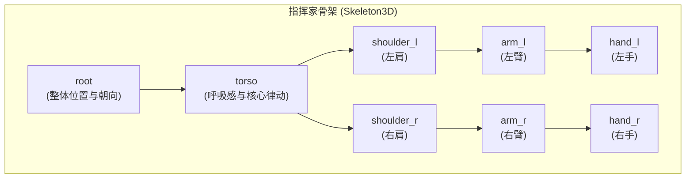
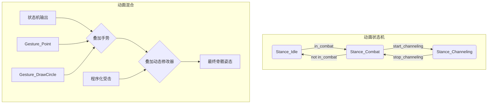

# 《Project Harmony》角色抽象动作与骨骼应用设计文档

**版本:** 1.0
**日期:** 2026-02-12
**作者:** Manus AI
**关联议题:** [#59](https://github.com/gdszyy/project-harmony-gdd/issues/59), [#66](https://github.com/gdszyy/project-harmony-gdd/issues/66)

---

## 1. 设计目标与哲学

本文档旨在为《Project Harmony》中代表玩家的抽象“谐振调式”化身，设计一套富有表现力、基于程序化骨骼的动作系统。此设计的核心目标是在不使用任何传统人形模型的前提下，通过一个不可见的“指挥家”骨架，驱动几何体做出具有强烈意图和音乐感的施法动作，从而在视觉上强化“战斗即创作”的核心体验。

设计严格遵循以下哲学：

- **表现意图，而非模拟现实：** 动画的首要目的是沟通“正在发生什么”以及“将要发生什么”，而非模仿真实的人体运动。
- **动作即反馈：** 骨骼动画是游戏状态（施法、待机、受伤）最直接、最核心的视觉反馈层。
- **模块化与程序化：** 整个系统需高度模块化，允许通过组合不同的动画“基元”来程序化地生成无穷的动作变化，以响应玩家千变万化的“编曲”。

## 2. “指挥家”抽象骨骼设计

根据议题 [#59](https://github.com/gdszyy/project-harmony-gdd/issues/59) 中提出的技术方向，我们将采用一个极简但高效的 `Skeleton3D` 节点作为所有角色化身的动作驱动核心。这个骨骼本身在游戏中不可见，其唯一作用是提供一系列可供动画和程序控制的变换（Transforms）。

### 2.1. 骨骼层级结构

骨骼结构被设计为能模拟指挥家上半身的核心动态，足以表现出丰富的施法手势。

| 骨骼名称 | 核心职责 | 关联的视觉表现 |
| :--- | :--- | :--- |
| `root` | 控制角色的整体位置和Y轴旋转。 | 整体移动和朝向。 |
| `torso` | 驱动核心的、与BPM同步的垂直律动（呼吸感），以及受击时的后仰。 | 角色几何核心的上下起伏和受击反馈。 |
| `shoulder_l`/`r` | 控制手臂的内外开合与前后摆动，用于表现蓄力或范围法术的准备动作。 | 几何光环的扩张与收缩。 |
| `arm_l`/`r` | 负责大部分施法动作的主体，如抬手、画圈、前推。 | 几何光环的倾斜、抬升。 |
| `hand_l`/`r` | 施法动作的终点，负责精细的手势，如指向、抓取。也是法术粒子发射的锚点。 | 几何光环的指向性旋转、法术特效的生成位置。 |

### 2.2. 几何体附着

所有可见的程序化几何体（如爱奥尼亚式的光环、弗里几亚式的晶体核心）都将通过 `BoneAttachment3D` 节点附着到上述骨骼的不同骨骼上。例如：

- **核心几何体** (如十二面体) -> 附着于 `torso` 骨骼。
- **外层光环** -> 附着于 `hand_l` 和 `hand_r` 骨骼，使其能随双手动作而拉伸、倾斜。

## 3. 模块化动作系统设计

我们将摒弃传统游戏中冗长、固定的动画片段，转而采用一套基于“动画基元”（Animation Primitives）的模块化系统。这些基元是简短、可循环、可叠加的 `Animation` 资源，由 `AnimationPlayer` 和 `AnimationTree` 进行管理和混合。

### 3.1. 动画基元库

动画基元分为三类：姿态、手势和动态修改器。

#### A. 姿态 (Stances) - 持续状态

这些是角色大部分时间所处的循环动画，定义了角色的基础状态。

| 姿态名称 | 描述 | 骨骼影响 |
| :--- | :--- | :--- |
| `Stance_Idle` | 待机状态。双手自然垂于身体两侧，随BPM轻微起伏。 | `torso` 上下微动，`arm` 和 `hand` 小幅摆动。 |
| `Stance_Combat` | 战斗准备状态。双手抬起至胸前，准备施法。 | `arm` 抬起，`hand` 悬停。 |
| `Stance_Channeling` | 持续施法/引导状态。双手向前或向上举起，有能量集中的抖动。 | `arm` 和 `hand` 锁定于特定姿势，附加高频抖动。 |

#### B. 手势 (Gestures) - 瞬时动作

这些是叠加在姿态之上的、一次性的施法动作，直接对应玩家的输入或法术的触发。

| 手势名称 | 描述 | 骨骼影响 | 关联法术类型 |
| :--- | :--- | :--- | :--- |
| `Gesture_Point` | 单手或双手快速向前直指。 | `arm` 和 `hand` 快速前伸。 | 弹射物 (Projectile) |
| `Gesture_DrawCircle` | 双手在胸前画一个圆。 | `hand` 沿圆形轨迹移动。 | 范围效果 (AOE) |
| `Gesture_Raise` | 双手从下向上高举。 | `arm` 和 `hand` 向上抬升。 | 召唤物 (Summon) |
| `Gesture_Push` | 双手从胸前猛力前推。 | `arm` 和 `hand` 快速前推。 | 冲击波 (Shockwave) |
| `Gesture_Flick` | 单手手腕快速向外甩动。 | `hand` 快速旋转。 | 散射 (Scatter) |

#### C. 动态修改器 (Modifiers) - 程序化叠加效果

这些不是预设动画，而是通过代码实时计算并叠加到骨骼上的变换，用于响应动态变化的游戏参数。

| 修改器名称 | 描述 | 实现方式 | 关联参数 |
| :--- | :--- | :--- | :--- |
| `Modifier_Fatigue` | 听感疲劳度越高，动作越“迟缓”、“拖沓”。 | 使用 `AnimationTree` 的 `TimeScale` 或 `lerp` 降低动画播放速度和混合速度。 | `AestheticFatigueIndex` |
| `Modifier_Impact` | 受到伤害时，身体有一个快速、剧烈的后仰和回弹。 | 直接向 `torso` 骨骼施加一个反向的瞬时位移和旋转。 | `on_damage_received` 事件 |
| `Modifier_BPM_Sync` | 所有动作都与背景音乐的节拍同步。 | 动画的触发和关键帧应与 `GameManager` 提供的BPM节拍信号对齐。 | `beat_signal` |

### 3.2. 动画状态机 (`AnimationTree`)

我们将使用 `AnimationTree` 和 `AnimationNodeStateMachine` 来管理姿态之间的转换，并使用 `AnimationNodeBlendSpace1D` 或 `AnimationNodeAdd2` 来将手势动画叠加到当前的姿态之上。

## 4. 敌人骨骼动画应用：“对位爬虫”案例分析

根据议题 [#66](https://github.com/gdszyy/project-harmony-gdd/issues/66) 的设计，程序化骨骼动画不仅用于玩家，也用于特定的复杂敌人，如“对位爬虫”（Counterpoint Crawler）。

### 4.1. 骨骼设计

爬虫的骨骼将更为复杂，包含身体、炮塔和多条腿的骨骼链。

- **`body`**: 主体骨骼。
- **`turret`**: 附着于 `body`，可独立旋转。
- **`leg_l1_coxa`, `leg_l1_femur`, `leg_l1_tibia`**: 代表左前腿的骨骼链（共6-8条腿）。

### 4.2. 程序化行走与IK

爬虫的行走动画将完全程序化，不使用预设的行走循环动画。

1.  **IK应用**: 每条腿的末端（`tibia`）将设置一个 `CCDIK3D` 修改器。
2.  **目标点计算**: 算法会为每条腿在地面上计算一个理想的“落脚点”（通过 `RayCast3D`）。
3.  **步态逻辑 (Gait Logic)**: 当身体移动导致某条腿的当前位置与理想落脚点超过一定距离时，触发该腿的“迈步”动作。
4.  **迈步动画**: “迈步”不是一个 `Animation` 资源，而是通过代码驱动 `CCDIK3D` 的目标点，用 `Tween` 或 `lerp` 将其从当前位置平滑移动到新的落脚点。同时，为了模拟抬腿，目标点在移动过程中会在Y轴上经过一个向上的弧线。
5.  **步态协调**: 步态逻辑将确保腿的移动是协调的（如交替的“三脚架”步态），从而创造出真实、动态、能适应任何地形的行走效果。

## 5. 结论与后续步骤

本设计文档提出的抽象动作与骨骼应用方案，为《Project Harmony》提供了一套兼具表现力和技术可行性的角色动画系统。它通过一个不可见的“指挥家”骨架和模块化的动画基元，将玩家的音乐创作行为与富有表现力的视觉动作深度绑定。同时，将此技术应用于“对位爬虫”等敌人，也为创造更生动、更具挑战性的Boss战奠定了基础。

**后续步骤：**

1.  **原型验证：** 在Godot中搭建一个测试场景，实现基础的“指挥家”骨架和一到两个动画基元，验证 `BoneAttachment3D` 与程序化几何体的结合效果。
2.  **IK测试：** 单独实现“对位爬虫”的程序化行走系统，重点调试IK链和步态逻辑。
3.  **动画库扩充：** 根据法术系统的具体设计，逐步扩充动画基元库，并完善 `AnimationTree` 的混合逻辑。
