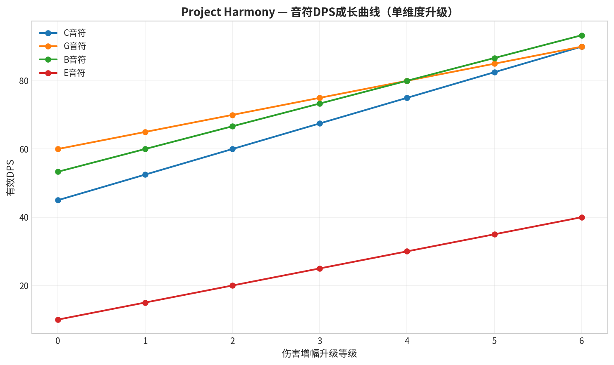
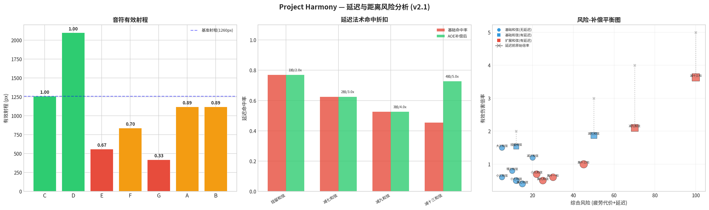
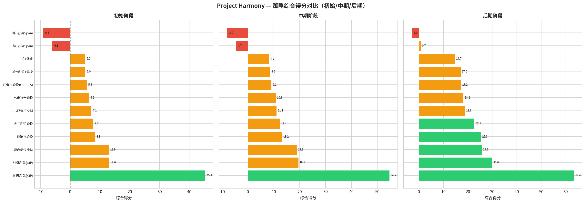
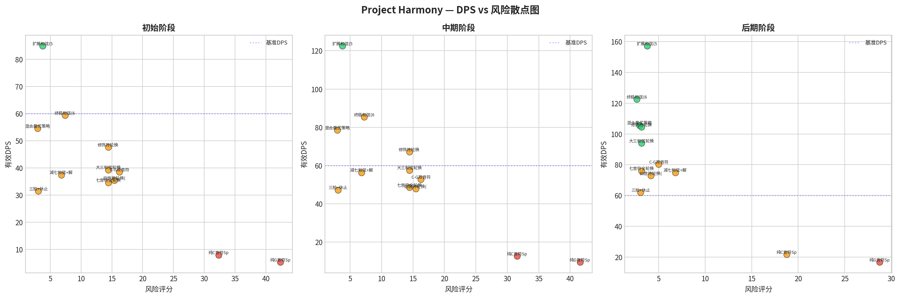

# Project Harmony：数值设计文档

**作者：** Manus AI
**版本：** 2.2
**日期：** 2026年2月11日

---

## 1. 引言

本文档为 **Project Harmony** 的核心游戏机制提供了一套完整、可量化且支持长线成长的数值设计方案。该方案在v1.0的基础上，根据肉鸽（Roguelite）生存者的游戏模式，重点引入了**数值成长系统**、**扩展和弦体系**，并配套了**自动化平衡性跑分系统**，以确保游戏在长线体验中依然保持平衡、策略深度和可玩性。

设计遵循以下核心原则：

*   **风险与回报的动态平衡**：高风险操作应提供高回报，但惩罚也应随成长而动态调整，避免后期风险过低或过高。
*   **有意义的成长选择**：玩家在肉鸽升级中获得的每个数值提升都应带来清晰、可感知的策略变化，而非简单的线性增强。
*   **策略多样性的持续奖励**：鼓励玩家在游戏的不同阶段探索和组合不同的法术元素，并通过数值设计使其成为比单调策略更优的选择。
*   **可维护与可扩展性**：通过自动化的跑分系统，保证未来新增内容（新音符、新和弦、新升级）时，能够快速验证其对整体平衡性的影响。

本文档专注于数值本身的设计与平衡，关于这些数值如何驱动法术的视觉表现，请参阅 **[《法术系统视觉增强设计文档》](./Spell_Visual_Enhancement_Design.md)**。

---

## 2. 核心数值体系

### 2.1. 基础参数与转换

白键音符的基础弹体由四维参数（伤害DMG, 速度SPD, 持续DUR, 大小SIZE）驱动，其总和恒定为**12**。这些参数到游戏内实际属性的转换比率如下（v2.2中DUR和SIZE的每点价值有所提升，以凸显区域控制型音符的特性）：

| 参数 | 每点对应值 | 设计说明 |
| :--- | :--- | :--- |
| **伤害 (DMG)** | 10 基础伤害 | 决定了弹体的基础伤害值。 |
| **速度 (SPD)** | 200 像素/秒 | 决定了弹体的飞行速度，影响射程和命中率。 |
| **持续 (DUR)** | **0.7 秒** | 决定了弹体在消失前的存活时间。v2.2中从0.5s提升至0.7s（+40%），使高DUR音符的持久优势更加显著。 |
| **大小 (SIZE)** | **12 像素** | 决定了弹体的碰撞半径，影响命中率和覆盖范围。v2.2中从8px提升至12px（+50%），使高SIZE音符的空间覆盖优势更加显著。 |

### 2.2. 白键音符基础数值

下表展示了7个白键音符在**无任何成长**下的基础数值。**有效DPS** 是一个综合指标，它估算了在标准施法间隔（BPM=120）下，考虑了命中率因素后的期望秒伤。

> **有效DPS** ≈ (基础伤害 × 命中因子) / 施法间隔
> **命中因子** ≈ min(1.0, (SIZE点数 × SPD点数) / 12.0)

| 音符 | DMG | SPD | DUR | SIZE | 定位 | 实际伤害 | 速度(px/s) | 存活(s) | 半径(px) | 有效DPS | 覆盖面积(px²) |
| :---: | :-: | :-: | :-: | :-: | :--- | :---: | :---: | :---: | :---: | :---: | :---: |
| **C** | 3 | 3 | 3 | 3 | 均衡型 | 30 | 600 | 2.1 | 36 | 45.0 | 4072 |
| **D** | 2 | 5 | 3 | 2 | 极速远程 | 20 | 1000 | 2.1 | 24 | 33.3 | 1810 |
| **E** | **1** | **1** | **4** | **6** | **巨型缓行** | **10** | **200** | **2.8** | **72** | **3.3** | **16286** |
| **F** | **2** | **1** | **6** | **3** | **超持久缓行** | **20** | **200** | **4.2** | **36** | **6.7** | **4072** |
| **G** | **6** | **3** | **1** | **2** | **高伤快消** | **60** | **600** | **0.7** | **24** | **60.0** | **1810** |
| **A** | 4 | 2 | 4 | 2 | 持久高伤 | 40 | 400 | 2.8 | 24 | 26.7 | 1810 |
| **B** | 4 | 4 | 2 | 2 | 高速高伤 | 40 | 800 | 1.4 | 24 | 53.3 | 1810 |

> **v2.2 设计哲学——"原子 vs. 分子"**：基础音符是"原子"，其差异**仅通过四维物理属性的极化**来体现，不应拥有任何特殊机制（如固定放置、区域DOT等）。特殊机制是"分子"——和弦法术的专属领域。E/F/G的定位从原来的"地形伤害/地雷/爆发"重新定义为"巨型缓行/超持久缓行/高伤快消"，确保它们不会僭越和弦法术的设计空间。
>
> **层级约束**：G音符的伤害(60)被严格限制在最弱三音和弦(C根音, 1.5x = 45)之上但低于同根音和弦(G根音大三, 1.5x = 90)，确保和弦法术恒强于基础音符的组合成本收益。

---

## 3. 肉鸽数值成长系统

作为肉鸽游戏，玩家在每次游戏流程中可以通过升级获得各种强化。这些强化分为五大类别，为玩家提供了丰富的Build构建空间。

### 3.1. 升级类别与示例

| 类别 | 设计目标 | 升级示例 | 稀有度 |
| :--- | :--- | :--- | :--- |
| **音符属性强化** | 强化特定音符的四维参数，实现单点突破。 | **伤害增幅**: 选择一个音符，其DMG参数+0.5 | 普通 |
| | | **全维强化**: 选择一个音符，其所有参数+0.25 | 史诗 |
| **疲劳耐受强化** | 降低“单音寂静”系统的负面影响，提升操作容错率。 | **单调耐受**: 单调值累积速率-10% | 稀有 |
| | | **不和谐消散**: 不和谐值自然衰减速率+0.5/秒 | 稀有 |
| **节奏精通** | 强化节奏相关的机制，提供战术多样性。 | **节奏加速**: 基础BPM+5 | 稀有 |
| | | **蓄力精通**: 休止符对其他弹体的DMG/SIZE加成+0.15 | 稀有 |
| **和弦精通** | 强化和弦效果，解锁更强大的和弦。 | **和弦威力**: 所有和弦的伤害倍率+0.1x | 稀有 |
| | | **扩展和弦解锁**: 解锁5音/6音扩展和弦的使用能力 | **传说** |
| **生存强化** | 提升玩家的生存能力。 | **生命强化**: 最大生命值+25 | 普通 |
| | | **闪避本能**: 基础闪避率+3% | 稀有 |

### 3.2. 音符成长与和弦继承

**核心机制**：对单个音符的任何四维参数（DMG/SPD/DUR/SIZE）强化，都会被其参与构成的**和弦法术**所继承。

*   **伤害继承**：和弦法术的基础伤害通常取决于**根音**的伤害值。因此，强化根音的DMG属性会直接提升和弦法术的威力。
*   **功能继承**：和弦法术的功能性参数（如持续时间、范围）取决于**所有构成音**的对应参数的**平均值**或**总和**。例如，一个由高DUR音符组成的“持续区域”法术，其持续时间会更长。

这一设计确保了即使在游戏后期，玩家依然有动力去强化基础音符，因为这些强化能贯穿整个法术系统，持续提供价值。

*图1：音符DPS成长曲线，展示了对不同音符进行“伤害增幅”升级后的DPS变化。可见，成长曲线基本呈线性，符合预期。*

---

## 4. 扩展和弦体系 (4/5/6音)

为了提供更长线、更有深度的后期游戏体验，我们在原有的3-4音和弦基础上，引入了更复杂的5音和6音和弦。这些**扩展和弦**拥有毁天灭地的威力，但伴随着极高的**不和谐度**和**疲劳代价**，并且需要通过传说级升级项**“扩展和弦解锁”**才能使用。

### 4.1. 扩展和弦列表

| 和弦类型 | 音数 | 不和谐度 | 法术形态 | 伤害倍率 | 疲劳代价 | 特殊效果 |
| :--- | :-: | :-: | :--- | :-: | :-: | :--- |
| **属九和弦** | 5 | 5.00 | 风暴区域 | 0.5x | 0.25 | 区域内敌人减速30% |
| **大九和弦** | 5 | 3.50 | 圣光领域 | 0.0x | 0.15 | 领域内队友持续回血(2/秒) |
| **减九和弦** | 5 | 7.50 | 湮灭射线 | 4.0x | 0.40 | 直线贯穿，无视防御 |
| **属十一和弦** | 5 | 6.00 | 时空裂隙 | 0.6x | 0.30 | 区域内时间减速50% |
| **属十三和弦** | 6 | 7.00 | 交响风暴 | 1.0x | 0.45 | 全屏持续AOE，附加随机元素效果 |
| **减十三和弦** | 6 | 9.50 | **终焉乐章** | **5.0x** | **0.60** | 延迟后全屏毁灭打击，施法者自损20%HP |

### 4.2. 风险-回报分析

扩展和弦的设计严格遵循“高风险高回报”的原则。随着音数的增加，和弦的威力和复杂性呈指数级增长，其不和谐度与疲劳代价也随之飙升。

*图2：和弦的不和谐度与伤害倍率关系图。红色的扩展和弦（5-6音）普遍位于图表的右上角，体现了其高风险、高回报的特性。*

*图3：左图显示不和谐度随音数增加而近似指数增长；右图显示疲劳代价也随之急剧增加。这确保了扩展和弦的强大威力被其高昂的风险所平衡。*

---

## 5. 延迟与距离风险体系 (v2.1新增)

在生存者类游戏中，法术的“延迟”和“短距离”是两种重要的战术风险。延迟意味着法术施放后不立即生效，敌人可能移出范围；短距离意味着玩家必须贴近敌人施法，增加了被攻击的概率。通常，这些风险会通过更高的伤害或更大的范围来补偿。

### 5.1. 音符有效射程与距离因子

每个音符的有效射程由其速度和持续时间决定：有效射程 = SPD × 200px/s × DUR × 0.7s。基准射程设定为1260px（v2.2中C音符的射程 = 3×200×3×0.7 = 1260），低于此值的音符会受到命中率折扣，但大弹体（高SIZE）可以部分补偿。

| 音符 | 有效射程(px) | 基础距离因子 | SIZE补偿 | 调整后因子 | 设计说明 |
| :---: | :---: | :---: | :---: | :---: | :--- |
| **C** | 1260 | 1.000 | 0.10 | 1.000 | 基准音符，无折扣 |
| **D** | 2100 | 1.000 | 0.00 | 1.000 | 远程狙击型，射程最远 |
| **E** | **560** | **0.444** | **0.40** | **0.667** | 巨型缓行，射程极短但SIZE=6提供最大补偿 |
| **F** | **840** | **0.667** | **0.10** | **0.700** | 超持久缓行，射程较短但DUR=6保证长存活 |
| **G** | **420** | **0.333** | **0.00** | **0.333** | 高伤快消，射程最短，高DMG(60)作为补偿 |
| **A** | 1120 | 0.889 | 0.00 | 0.889 | 轻微折扣 |
| **B** | 1120 | 0.889 | 0.00 | 0.889 | 轻微折扣 |

### 5.2. 和弦延迟命中折扣

部分和弦法术具有施法延迟，延迟期间敌人可能移动导致未命中。延迟命中率采用反比例衰减模型：delay_hit = 1/(1+0.3×delay_beats)。AOE法术可部分补偿（全屏法术不需精确瞄准）。

| 和弦类型 | 延迟(拍) | 基础命中率 | AOE补偿 | 调整后命中率 | 伤害倍率 | 有效倍率 |
| :--- | :-: | :---: | :---: | :---: | :-: | :---: |
| **挂留和弦** | 1 | 76.9% | 0% | 76.9% | 2.0x | 1.54x |
| **减七和弦** | 2 | 62.5% | 0% | 62.5% | 3.0x | 1.88x |
| **减九和弦** | 3 | 52.6% | 0% | 52.6% | 4.0x | 2.11x |
| **减十三和弦** | 4 | 45.5% | 27.3% | 72.7% | 5.0x | 3.64x |

上表的“有效倍率”列展示了考虑延迟折扣后的实际伤害倍率。可以看到，即使减十三和弦的名义倍率高达5.0x，其实际有效倍率也只有3.64x，但全屏AOE的补偿使其仍然是最强的法术。

*图6：延迟与距离风险分析。左图展示各音符的有效射程和距离因子；中图展示延迟法术的命中折扣及AOE补偿；右图展示所有和弦的风险-补偿平衡关系。*

---

## 6. 自动化平衡性跑分系统

为了科学、高效地进行平衡性验证，我们开发了一套**平衡性跑分系统**。该系统能够模拟各种法术策略，并从**输出、生存、风险**三个维度进行量化评估，最终给出一个综合得分。

**方法论文档**：[./BalanceKit/Methodology.md](./BalanceKit/Methodology.md)
**跑分系统源码**：[./BalanceKit/balance_scorer.py](./BalanceKit/balance_scorer.py)
**可视化报告生成器**：[./BalanceKit/generate_report.py](./BalanceKit/generate_report.py)

### 5.1. 跑分结果分析

我们对12种预设策略，在“初始”、“中期”、“后期”三个成长阶段分别进行了跑分，结果如下：

*图4：策略综合得分对比图。红色条为负分（有害策略），黄色为正分（有效策略），绿色为高分（优秀策略）。*

**核心结论**：
1.  **惩罚系统有效**：“纯C/G音符Spam”这类单调策略在所有阶段均为负分，证明了疲劳系统的有效性。
2.  **多样性奖励显著**：包含多样化音符、和弦、休止符的“混合最优策略”和使用高级和弦的策略得分远高于简单策略。
3.  **成长曲线健康**：随着从“初始”到“后期”的成长，所有有效策略的得分均有显著提升，且强力策略（如扩展和弦）的优势愈发明显，符合肉鸽游戏的爽快感预期。

*图5：DPS vs 风险散点图。优秀的策略（绿色）集中在左上角的“高DPS、低风险”区域，而糟糕的策略（红色）则集中在右下角的“低DPS、高风险”区域，符合设计预期。*

### 5.2. 平衡性微调建议

从跑分结果看，当前数值体系整体健康。但“后期阶段”的策略得分差距较大（最高分69.7，中位策略仅4.4），可能导致后期最优解过于单一。建议进行以下微调：

*   **增强中期策略**：适当提升部分基础和弦（如增三和弦、小七和弦）的伤害倍率或功能性，使其在后期的成长收益能跟上扩展和弦的步伐。
*   **增加升级多样性**：增加更多针对特定节奏型或非伤害性和弦（如大七和弦）的升级项，为玩家提供更多元的后期Build可能性。

---

## 7. 总结

本次 v2.2 数值设计在 v2.1 的基础上，进行了两项重要改革：

1.  **转换比率调整**：DUR每点价值从0.5s提升至0.7s（+40%），SIZE每点价值从8px提升至12px（+50%），使区域控制型音符的特性更加显著。
2.  **E/F/G音符四维参数极化重分配**：基于"原子 vs. 分子"的设计哲学，将E/F/G的定位从原来的"地形伤害/地雷/爆发"重新定义为"巨型缓行/超持久缓行/高伤快消"，确保音符不会僭越和弦法术的设计空间，且G音符伤害(60)严格低于同根音和弦(G根音大三, 1.5x = 90)。

结合此前的肉鸽数值成长系统、扩展和弦体系和自动化跑分系统，**Project Harmony** 现已拥有一套完整的、多维度的数值设计与验证体系，为项目未来的迭代和扩展提供了坚实的基础。

---

## 8. 局外成长系统 (Meta-Progression) 的数值整合

为了提供长线游戏目标和持续的成长感，我们引入了名为“和谐殿堂”的局外成长系统。该系统的数值设计必须严格遵循边界限制，以确保其不会破坏局内肉鸽（In-Game Roguelite）玩法的核心体验和平衡性。

### 8.1. 设计原则：辅助而非主导

局外成长系统的核心原则是**“辅助而非主导”**。这意味着其提供的数值加成应主要用于：

1.  **降低早期门槛**：帮助玩家更平滑地度过游戏初期。
2.  **提供便利性**：如扩大拾取范围，提升游戏体验。
3.  **解锁多样性**：逐步开放更复杂的机制和流派，而非直接提供强度。

主要的数值成长来源**必须**保留在局内的随机升级和策略构建上。

### 8.2. 数值边界与跑分系统整合

为了将局外成长纳入平衡性跑分系统，我们在 `balance_scorer.py` 的 `PlayerBuild` 类中预留了应用局外升级的接口。所有局外升级提供的加成将在模拟开始前被应用，从而创建一个带有“永久加成”的初始Build状态。该系统的数值边界被严格限制，以防止数值膨胀。

| 升级类别 | 数值上限（总和） | 设计说明 |
| :--- | :--- | :--- |
| **基础伤害加成** | **+50%** | 局外提供的总伤害加成不应超过50%。这确保了玩家无法通过“肝”来碾压早期内容，核心伤害来源依然是局内的和弦构建与协同。 |
| **疲劳系统减免** | **-30%** | 对“单调值”、“密度值”和“不和谐值”的累积速度或效果的综合减免不应超过30%。这保证了“听感疲劳”作为核心机制的有效性，避免玩家退化为无脑按键。 |
| **初始生命值加成** | **+100 HP** | 提供一定的容错率，但不应让玩家在前期可以无视走位和伤害规避。 |
| **机制解锁** | 无上限 | 对于解锁新和弦、新修饰符或新职业（调式），不设数值上限，因为它们本身是增加策略多样性，其平衡性由自身的数值设计和风险所决定。 |

### 8.3. 跑分验证流程

在未来的平衡性测试中，我们将引入一个新的跑分场景：**“满级局外成长Build”**。该场景将模拟一个玩家在点满所有局外升级后的状态，并以此为基础运行所有标准策略。我们将重点关注：

-   **初始策略得分**：检查满级局外成长是否让最简单的策略（如“纯C音符Spam”）变得过强。
-   **策略得分差异**：观察不同策略之间的得分差距是否被过度压缩。一个健康的系统应该依然是多样化、高技巧的策略得分更高。
-   **风险评分**：验证即使在满级状态下，高风险策略（如使用终极和弦）是否依然伴随着显著的风险评分。
