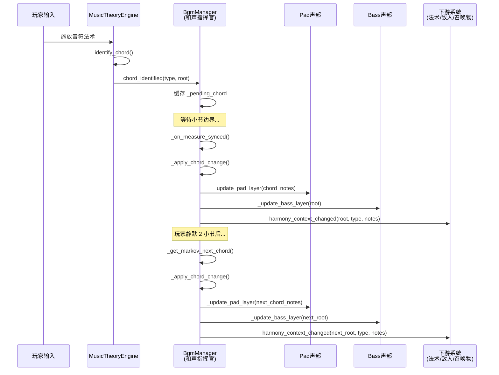

# 全局动态和声指挥官 (Global Dynamic Harmony Conductor)

**版本:** 1.0
**最后更新:** 2026-02-12
**状态:** 设计稿
**作者:** Manus AI
**优先级:** P0 — 第一优先级（奠定基础）
**关联模块:** `bgm_manager.gd`, `music_theory_engine.gd`, `GameManager`

---

## 1. 设计概述

### 1.1. 现状分析

当前项目中存在两个独立运作的和声系统：

1. **玩家侧：** `music_theory_engine.gd` 能够实时识别玩家用法术构建的复杂和弦（通过 `identify_chord()` 函数），并通过 `chord_identified` 信号广播和弦类型与根音，触发相应的和弦进行效果。
2. **BGM侧：** `bgm_manager.gd` 的 Pad 层和 Bass 层在一个预设的、固定的 A 小调和弦进行（Am-G-F-Em）中循环，其和声演进与玩家的行为完全解耦。

这种分离导致了核心体验的断裂：无论玩家演奏出多么华丽的和弦进行，背景音乐始终"无动于衷"，无法形成真正的"合奏感"。

### 1.2. 设计目标

将 `bgm_manager` 升级为全局唯一的**"和声指挥官"**，负责维护一个动态演进的和声上下文。该模块将：

- 接收 `music_theory_engine` 识别出的玩家和弦，并在下一个小节起始点动态调整 BGM 的 Pad 和 Bass 声部。
- 在玩家无操作期间，通过马尔可夫链概率模型驱动和声的自动演进，确保音乐的流动性。
- 向所有下游系统（法术音效、敌人音效、召唤物音效等）广播当前的全局和弦上下文。

### 1.3. 设计原则

- **玩家优先：** 玩家的和弦输入始终拥有最高优先级，立即覆盖自动演进。
- **小节对齐：** 所有和声切换必须发生在小节边界，确保音乐的自然过渡。
- **全局唯一：** 整个游戏在任何时刻只有一个"当前和弦"，所有音频实体都以此为基准。

---

## 2. 核心机制

### 2.1. 全局和声上下文 (Global Harmony Context)

和声指挥官维护以下全局状态：

| 状态变量 | 类型 | 说明 |
| :--- | :--- | :--- |
| `current_chord_root` | `int` | 当前和弦的根音（MIDI 音高类，0-11） |
| `current_chord_type` | `MusicData.ChordType` | 当前和弦类型（大三、小三、属七等） |
| `current_scale` | `Array[int]` | 当前全局音阶（由章节调式决定） |
| `current_chord_notes` | `Array[int]` | 当前和弦包含的所有音高类 |

### 2.2. 玩家和弦实时响应

当 `music_theory_engine` 通过 `chord_identified` 信号广播玩家构建的和弦时：

1. **接收和弦信息：** 从信号中提取和弦根音和类型。
2. **等待小节同步：** 将和弦切换请求缓存，等待当前小节结束（通过 `bgm_measure_synced` 信号）。
3. **动态调整声部：** 在下一个小节开始时，重新计算 Pad 和 Bass 层的音符序列，使其匹配新和弦。
4. **广播全局上下文：** 通过 `harmony_context_changed` 信号通知所有下游系统。
5. **重置自动演进计时器：** 玩家输入后重新开始计时。

### 2.3. 马尔可夫链驱动的和声自动演进

在玩家没有进行和弦构建操作的"静默期"（默认阈值：2个小节），和声指挥官将激活马尔可夫链模型自动生成和声进行。

> **马尔可夫链**：一种数学模型，每个状态的转移概率仅依赖于前一个状态。在音乐领域，可用于生成符合特定风格的和声进行。

**转移概率矩阵示例（A 小调 / Aeolian 模式）：**

| 当前和弦 | → Am | → Bdim | → C | → Dm | → Em | → F | → G |
| :--- | :--- | :--- | :--- | :--- | :--- | :--- | :--- |
| **Am (i)** | 0.05 | 0.05 | 0.15 | 0.20 | 0.25 | 0.20 | 0.10 |
| **C (III)** | 0.10 | 0.05 | 0.05 | 0.15 | 0.10 | 0.30 | 0.25 |
| **Dm (iv)** | 0.15 | 0.05 | 0.10 | 0.05 | 0.35 | 0.10 | 0.20 |
| **Em (v)** | 0.40 | 0.05 | 0.15 | 0.10 | 0.05 | 0.15 | 0.10 |
| **F (VI)** | 0.10 | 0.05 | 0.25 | 0.10 | 0.25 | 0.05 | 0.20 |
| **G (VII)** | 0.35 | 0.05 | 0.20 | 0.10 | 0.10 | 0.15 | 0.05 |

每个章节的调式将拥有独立的转移概率矩阵（参见 OPT04 章节调性演变模块）。

### 2.4. 声部调整算法

当和弦切换发生时，Pad 和 Bass 层的音符生成逻辑：

- **Bass 层：** 演奏新和弦的根音（`current_chord_root`），八度为 C2-C3 范围。
- **Pad 层：** 演奏新和弦的完整和弦音（根音 + 三音 + 五音 + 可选七音），八度为 C3-C4 范围，使用柔和的 Pad 音色。

---

## 3. 代码实现（GDScript 接口定义）

### 3.1. 新增信号定义

```gdscript
# bgm_manager.gd — 新增信号
signal harmony_context_changed(chord_root: int, chord_type: int, chord_notes: Array)
```

### 3.2. 和声指挥官核心逻辑

```gdscript
# bgm_manager.gd — 新增成员变量与方法

# ============================================================
# 和声指挥官状态
# ============================================================
var current_chord_root: int = 9  ## A (默认 Am)
var current_chord_type: int = 0  ## MusicData.ChordType.MINOR
var current_chord_notes: Array[int] = [9, 0, 4]  ## A, C, E
var current_scale: Array[int] = [9, 11, 0, 2, 4, 5, 7]  ## A 自然小调

var _pending_chord: Dictionary = {}  ## 缓存的待切换和弦
var _auto_evolve_countdown: int = 0  ## 自动演进倒计时（小节数）
const AUTO_EVOLVE_THRESHOLD: int = 2  ## 静默阈值（小节）

## 马尔可夫链转移概率矩阵
var _markov_matrix: Dictionary = {}  ## { chord_root: { next_root: probability } }

func _ready() -> void:
    # ... 现有初始化代码 ...
    
    # 连接 music_theory_engine 的和弦识别信号
    MusicTheoryEngine.chord_identified.connect(_on_player_chord_identified)
    
    # 连接自身的小节同步信号
    bgm_measure_synced.connect(_on_measure_synced)
    
    # 初始化马尔可夫链矩阵
    _init_markov_matrix()

## 响应玩家和弦输入
func _on_player_chord_identified(chord_type: int, root_note: int) -> void:
    _pending_chord = {
        "root": root_note % 12,
        "type": chord_type,
    }
    _auto_evolve_countdown = AUTO_EVOLVE_THRESHOLD  # 重置自动演进计时

## 小节同步处理
func _on_measure_synced(measure_index: int) -> void:
    if not _pending_chord.is_empty():
        # 玩家输入的和弦优先
        _apply_chord_change(_pending_chord.root, _pending_chord.type)
        _pending_chord = {}
    else:
        # 自动演进逻辑
        _auto_evolve_countdown -= 1
        if _auto_evolve_countdown <= 0:
            var next_chord = _get_markov_next_chord(current_chord_root)
            _apply_chord_change(next_chord.root, next_chord.type)

## 应用和弦切换
func _apply_chord_change(root: int, type: int) -> void:
    current_chord_root = root
    current_chord_type = type
    current_chord_notes = _calculate_chord_notes(root, type)
    
    # 更新 Pad 和 Bass 声部
    _update_pad_layer(current_chord_notes)
    _update_bass_layer(current_chord_root)
    
    # 广播全局和声上下文变更
    harmony_context_changed.emit(current_chord_root, current_chord_type, current_chord_notes)

## 计算和弦包含的音高类
func _calculate_chord_notes(root: int, type: int) -> Array[int]:
    var intervals: Array = MusicData.CHORD_INTERVALS.get(type, [0, 4, 7])
    var notes: Array[int] = []
    for interval in intervals:
        notes.append((root + interval) % 12)
    return notes

## 马尔可夫链：获取下一个和弦
func _get_markov_next_chord(current_root: int) -> Dictionary:
    var transitions = _markov_matrix.get(current_root, {})
    var rand = randf()
    var cumulative: float = 0.0
    for next_root in transitions:
        cumulative += transitions[next_root].probability
        if rand <= cumulative:
            return {"root": next_root, "type": transitions[next_root].type}
    # 默认回到主和弦
    return {"root": current_scale[0], "type": MusicData.ChordType.MINOR}

## 音阶锁定：将任意音高吸附到当前音阶
func quantize_to_scale(pitch_class: int) -> int:
    var min_distance: int = 12
    var closest_note: int = pitch_class
    for scale_note in current_scale:
        var dist = absi((pitch_class - scale_note + 12) % 12)
        if dist > 6:
            dist = 12 - dist
        if dist < min_distance:
            min_distance = dist
            closest_note = scale_note
    return closest_note
```

### 3.3. 公共查询 API

```gdscript
## 供其他系统查询当前和声上下文
func get_current_chord() -> Dictionary:
    return {
        "root": current_chord_root,
        "type": current_chord_type,
        "notes": current_chord_notes,
    }

func get_current_scale() -> Array[int]:
    return current_scale

func get_chord_note_for_degree(degree: int) -> int:
    ## degree: 1=根音, 3=三音, 5=五音, 7=七音
    var index = (degree - 1) / 2  # 简化映射
    if index < current_chord_notes.size():
        return current_chord_notes[index]
    return current_chord_root
```

---

## 4. 信号交互流程



---

## 5. 与现有系统的集成点

| 现有系统 | 集成方式 | 说明 |
| :--- | :--- | :--- |
| `music_theory_engine.gd` | 信号连接 | 监听 `chord_identified` 信号获取玩家和弦 |
| `bgm_manager.gd` | 内部扩展 | 在现有 `_generate_pad_sample()` 和 `_generate_bass_sample()` 中使用动态和弦音 |
| `GameManager` | 信号连接 | 监听 BPM 变化以同步节拍计算 |
| `MusicData` | 数据引用 | 使用 `CHORD_INTERVALS` 字典计算和弦音 |

---

## 6. 引用文档

- `godot_project/scripts/autoload/bgm_manager.gd` — 当前 BGM 管理器实现
- `godot_project/scripts/autoload/music_theory_engine.gd` — 和弦识别引擎
- `godot_project/scripts/autoload/music_data.gd` — 乐理数据定义
- `Docs/Audio_Design_Guide.md` — 音频设计指南
