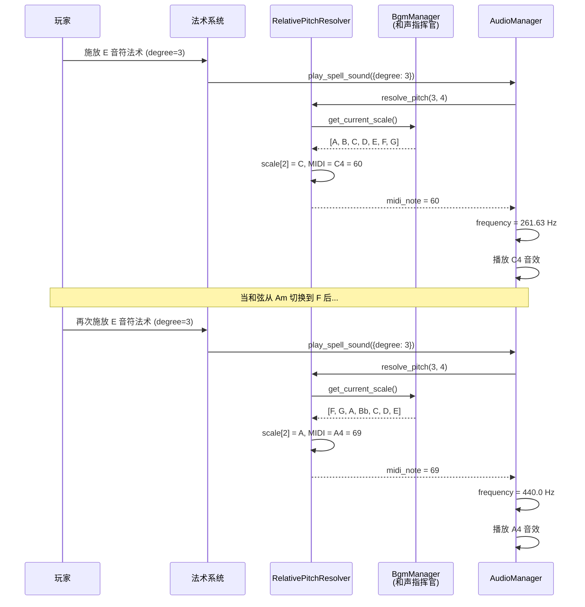

# 法术音效的"相对音高"系统 (Relative Pitch System)

**版本:** 1.0
**最后更新:** 2026-02-12
**状态:** 设计稿
**作者:** Manus AI
**优先级:** P0 — 第一优先级（奠定基础）
**前置依赖:** OPT01 — 全局动态和声指挥官
**关联模块:** `music_theory_engine.gd`, `bgm_manager.gd`, `MusicData`

---

## 1. 设计概述

### 1.1. 现状分析

当前 GDD 为白键音符（C, D, E, F, G, A, B）定义了各自的弹体行为和视觉效果，其核心音高是固定的绝对值。当玩家施放一个 C 音符法术时，它播放的始终是 C 音。这在游戏初期是合理的，但随着和声系统的引入，问题便凸显出来：

- 如果当前 BGM 和弦是 F 大调，一个独立的 C 音虽然是和弦的五音，但其"绝对音高"的身份是孤立的，无法与和弦形成明确的功能关系。
- 如果玩家施放了一个不在当前和弦内的音符（如 B 音），会直接导致听感上的不和谐。

### 1.2. 设计目标

建立一个**相对音高系统**，将法术的音高定义从"播放 C 音"变为"播放当前和弦的某个功能音"。这确保了：

- 无论背景和声如何变化，玩家的每一次施法在听觉上都是"正确"和"悦耳"的。
- 玩家将开始思考"我应该施放一个根音来稳固和声，还是施放一个七音来增加紧张度？"，为战斗策略增加全新的音乐维度。

### 1.3. 设计原则

- **和谐优先：** 所有法术音效必须与当前全局和弦保持和谐。
- **功能化音高：** 法术的音高不再是绝对的，而是相对于当前和弦的功能性角色。
- **向下兼容：** 在和声指挥官未激活时（如教程阶段），系统可回退到绝对音高模式。

---

## 2. 核心机制

### 2.1. 音程度数定义 (Degree Mapping)

将七个白键音符重新定义为调式内的七个级音（Scale Degree）：

| 白键音符 | 音程度数 (Degree) | 功能角色 | 音乐效果 |
| :--- | :--- | :--- | :--- |
| **C** | 1（根音 / Tonic） | 稳定、解决 | 最和谐，适合"收束"和弦进行 |
| **D** | 2（上主音 / Supertonic） | 过渡 | 轻微紧张，引导向下一个音 |
| **E** | 3（中音 / Mediant） | 色彩 | 决定和弦的大/小调色彩 |
| **F** | 4（下属音 / Subdominant） | 运动 | 产生"离开"主和弦的推动力 |
| **G** | 5（属音 / Dominant） | 紧张 | 强烈的回归主和弦的倾向 |
| **A** | 6（下中音 / Submediant） | 柔和色彩 | 提供意外的和声色彩变化 |
| **B** | 7（导音 / Leading Tone） | 极度紧张 | 最强的解决倾向，适合制造悬念 |

### 2.2. 实时音高解析流程

当玩家施放一个法术时，音频系统执行以下步骤：

1. **获取法术度数：** 从法术数据中读取其 `pitch_degree`（1-7）。
2. **查询全局和弦：** 向和声指挥官（`BgmManager`）查询 `get_current_chord()` 获取当前和弦根音和音阶。
3. **计算绝对音高：** 根据当前音阶和法术度数，计算出应播放的 MIDI 音高。
4. **生成/变调音效：** 使用程序化合成器生成该音高的音效，或通过 Pitch Shifting 调整基础音效。

### 2.3. 音高计算算法

```
目标音高 = 当前音阶[degree - 1] + 基础八度 * 12
```

例如，当前音阶为 A 自然小调 `[A, B, C, D, E, F, G]`，法术度数为 3（中音），则目标音高为 C（MIDI 60，即 C4）。

---

## 3. 代码实现（GDScript 接口定义）

### 3.1. 法术数据扩展

```gdscript
# 在法术数据资源中新增字段
# spell_data.gd 或 MusicData 中的法术定义

## 法术的音程度数（1-7，对应调式内的七个级音）
@export var pitch_degree: int = 1

## 法术的基础八度（用于确定最终音高的音域范围）
@export var base_octave: int = 4  ## C4 = MIDI 60
```

### 3.2. 相对音高解析器

```gdscript
# relative_pitch_resolver.gd — 可作为 AudioManager 的内部模块

class_name RelativePitchResolver

## 根据法术度数和当前和声上下文，计算绝对 MIDI 音高
static func resolve_pitch(degree: int, base_octave: int = 4) -> int:
    var harmony = BgmManager.get_current_chord()
    var scale = BgmManager.get_current_scale()
    
    # 确保度数在有效范围内
    var index = clampi(degree - 1, 0, scale.size() - 1)
    var pitch_class = scale[index]
    
    # 计算 MIDI 音高
    var midi_note = pitch_class + (base_octave + 1) * 12
    return midi_note

## 根据法术度数获取对应的和弦功能音
## 优先返回和弦内音，若度数对应的音不在和弦内，返回最近的和弦音
static func resolve_chord_tone(degree: int, base_octave: int = 4) -> int:
    var harmony = BgmManager.get_current_chord()
    var chord_notes = harmony.notes  # Array[int] 音高类
    var scale = BgmManager.get_current_scale()
    
    var index = clampi(degree - 1, 0, scale.size() - 1)
    var target_pc = scale[index]
    
    # 检查是否为和弦内音
    if target_pc in chord_notes:
        return target_pc + (base_octave + 1) * 12
    
    # 不在和弦内，吸附到最近的和弦音
    var quantized = BgmManager.quantize_to_scale(target_pc)
    return quantized + (base_octave + 1) * 12

## 将 MIDI 音高转换为频率 (Hz)
static func midi_to_frequency(midi_note: int) -> float:
    return 440.0 * pow(2.0, (midi_note - 69) / 12.0)
```

### 3.3. AudioManager 集成

```gdscript
# audio_manager.gd — 法术音效播放逻辑修改

## 播放法术音效（使用相对音高系统）
func play_spell_sound(spell_data: Dictionary) -> void:
    var degree: int = spell_data.get("pitch_degree", 1)
    var base_octave: int = spell_data.get("base_octave", 4)
    
    # 解析相对音高
    var midi_note = RelativePitchResolver.resolve_pitch(degree, base_octave)
    var frequency = RelativePitchResolver.midi_to_frequency(midi_note)
    
    # 方案A：程序化合成（推荐，与 OPT08 配合）
    # SynthManager.play_note(frequency, spell_data.timbre_params)
    
    # 方案B：Pitch Shifting 基础采样
    var base_sample = _get_spell_base_sample(spell_data.note_name)
    var pitch_ratio = frequency / _get_base_frequency(spell_data.note_name)
    _play_pitched_sample(base_sample, pitch_ratio)
```

---

## 4. 信号交互流程



---

## 5. 与现有系统的集成点

| 现有系统 | 集成方式 | 说明 |
| :--- | :--- | :--- |
| `music_theory_engine.gd` | 数据引用 | 使用 `MusicData.CHORD_INTERVALS` 进行和弦音计算 |
| `bgm_manager.gd` | API 调用 | 通过 `get_current_chord()` 和 `get_current_scale()` 查询和声上下文 |
| 法术数据定义 | 数据扩展 | 为每个法术新增 `pitch_degree` 和 `base_octave` 字段 |
| `AudioManager` | 逻辑修改 | 修改法术音效播放流程，接入相对音高解析器 |

---

## 6. 引用文档

- `godot_project/scripts/autoload/music_theory_engine.gd` — 和弦识别引擎
- `godot_project/scripts/autoload/music_data.gd` — 乐理数据定义
- `Docs/Audio_Design_Guide.md` — 音频设计指南
- `Docs/Optimization_Modules/OPT01_GlobalDynamicHarmonyConductor.md` — 前置依赖
