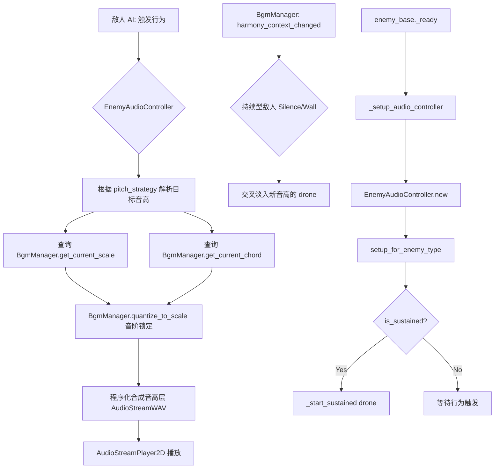

# 赋予敌人"乐器身份"与音高维度 (Musical Instrument Identity for Enemies)

**版本:** 2.0
**最后更新:** 2026-02-12
**状态:** 已实现
**作者:** Manus AI
**优先级:** P1 — 第二优先级（丰富声景）
**前置依赖:** OPT01 — 全局动态和声指挥官（已实现）
**关联模块:** `Enemy_System_Design.md`, `Audio_Design_Guide.md`, `bgm_manager.gd`

---

## 1. 设计概述

### 1.1. 现状分析

`Enemy_System_Design.md` 和 `Audio_Design_Guide.md` 将敌人定义为"不和谐的具象化"和"噪音"，其音效（移动、受击、死亡）被设计为电流干扰、数据错误等非乐音。这是一个非常成功的设计，与玩家的"和谐"行为形成了鲜明对比。然而，这种设计也使敌人在音乐层面完全处于"贡献者"之外——它们只是被净化的"对象"，而不是乐曲的"一个声部"。

### 1.2. 设计目标

在保留敌人"噪音"质感的基础上，为其增加一个**音高维度**，将其从纯粹的"噪音源"提升为"有固定音高的打击乐器或合成器"。每个敌人的行为音效都将经过**音阶锁定（Scale Locking）**处理，使其成为动态乐曲中一个虽然"脏"但音高正确的声部。

### 1.3. 设计原则

- **噪音优先：** 敌人的基础音色仍然是噪音/失真，音高维度是叠加而非替代。
- **音阶锁定：** 所有敌人音效的音高必须经过和声指挥官的音阶量化处理。
- **信息化音景：** 玩家应能通过听觉感知战场威胁（听音辨位、听音辨敌）。

---

## 2. 核心机制

### 2.1. 敌人乐器角色与音域定义

为每种敌人类型分配一个基础的音高范围和音乐角色：

| 敌人类型 | 音乐角色 | 建议音域 | 基础音色描述 | 行为触发时机 |
| :--- | :--- | :--- | :--- | :--- |
| **Static (底噪)** | 高频打击乐 (Hi-hats) | C5-C6 (MIDI 72-84) | 短促、高频的噪音脉冲 | 量化移动时 |
| **Silence (寂静)** | 超低频铺底 (Sub-Bass Pad) | C1-C2 (MIDI 24-36) | 持续的、极低频的嗡鸣 | 存在时持续 |
| **Screech (尖啸)** | 独奏主音 (Lead Synth) | C6-C7 (MIDI 84-96) | 尖锐、穿透的合成器音色 | 攻击/尖啸时 |
| **Pulse (脉冲)** | 节奏型琶音 (Arpeggiator) | C4-C5 (MIDI 60-72) | 规律脉冲的合成器序列 | 蓄力/脉冲释放时 |
| **Wall (音墙)** | 和声长音 (Drone) | C2-C3 (MIDI 36-48) | 厚重、持续的合成器长音 | 存在时持续 |

### 2.2. 音高吸附机制 (Pitch Snapping)

当敌人执行其标志性行为时，音频系统执行以下流程：

1. **获取基础噪音音效：** 根据敌人类型和行为获取对应的噪音采样。
2. **确定目标音域：** 根据敌人的 `base_octave` 和 `pitch_range` 确定音高范围。
3. **音阶锁定：** 调用和声指挥官的 `quantize_to_scale()` 方法，将目标音高吸附到当前全局音阶的合法音符上。
4. **叠加音高层：** 在原始噪音音效之上，叠加一个经过音阶锁定的音高层（使用简单的合成器波形）。
5. **播放混合音效：** 同时播放噪音层和音高层，噪音层音量略高于音高层，保持"噪音"的主体感。

### 2.3. 音高选择策略

不同敌人类型使用不同的音高选择策略：

| 敌人类型 | 音高选择策略 | 说明 |
| :--- | :--- | :--- |
| **Static** | 随机音阶音 | 每次移动随机选择音域内的一个音阶音 |
| **Silence** | 和弦根音 | 始终演奏当前和弦的根音，提供低频基础 |
| **Screech** | 和弦外音→解决 | 先演奏一个不和谐的音（经过音），然后滑向最近的和弦音 |
| **Pulse** | 琶音序列 | 按固定模式依次演奏和弦的各个组成音 |
| **Wall** | 和弦五音 | 始终演奏当前和弦的五音，与根音形成纯五度 |

---

## 3. 实现架构

### 3.1. 新增文件

| 文件路径 | 类名 | 职责 |
| :--- | :--- | :--- |
| `scripts/data/enemy_audio_profile.gd` | `EnemyAudioProfile` | 敌人音频配置资源，定义乐器角色、音域、策略、ADSR 包络等 |
| `scripts/systems/enemy_audio_controller.gd` | `EnemyAudioController` | 敌人音频控制组件，负责音高解析、合成和播放 |

### 3.2. 修改文件

| 文件路径 | 修改内容 |
| :--- | :--- |
| `scripts/entities/enemy_base.gd` | 新增 `_audio_controller` 变量、`_setup_audio_controller()` 方法，在 move/hit/death 行为中触发音高层 |
| `scripts/entities/enemies/enemy_screech.gd` | 在 `_start_dash()` 中触发攻击音高层 |
| `scripts/entities/enemies/enemy_pulse.gd` | 在 `_trigger_burst()` 中触发攻击音高层，修复缩进问题 |

### 3.3. EnemyAudioProfile 配置参数

```gdscript
class_name EnemyAudioProfile
extends Resource

@export var instrument_role: String = "hi_hat"
@export var base_octave: int = 5
@export var pitch_range: int = 12
@export_enum("random_scale", "chord_root", "chord_approach", "arpeggio", "chord_fifth")
var pitch_strategy: String = "random_scale"
@export_range(0.0, 1.0) var noise_mix: float = 0.7
@export_range(0, 3) var pitch_waveform: int = 0  # 0=正弦, 1=方波, 2=锯齿, 3=三角
@export_range(-40.0, 0.0) var pitch_volume_db: float = -12.0

# ADSR 包络
@export_range(0.001, 0.5) var attack_time: float = 0.005
@export_range(0.01, 1.0) var decay_time: float = 0.05
@export_range(0.0, 1.0) var sustain_level: float = 0.7
@export_range(0.01, 2.0) var release_time: float = 0.05

# 持续型配置
@export var is_sustained: bool = false
@export_range(0.5, 4.0) var sustained_loop_duration: float = 2.0

# 琶音配置 (Pulse)
@export_range(0.05, 1.0) var arpeggio_step_interval: float = 0.15
@export_enum("up", "down", "up_down", "random") var arpeggio_mode: String = "up"

# 经过音配置 (Screech)
@export_range(0.01, 0.5) var approach_glide_time: float = 0.08
@export_range(-3, 3) var approach_offset: int = 1
```

### 3.4. EnemyAudioController 核心接口

```gdscript
class_name EnemyAudioController
extends Node

## 根据敌人类型自动配置
func setup_for_enemy_type(type_name: String) -> void

## 播放行为音高层 (move/attack/hit/death)
func play_behavior_pitch(behavior: String) -> void

## 停止持续型音效 (死亡时调用)
func stop_sustained() -> void
```

---

## 4. 信号交互流程



---

## 5. 与现有系统的集成点

| 现有系统 | 集成方式 | 说明 |
| :--- | :--- | :--- |
| `enemy_base.gd` | 组件挂载 | `_ready()` 中动态创建 `EnemyAudioController` 子节点 |
| `enemy_base.gd` | 行为触发 | `_play_quantized_step_sound()`、`take_damage()`、`_die()` 中调用 `play_behavior_pitch()` |
| `enemy_screech.gd` | 攻击触发 | `_start_dash()` 中调用 `play_behavior_pitch("attack")` |
| `enemy_pulse.gd` | 攻击触发 | `_trigger_burst()` 中调用 `play_behavior_pitch("attack")` |
| `bgm_manager.gd` (OPT01) | API 调用 | 通过 `quantize_to_scale()`、`get_current_chord()`、`get_current_scale()` 进行音阶锁定 |
| `bgm_manager.gd` (OPT01) | 信号监听 | 持续型敌人监听 `harmony_context_changed` 信号实时更新音高 |

---

## 6. 各敌人类型预设配置汇总

| 参数 | Static | Silence | Screech | Pulse | Wall |
| :--- | :--- | :--- | :--- | :--- | :--- |
| 乐器角色 | hi_hat | sub_bass_pad | lead_synth | arpeggiator | drone |
| 基础八度 | 5 | 1 | 6 | 4 | 2 |
| 音高策略 | random_scale | chord_root | chord_approach | arpeggio | chord_fifth |
| 噪音混合 | 0.75 | 0.60 | 0.65 | 0.65 | 0.60 |
| 波形类型 | 方波 | 正弦波 | 锯齿波 | 方波 | 三角波 |
| 持续型 | 否 | 是 | 否 | 否 | 是 |
| Attack | 0.002s | 0.3s | 0.001s | 0.003s | 0.4s |
| Decay | 0.03s | 0.5s | 0.08s | 0.05s | 0.6s |
| Sustain | 0.0 | 0.8 | 0.5 | 0.6 | 0.85 |
| Release | 0.02s | 0.5s | 0.1s | 0.04s | 0.8s |

---

## 7. 引用文档

- `Docs/Enemy_System_Design.md` — 敌人系统设计
- `Docs/Audio_Design_Guide.md` — 音频设计指南
- `Docs/Optimization_Modules/OPT01_GlobalDynamicHarmonyConductor.md` — 前置依赖（已实现）
