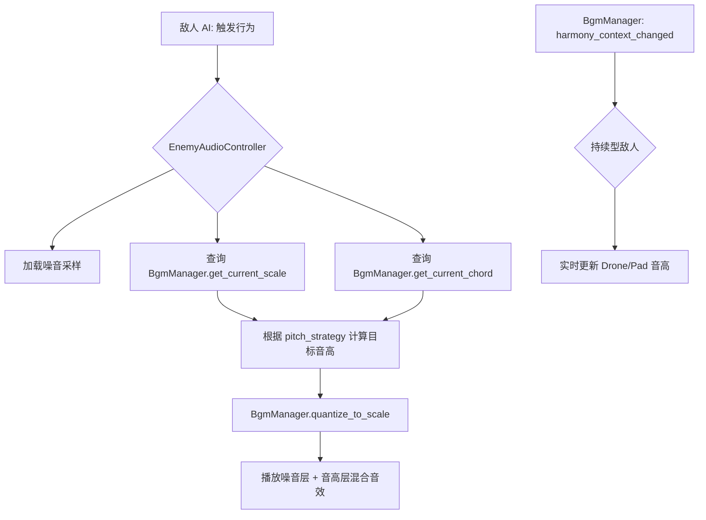

# 赋予敌人"乐器身份"与音高维度 (Musical Instrument Identity for Enemies)

**版本:** 1.0
**最后更新:** 2026-02-12
**状态:** 设计稿
**作者:** Manus AI
**优先级:** P1 — 第二优先级（丰富声景）
**前置依赖:** OPT01 — 全局动态和声指挥官
**关联模块:** `Enemy_System_Design.md`, `Audio_Design_Guide.md`, `bgm_manager.gd`

---

## 1. 设计概述

### 1.1. 现状分析

`Enemy_System_Design.md` 和 `Audio_Design_Guide.md` 将敌人定义为"不和谐的具象化"和"噪音"，其音效（移动、受击、死亡）被设计为电流干扰、数据错误等非乐音。这是一个非常成功的设计，与玩家的"和谐"行为形成了鲜明对比。然而，这种设计也使敌人在音乐层面完全处于"贡献者"之外——它们只是被净化的"对象"，而不是乐曲的"一个声部"。

### 1.2. 设计目标

在保留敌人"噪音"质感的基础上，为其增加一个**音高维度**，将其从纯粹的"噪音源"提升为"有固定音高的打击乐器或合成器"。每个敌人的行为音效都将经过**音阶锁定（Scale Locking）**处理，使其成为动态乐曲中一个虽然"脏"但音高正确的声部。

### 1.3. 设计原则

- **噪音优先：** 敌人的基础音色仍然是噪音/失真，音高维度是叠加而非替代。
- **音阶锁定：** 所有敌人音效的音高必须经过和声指挥官的音阶量化处理。
- **信息化音景：** 玩家应能通过听觉感知战场威胁（听音辨位、听音辨敌）。

---

## 2. 核心机制

### 2.1. 敌人乐器角色与音域定义

为每种敌人类型分配一个基础的音高范围和音乐角色：

| 敌人类型 | 音乐角色 | 建议音域 | 基础音色描述 | 行为触发时机 |
| :--- | :--- | :--- | :--- | :--- |
| **Static (底噪)** | 高频打击乐 (Hi-hats) | C5-C6 (MIDI 72-84) | 短促、高频的噪音脉冲 | 量化移动时 |
| **Silence (寂静)** | 超低频铺底 (Sub-Bass Pad) | C1-C2 (MIDI 24-36) | 持续的、极低频的嗡鸣 | 存在时持续 |
| **Screech (尖啸)** | 独奏主音 (Lead Synth) | C6-C7 (MIDI 84-96) | 尖锐、穿透的合成器音色 | 攻击/尖啸时 |
| **Pulse (脉冲)** | 节奏型琶音 (Arpeggiator) | C4-C5 (MIDI 60-72) | 规律脉冲的合成器序列 | 蓄力/脉冲释放时 |
| **Wall (音墙)** | 和声长音 (Drone) | C2-C3 (MIDI 36-48) | 厚重、持续的合成器长音 | 存在时持续 |

### 2.2. 音高吸附机制 (Pitch Snapping)

当敌人执行其标志性行为时，音频系统执行以下流程：

1. **获取基础噪音音效：** 根据敌人类型和行为获取对应的噪音采样。
2. **确定目标音域：** 根据敌人的 `base_octave` 和 `pitch_range` 确定音高范围。
3. **音阶锁定：** 调用和声指挥官的 `quantize_to_scale()` 方法，将目标音高吸附到当前全局音阶的合法音符上。
4. **叠加音高层：** 在原始噪音音效之上，叠加一个经过音阶锁定的音高层（使用简单的合成器波形）。
5. **播放混合音效：** 同时播放噪音层和音高层，噪音层音量略高于音高层，保持"噪音"的主体感。

### 2.3. 音高选择策略

不同敌人类型使用不同的音高选择策略：

| 敌人类型 | 音高选择策略 | 说明 |
| :--- | :--- | :--- |
| **Static** | 随机音阶音 | 每次移动随机选择音域内的一个音阶音 |
| **Silence** | 和弦根音 | 始终演奏当前和弦的根音，提供低频基础 |
| **Screech** | 和弦外音→解决 | 先演奏一个不和谐的音（经过音），然后滑向最近的和弦音 |
| **Pulse** | 琶音序列 | 按固定模式依次演奏和弦的各个组成音 |
| **Wall** | 和弦五音 | 始终演奏当前和弦的五音，与根音形成纯五度 |

---

## 3. 代码实现（GDScript 接口定义）

### 3.1. 敌人音频配置数据

```gdscript
# enemy_audio_profile.gd — 敌人音频配置资源

class_name EnemyAudioProfile
extends Resource

## 乐器角色标识
@export var instrument_role: String = "hi_hat"

## 基础八度
@export var base_octave: int = 5

## 音域范围（半音数，以 base_octave 为中心）
@export var pitch_range: int = 12

## 音高选择策略
@export_enum("random_scale", "chord_root", "chord_approach", "arpeggio", "chord_fifth")
var pitch_strategy: String = "random_scale"

## 噪音层与音高层的混合比例（0.0 = 纯音高，1.0 = 纯噪音）
@export_range(0.0, 1.0) var noise_mix: float = 0.7

## 基础噪音音效路径
@export var noise_samples: Dictionary = {
    "move": "",
    "attack": "",
    "hit": "",
    "death": "",
}
```

### 3.2. 敌人音频控制器

```gdscript
# enemy_audio_controller.gd — 挂载在敌人节点上的音频控制组件

class_name EnemyAudioController
extends Node

@export var audio_profile: EnemyAudioProfile

var _pitch_player: AudioStreamPlayer2D  ## 音高层播放器
var _noise_player: AudioStreamPlayer2D  ## 噪音层播放器

func _ready() -> void:
    _pitch_player = AudioStreamPlayer2D.new()
    _noise_player = AudioStreamPlayer2D.new()
    add_child(_pitch_player)
    add_child(_noise_player)
    
    # 连接和声上下文变更信号（用于持续型敌人如 Silence/Wall）
    BgmManager.harmony_context_changed.connect(_on_harmony_changed)

## 播放敌人行为音效
func play_behavior_sound(behavior: String) -> void:
    # 1. 播放噪音层
    var noise_sample = _load_noise_sample(behavior)
    if noise_sample:
        _noise_player.stream = noise_sample
        _noise_player.volume_db = linear_to_db(audio_profile.noise_mix)
        _noise_player.play()
    
    # 2. 计算并播放音高层
    var target_midi = _resolve_target_pitch()
    var frequency = 440.0 * pow(2.0, (target_midi - 69) / 12.0)
    _play_pitched_tone(frequency, 1.0 - audio_profile.noise_mix)

## 根据策略解析目标音高
func _resolve_target_pitch() -> int:
    var scale = BgmManager.get_current_scale()
    var chord = BgmManager.get_current_chord()
    var base_midi = audio_profile.base_octave * 12 + 12
    
    match audio_profile.pitch_strategy:
        "random_scale":
            var random_pc = scale[randi() % scale.size()]
            return base_midi + random_pc
        "chord_root":
            return base_midi + chord.root
        "chord_fifth":
            var fifth = (chord.root + 7) % 12
            var quantized = BgmManager.quantize_to_scale(fifth)
            return base_midi + quantized
        "arpeggio":
            var arp_index = _get_arpeggio_step()
            if arp_index < chord.notes.size():
                return base_midi + chord.notes[arp_index]
            return base_midi + chord.root
        "chord_approach":
            # 先返回一个经过音，下次调用时解决到和弦音
            var approach_note = _get_approach_note(chord)
            return base_midi + approach_note
        _:
            return base_midi + chord.root

## 和声上下文变更时更新持续型音效
func _on_harmony_changed(root: int, type: int, notes: Array) -> void:
    if audio_profile.pitch_strategy in ["chord_root", "chord_fifth"]:
        # 持续型敌人需要实时更新其音高
        var target_midi = _resolve_target_pitch()
        _update_sustained_pitch(target_midi)
```

---

## 4. 信号交互流程



---

## 5. 与现有系统的集成点

| 现有系统 | 集成方式 | 说明 |
| :--- | :--- | :--- |
| `Enemy_System_Design.md` | 数据扩展 | 为每种敌人类型添加 `EnemyAudioProfile` 资源 |
| `bgm_manager.gd` | API 调用 | 通过 `quantize_to_scale()` 和 `get_current_chord()` 进行音阶锁定 |
| `Audio_Design_Guide.md` | 设计扩展 | 在现有噪音音效基础上叠加音高层 |
| 敌人场景文件 | 节点添加 | 为每个敌人场景添加 `EnemyAudioController` 节点 |

---

## 6. 引用文档

- `Docs/Enemy_System_Design.md` — 敌人系统设计
- `Docs/Audio_Design_Guide.md` — 音频设计指南
- `Docs/Optimization_Modules/OPT01_GlobalDynamicHarmonyConductor.md` — 前置依赖
