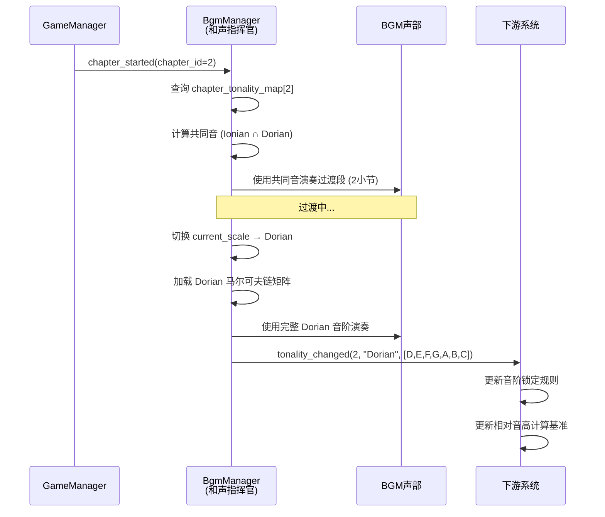

# 引入 BGM 的章节调性演变 (Chapter-Based Tonality Evolution for BGM)

**版本:** 1.0
**最后更新:** 2026-02-12
**状态:** 设计稿
**作者:** Manus AI
**优先级:** P3 — 第四优先级（深化系统）
**前置依赖:** OPT01 — 全局动态和声指挥官
**关联模块:** `bgm_manager.gd`, `关卡与Boss整合设计文档_v3.0.md`, `TimbreSystem_Documentation.md`

---

## 1. 设计概述

### 1.1. 现状分析

GDD 中对七个章节的设计充满了音乐史的隐喻，从古希腊的毕达哥拉斯到现代的频谱音乐，形成了一条清晰的"辩证否定链"。然而，当前的 BGM 系统（`bgm_manager.gd`）在所有章节中似乎都固守在 A 小调或 C 大调的体系内，未能通过音乐自身的演进来体现这一宏大的叙事结构。章节之间的区隔主要依赖于新的敌人和机制，而音乐氛围本身缺乏根本性的变化。

### 1.2. 设计目标

将 GDD 中的音乐史叙事线索，直接转化为 BGM 系统的**调式/音阶演进路线图**。每个章节都应拥有一个独特的、与其历史对标和核心机制相匹配的全局音乐调式，从而通过音乐语言本身来讲述从"古典"到"现代"的演进故事。

### 1.3. 设计原则

- **叙事驱动：** 调式选择必须服务于章节的音乐史主题和情感氛围。
- **渐进复杂：** 调式从简单和谐（Ionian）逐步走向复杂不和谐（Atonal），与游戏难度曲线同步。
- **系统联动：** 调式变更将影响所有依赖和声上下文的子系统（法术音高、敌人音效、召唤物等）。

---

## 2. 核心机制

### 2.1. 章节调式映射表

| 章节 | 历史对标 | 核心机制 | 全局调式/音阶 | 根音 | 音阶音程 | 情感色彩 |
| :--- | :--- | :--- | :--- | :--- | :--- | :--- |
| **Ch1 数之和谐** | 古希腊 | 节奏与单音 | **Ionian (大调)** | C | 2-2-1-2-2-2-1 | 纯净、和谐、明亮 |
| **Ch2 记谱之光** | 中世纪 | 三和弦 | **Dorian** | D | 2-1-2-2-2-1-2 | 忧郁、神圣、空灵 |
| **Ch3 复调迷宫** | 巴洛克 | 和弦进行 | **Mixolydian** | G | 2-2-1-2-2-1-2 | 明亮、具有导向性 |
| **Ch4 完美形式** | 古典主义 | 七和弦/复调 | **Phrygian** | E | 1-2-2-2-1-2-2 | 戏剧性、紧张、异域 |
| **Ch5 命运之力** | 浪漫主义 | 不和谐度 | **Locrian** | B | 1-2-2-1-2-2-2 | 极度不和谐、冲突 |
| **Ch6 即兴之魂** | 爵士时代 | 扩展和弦/摇摆 | **Blues Scale** | C | 3-2-1-1-3-2 | 蓝调、张力、表现力 |
| **Ch7 频谱之境** | 现代/未来 | 频谱相位 | **Chromatic / Twelve-Tone** | — | 1-1-1-1-1-1-1-1-1-1-1-1 | 无调性、自由、混沌 |

### 2.2. 调式数据结构

每个调式包含以下信息：

```gdscript
## 调式配置数据
var chapter_tonality_map: Dictionary = {
    1: {
        "name": "Ionian",
        "root": 0,  # C
        "intervals": [2, 2, 1, 2, 2, 2, 1],
        "scale_notes": [0, 2, 4, 5, 7, 9, 11],  # C D E F G A B
        "markov_matrix_id": "ionian_default",
        "suggested_bpm_range": [100, 120],
        "pad_character": "warm_sine",
    },
    2: {
        "name": "Dorian",
        "root": 2,  # D
        "intervals": [2, 1, 2, 2, 2, 1, 2],
        "scale_notes": [2, 4, 5, 7, 9, 11, 0],  # D E F G A B C
        "markov_matrix_id": "dorian_default",
        "suggested_bpm_range": [90, 110],
        "pad_character": "hollow_pad",
    },
    # ... 其余章节配置 ...
    7: {
        "name": "Chromatic",
        "root": -1,  # 无固定根音
        "intervals": [1, 1, 1, 1, 1, 1, 1, 1, 1, 1, 1, 1],
        "scale_notes": [0, 1, 2, 3, 4, 5, 6, 7, 8, 9, 10, 11],
        "markov_matrix_id": "chromatic_random",
        "suggested_bpm_range": [130, 160],
        "pad_character": "spectral_noise",
    },
}
```

### 2.3. 调式切换流程

1. **触发条件：** 当 `GameManager` 广播章节切换事件（如 `chapter_started` 信号）时触发。
2. **加载调式：** 和声指挥官从 `chapter_tonality_map` 中查询新章节的调式配置。
3. **更新全局状态：** 设置 `current_scale`、`current_chord_root`，并加载对应的马尔可夫链矩阵。
4. **过渡处理：** 在章节切换时，BGM 执行一个 2-4 小节的过渡段，从旧调式平滑过渡到新调式（通过共同音或半音移动）。
5. **广播变更：** 通过 `tonality_changed` 信号通知所有下游系统。

### 2.4. 调式过渡算法

为了避免调式切换时的突兀感，系统将使用**共同音过渡法**：

1. 计算旧音阶与新音阶的共同音（Common Tones）。
2. 在过渡的前 2 个小节中，BGM 仅使用共同音进行演奏。
3. 在过渡的后 2 个小节中，逐步引入新音阶的特征音（Characteristic Tones）。
4. 过渡完成后，完全切换到新调式。

---

## 3. 代码实现（GDScript 接口定义）

### 3.1. 新增信号

```gdscript
# bgm_manager.gd — 新增信号
signal tonality_changed(chapter_id: int, mode_name: String, scale_notes: Array)
```

### 3.2. 调式管理逻辑

```gdscript
# bgm_manager.gd — 新增调式管理方法

## 章节调式映射配置（可外部化为 JSON/Resource）
var _chapter_tonality_map: Dictionary = {}  # 见 2.2 节数据结构

## 当前调式信息
var _current_mode_name: String = "Ionian"
var _current_chapter_id: int = 1
var _is_transitioning: bool = false

func _ready() -> void:
    # ... 现有代码 ...
    GameManager.chapter_started.connect(_on_chapter_started)
    _load_tonality_config()

## 响应章节切换
func _on_chapter_started(chapter_id: int) -> void:
    if chapter_id == _current_chapter_id:
        return
    
    var config = _chapter_tonality_map.get(chapter_id, null)
    if config == null:
        push_warning("未找到章节 %d 的调式配置" % chapter_id)
        return
    
    _current_chapter_id = chapter_id
    _start_tonality_transition(config)

## 启动调式过渡
func _start_tonality_transition(new_config: Dictionary) -> void:
    _is_transitioning = true
    var old_scale = current_scale.duplicate()
    var new_scale: Array[int] = new_config.scale_notes
    
    # 计算共同音
    var common_tones: Array[int] = []
    for note in old_scale:
        if note in new_scale:
            common_tones.append(note)
    
    # 阶段1：仅使用共同音（2小节）
    _set_transition_scale(common_tones if common_tones.size() >= 3 else old_scale)
    
    # 等待2小节后切换到完整新音阶
    await _wait_measures(2)
    
    # 阶段2：切换到新调式
    current_scale = new_scale
    _current_mode_name = new_config.name
    
    # 加载新的马尔可夫链矩阵
    _load_markov_matrix(new_config.markov_matrix_id)
    
    # 设置新的默认和弦（新调式的主和弦）
    if new_config.root >= 0:
        current_chord_root = new_config.root
        current_chord_notes = _calculate_chord_notes(new_config.root, MusicData.ChordType.MINOR)
    
    _is_transitioning = false
    
    # 广播调式变更
    tonality_changed.emit(_current_chapter_id, _current_mode_name, current_scale)

## 获取当前调式名称
func get_current_mode() -> String:
    return _current_mode_name
```

---

## 4. 信号交互流程



---

## 5. 与现有系统的集成点

| 现有系统 | 集成方式 | 说明 |
| :--- | :--- | :--- |
| `GameManager` | 信号连接 | 监听 `chapter_started` 信号触发调式切换 |
| `bgm_manager.gd` | 内部扩展 | 新增调式管理和过渡逻辑 |
| `关卡与Boss整合设计文档` | 设计对齐 | 确保章节调式与 Boss 战音乐氛围一致 |
| `TimbreSystem_Documentation.md` | 设计协同 | 章节专属音色武器的音色应与该章节调式的情感色彩匹配 |
| OPT01 和声指挥官 | 数据更新 | 调式切换时更新 `current_scale` 和马尔可夫链矩阵 |

---

## 6. 引用文档

- `Docs/关卡与Boss整合设计文档_v3.0.md` — 章节与 Boss 设计
- `Docs/TimbreSystem_Documentation.md` — 音色武器系统
- `godot_project/scripts/autoload/bgm_manager.gd` — BGM 管理器
- `Docs/Optimization_Modules/OPT01_GlobalDynamicHarmonyConductor.md` — 前置依赖
