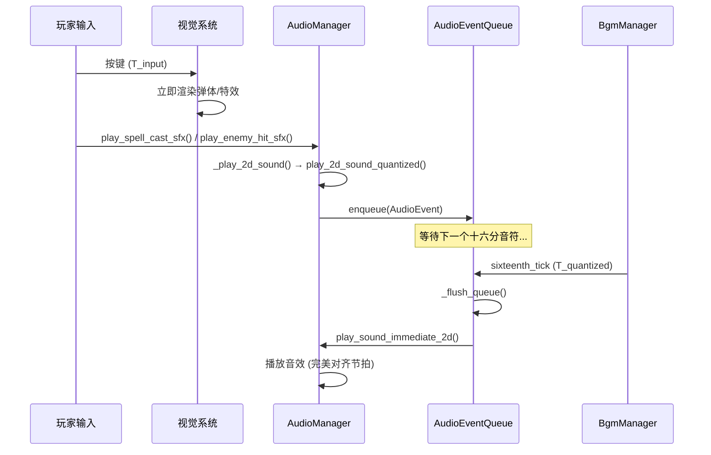

# 引入"Rez 式"输入量化错觉 (Rez-Style Input Quantization Illusion)

**版本:** 2.0
**最后更新:** 2026-02-12
**状态:** ✅ 已实现
**作者:** Manus AI
**优先级:** P2 — 第三优先级（提升体验）
**前置依赖:** 无硬性依赖（可独立实现，但与 OPT01 配合效果最佳）
**关联模块:** `bgm_manager.gd`, `audio_manager.gd`, `audio_event.gd`, `audio_event_queue.gd`

---

## 1. 设计概述

### 1.1. 现状分析

项目已经拥有一个"完美卡拍"的奖励机制，鼓励玩家在节拍上进行操作。然而，对于那些未能完美卡拍的"非完美"输入，系统是即时响应的——视觉和音频同时发生。这在功能上没有问题，但在追求"音乐性"的极致体验上，却错失了一个创造"人人都是节奏大师"错觉的机会。

### 1.2. 设计目标

借鉴传奇音乐游戏《Rez》的核心设计：**视觉即时，音频量化**。无论玩家何时按下按键，视觉效果（弹体发射、粒子特效）都立即发生；但与该操作关联的**音效**，则被系统自动"延迟"并"吸附"到最近的下一个**十六分音符**节拍点上播放。

### 1.3. 设计原则

- **视觉即时：** 操作的视觉反馈不受任何延迟影响，保持操作的响应性。
- **音频量化：** 所有游戏音效（法术、敌人受击等）都对齐到十六分音符网格。
- **无感延迟：** 最大延迟不超过一个十六分音符的时长（120BPM 下约 125ms），在人类感知阈值内。

---

## 2. 核心机制

### 2.1. 音效事件队列 (Audio Event Queue)

系统的核心是一个轻量级的音效事件队列，位于 `AudioManager` 中：

| 组件 | 职责 |
| :--- | :--- |
| **AudioEvent** (`audio_event.gd`) | 封装音效事件数据结构，包含音效 ID、音高、音量、位置、来源类型等 |
| **AudioEventQueue** (`audio_event_queue.gd`) | 存储待播放的音效事件，监听 BGM 时钟信号，在节拍点批量处理 |
| **BGM 时钟信号** (`sixteenth_tick`) | `bgm_manager.gd` 暴露的十六分音符时钟信号 |
| **即时视觉分发器** | 在音效入队的同时，立即触发对应的视觉效果（无需修改） |

### 2.2. 事件处理流程

1. **玩家输入发生：** 玩家在时间 `T_input` 按下按键。
2. **视觉即时触发：** 视觉系统立即在 `T_input` 渲染弹体发射、粒子特效等。
3. **音效事件入队：** `AudioManager` 创建一个 `AudioEvent` 并加入队列，记录 `T_input` 时间戳。
4. **等待节拍点：** 队列等待下一个十六分音符节拍点 `T_quantized`。
5. **批量播放：** 在 `T_quantized` 到来时，队列中所有在 `T_prev_quantized` 到 `T_quantized` 之间入队的事件被一次性播放。

### 2.3. 量化精度与延迟分析

| BPM | 十六分音符间隔 | 最大延迟 | 平均延迟 | 人类感知阈值 |
| :--- | :--- | :--- | :--- | :--- |
| 100 | 150ms | 150ms | 75ms | 约 100-150ms |
| 120 | 125ms | 125ms | 62.5ms | 约 100-150ms |
| 140 | 107ms | 107ms | 53.5ms | 约 100-150ms |
| 160 | 93.75ms | 93.75ms | 46.9ms | 约 100-150ms |

在项目的 BPM 范围内（100-160），最大延迟均在人类"视听同步感知阈值"（约 100-150ms）附近或以内，配合即时的视觉反馈，玩家几乎不会感知到延迟。

### 2.4. 量化强度配置

为了适应不同玩家的偏好，提供三种量化强度的配置选项：

| 量化模式 | 说明 | 适用场景 |
| :--- | :--- | :--- |
| **Full（完全量化）** | 所有音效严格对齐到十六分音符 | 默认模式，最佳音乐体验 |
| **Soft（柔性量化）** | 仅当偏差 > 1/32 音符时才量化 | 高手模式，保留精确输入的即时感 |
| **Off（关闭）** | 音效即时播放，无量化 | 无障碍/竞技模式 |

---

## 3. 实现文件清单

### 3.1. 新增文件

| 文件路径 | 说明 |
| :--- | :--- |
| `godot_project/scripts/audio/audio_event.gd` | 音效事件数据结构（`class_name AudioEvent`） |
| `godot_project/scripts/audio/audio_event_queue.gd` | 音效事件量化队列管理器（`class_name AudioEventQueue`） |

### 3.2. 修改文件

| 文件路径 | 修改内容 |
| :--- | :--- |
| `godot_project/scripts/autoload/bgm_manager.gd` | 新增 `sixteenth_tick` 信号；在 `_tick_sixteenth()` 中发射信号 |
| `godot_project/scripts/autoload/audio_manager.gd` | 集成 `AudioEventQueue`；新增量化播放接口；内部播放路径改为走量化队列 |
| `godot_project/scripts/ui/settings_menu.gd` | 新增量化模式选项（Full/Soft/Off） |
| `godot_project/scripts/ui/debug_panel.gd` | 新增"音效量化 (OPT05)"调试统计区域 |

---

## 4. 代码实现详解

### 4.1. AudioEvent — 音效事件数据结构

```gdscript
# scripts/audio/audio_event.gd
class_name AudioEvent
extends RefCounted

enum SourceType {
    SPELL,              ## 玩家法术施放音效
    CHORD,              ## 和弦法术音效
    ENEMY_HIT,          ## 敌人受击音效
    ENEMY_DEATH,        ## 敌人死亡音效
    ENEMY_MOVE,         ## 敌人移动音效
    STATUS_FEEDBACK,    ## 状态反馈音效
    PROGRESSION,        ## 和弦进行完成音效
    OTHER,              ## 其他音效
}

var sound_id: String = ""
var pitch: float = 1.0
var volume_db: float = 0.0
var position: Vector2 = Vector2.ZERO
var is_spatial: bool = false
var timestamp_ms: float = 0.0
var source_type: SourceType = SourceType.OTHER
var bus_name: String = "SFX"
var extra_data: Dictionary = {}

# 提供工厂方法：create_spell(), create_chord(), create_enemy(), create_global()
```

### 4.2. AudioEventQueue — 量化队列管理器

```gdscript
# scripts/audio/audio_event_queue.gd
class_name AudioEventQueue
extends Node

enum QuantizeMode { FULL, SOFT, OFF }

var quantize_mode: QuantizeMode = QuantizeMode.FULL
var _queue: Array[AudioEvent] = []

func _ready() -> void:
    # 连接 BGMManager 的十六分音符时钟信号
    BGMManager.sixteenth_tick.connect(_on_sixteenth_tick)

func enqueue(event: AudioEvent) -> void:
    match quantize_mode:
        QuantizeMode.OFF:
            _play_event(event)  # 直接播放
        QuantizeMode.SOFT:
            if _get_time_to_next_sixteenth() < SOFT_QUANTIZE_THRESHOLD_SEC:
                _play_event(event)
            else:
                _queue.append(event)
        QuantizeMode.FULL:
            _queue.append(event)

func _on_sixteenth_tick(_idx: int) -> void:
    _flush_queue()  # 在节拍点批量播放所有待处理事件

func _flush_queue() -> void:
    for event in _queue:
        _play_event(event)
    _queue.clear()
```

### 4.3. BGMManager 信号扩展

```gdscript
# bgm_manager.gd — 新增信号
signal sixteenth_tick(sixteenth_index: int)

# 在 _tick_sixteenth() 方法中发射
func _tick_sixteenth() -> void:
    # ... 原有逻辑 ...
    sixteenth_tick.emit(_current_sixteenth)
```

### 4.4. AudioManager 集成

```gdscript
# audio_manager.gd — 关键修改

var _event_queue: AudioEventQueue = null

func _ready() -> void:
    # ... 原有初始化 ...
    _setup_event_queue()  # OPT05

func _setup_event_queue() -> void:
    _event_queue = AudioEventQueue.new()
    _event_queue.name = "AudioEventQueue"
    _event_queue.set_audio_manager(self)
    add_child(_event_queue)

# 新增量化播放接口
func play_2d_sound_quantized(sound_name, position, volume_db, pitch, bus, source_type) -> void
func play_global_sound_quantized(sound_name, volume_db, pitch, bus, source_type) -> void

# 新增即时播放接口（供 AudioEventQueue 回调）
func play_sound_immediate_2d(sound_name, position, volume_db, pitch, bus) -> void
func play_sound_immediate_global(sound_name, volume_db, pitch, bus) -> void

# 新增量化模式控制接口
func set_quantize_mode(mode: AudioEventQueue.QuantizeMode) -> void
func get_quantize_mode() -> AudioEventQueue.QuantizeMode
func get_quantize_stats() -> Dictionary

# 内部播放函数自动走量化路径
func _play_2d_sound(...) -> void:
    play_2d_sound_quantized(...)  # 自动量化

func _play_global_sound(...) -> void:
    play_global_sound_quantized(...)  # 自动量化
```

---

## 5. 信号交互流程



---

## 6. 安全机制

| 机制 | 说明 |
| :--- | :--- |
| **超时强制播放** | 事件在队列中停留超过 500ms 时强制播放，防止 BGM 暂停时事件丢失 |
| **BGM 未播放回退** | 当 BGM 未播放时，定期（每 500ms）刷新队列，确保音效不会永远不播放 |
| **队列为空时零开销** | 队列为空时 `_flush_queue()` 立即返回，无性能影响 |
| **回退机制** | 如果 `AudioEventQueue` 不可用，自动回退到即时播放 |

---

## 7. 调试支持

在调试面板（`debug_panel.gd`）中新增"音效量化 (OPT05)"区域：

- **量化模式显示：** 实时显示当前量化模式（FULL / SOFT / OFF）
- **队列大小：** 实时显示当前队列中待处理的事件数量
- **统计信息：** 总入队数、已处理数、即时播放数
- **模式切换按钮：** 可在运行时切换量化模式进行对比测试

---

## 8. 与现有系统的集成点

| 现有系统 | 集成方式 | 说明 |
| :--- | :--- | :--- |
| `bgm_manager.gd` | 信号连接 | 新增 `sixteenth_tick` 信号，在 `_tick_sixteenth()` 中发射 |
| `audio_manager.gd` | 逻辑包装 | 内部 `_play_2d_sound` / `_play_global_sound` 自动走量化路径 |
| 法术系统 | 透明集成 | 无需修改调用方，所有通过 `AudioManager` 播放的音效自动量化 |
| 视觉系统 | 无修改 | 视觉反馈保持即时，无需任何改动 |
| 设置菜单 | 新增选项 | 玩家可在设置中选择量化模式 |
| 调试面板 | 新增区域 | 开发者可实时监控量化系统状态 |

---

## 9. 引用文档

- `godot_project/scripts/audio/audio_event.gd` — 音效事件数据结构
- `godot_project/scripts/audio/audio_event_queue.gd` — 音效事件量化队列
- `godot_project/scripts/autoload/bgm_manager.gd` — BGM 管理器（时钟源）
- `godot_project/scripts/autoload/audio_manager.gd` — 音效管理器（集成点）
- `Docs/Audio_Design_Guide.md` — 音频设计指南
- 《Rez》/ 《Rez Infinite》— 设计灵感来源
