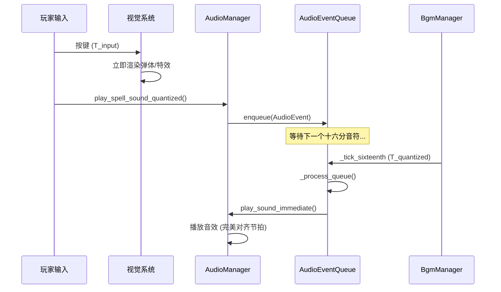

# 引入"Rez 式"输入量化错觉 (Rez-Style Input Quantization Illusion)

**版本:** 1.0
**最后更新:** 2026-02-12
**状态:** 设计稿
**作者:** Manus AI
**优先级:** P2 — 第三优先级（提升体验）
**前置依赖:** 无硬性依赖（可独立实现，但与 OPT01 配合效果最佳）
**关联模块:** `bgm_manager.gd`, `AudioManager`, `GameManager`

---

## 1. 设计概述

### 1.1. 现状分析

项目已经拥有一个"完美卡拍"的奖励机制，鼓励玩家在节拍上进行操作。然而，对于那些未能完美卡拍的"非完美"输入，系统是即时响应的——视觉和音频同时发生。这在功能上没有问题，但在追求"音乐性"的极致体验上，却错失了一个创造"人人都是节奏大师"错觉的机会。

### 1.2. 设计目标

借鉴传奇音乐游戏《Rez》的核心设计：**视觉即时，音频量化**。无论玩家何时按下按键，视觉效果（弹体发射、粒子特效）都立即发生；但与该操作关联的**音效**，则被系统自动"延迟"并"吸附"到最近的下一个**十六分音符**节拍点上播放。

### 1.3. 设计原则

- **视觉即时：** 操作的视觉反馈不受任何延迟影响，保持操作的响应性。
- **音频量化：** 所有游戏音效（法术、敌人受击等）都对齐到十六分音符网格。
- **无感延迟：** 最大延迟不超过一个十六分音符的时长（120BPM 下约 125ms），在人类感知阈值内。

---

## 2. 核心机制

### 2.1. 音效事件队列 (Audio Event Queue)

系统的核心是一个轻量级的音效事件队列，位于 `AudioManager` 中：

| 组件 | 职责 |
| :--- | :--- |
| **AudioEventQueue** | 存储待播放的音效事件，每个事件包含音效资源、音高、音量等参数 |
| **BGM 时钟同步器** | 监听 `bgm_manager` 的 `_tick_sixteenth` 信号，在每个十六分音符节拍点触发队列处理 |
| **即时视觉分发器** | 在音效入队的同时，立即触发对应的视觉效果 |

### 2.2. 事件处理流程

1. **玩家输入发生：** 玩家在时间 `T_input` 按下按键。
2. **视觉即时触发：** 视觉系统立即在 `T_input` 渲染弹体发射、粒子特效等。
3. **音效事件入队：** `AudioManager` 创建一个 `AudioEvent` 并加入队列，记录 `T_input` 时间戳。
4. **等待节拍点：** 队列等待下一个十六分音符节拍点 `T_quantized`。
5. **批量播放：** 在 `T_quantized` 到来时，队列中所有在 `T_prev_quantized` 到 `T_quantized` 之间入队的事件被一次性播放。

### 2.3. 量化精度与延迟分析

| BPM | 十六分音符间隔 | 最大延迟 | 平均延迟 | 人类感知阈值 |
| :--- | :--- | :--- | :--- | :--- |
| 100 | 150ms | 150ms | 75ms | 约 100-150ms |
| 120 | 125ms | 125ms | 62.5ms | 约 100-150ms |
| 140 | 107ms | 107ms | 53.5ms | 约 100-150ms |
| 160 | 93.75ms | 93.75ms | 46.9ms | 约 100-150ms |

在项目的 BPM 范围内（100-160），最大延迟均在人类"视听同步感知阈值"（约 100-150ms）附近或以内，配合即时的视觉反馈，玩家几乎不会感知到延迟。

### 2.4. 可选：量化强度配置

为了适应不同玩家的偏好，可以提供量化强度的配置选项：

| 量化模式 | 说明 | 适用场景 |
| :--- | :--- | :--- |
| **Full（完全量化）** | 所有音效严格对齐到十六分音符 | 默认模式，最佳音乐体验 |
| **Soft（柔性量化）** | 仅当偏差 > 1/32 音符时才量化 | 高手模式，保留精确输入的即时感 |
| **Off（关闭）** | 音效即时播放，无量化 | 无障碍/竞技模式 |

---

## 3. 代码实现（GDScript 接口定义）

### 3.1. 音效事件数据结构

```gdscript
# audio_event.gd

class_name AudioEvent

var sound_id: String          ## 音效资源标识
var pitch: float = 1.0        ## 音高（频率或 pitch_scale）
var volume_db: float = 0.0    ## 音量 (dB)
var position: Vector2 = Vector2.ZERO  ## 空间位置（用于 2D 空间化）
var timestamp: float = 0.0    ## 原始输入时间戳
var source_type: String = ""  ## 来源类型（"spell", "enemy_hit", "summon" 等）
```

### 3.2. 音效事件队列管理器

```gdscript
# audio_event_queue.gd — AudioManager 的内部模块

class_name AudioEventQueue
extends Node

## 待播放的事件队列
var _queue: Array[AudioEvent] = []

## 量化模式
enum QuantizeMode { FULL, SOFT, OFF }
var quantize_mode: QuantizeMode = QuantizeMode.FULL

## 柔性量化阈值（秒）
const SOFT_QUANTIZE_THRESHOLD: float = 0.03  # 约 1/32 音符 @120BPM

func _ready() -> void:
    # 连接 BGM 的十六分音符时钟信号
    BgmManager.bgm_beat_synced.connect(_on_beat_synced)

## 将音效事件加入队列
func enqueue(event: AudioEvent) -> void:
    event.timestamp = Time.get_ticks_msec() / 1000.0
    
    match quantize_mode:
        QuantizeMode.OFF:
            # 直接播放，不入队
            _play_event(event)
        QuantizeMode.SOFT:
            # 检查是否接近节拍点
            var time_to_next = _get_time_to_next_sixteenth()
            if time_to_next < SOFT_QUANTIZE_THRESHOLD:
                _play_event(event)  # 足够接近，直接播放
            else:
                _queue.append(event)
        QuantizeMode.FULL:
            _queue.append(event)

## 十六分音符节拍点回调
func _on_beat_synced(beat_index: int) -> void:
    # 注意：需要将 bgm_manager 的 _tick_sixteenth 暴露为信号
    # 或在 _process 中自行计算十六分音符时间点
    _process_queue()

## 处理队列：播放所有待处理事件
func _process_queue() -> void:
    for event in _queue:
        _play_event(event)
    _queue.clear()

## 实际播放音效
func _play_event(event: AudioEvent) -> void:
    # 委托给 AudioManager 的实际播放逻辑
    AudioManager.play_sound_immediate(
        event.sound_id,
        event.pitch,
        event.volume_db,
        event.position
    )

## 计算距离下一个十六分音符的时间
func _get_time_to_next_sixteenth() -> float:
    var sixteenth_interval = 60.0 / (BgmManager._bpm * 4.0)
    var current_time = Time.get_ticks_msec() / 1000.0
    var elapsed_in_beat = fmod(current_time, sixteenth_interval)
    return sixteenth_interval - elapsed_in_beat
```

### 3.3. 集成到现有音效播放流程

```gdscript
# audio_manager.gd — 修改现有播放接口

var _event_queue: AudioEventQueue

func _ready() -> void:
    _event_queue = AudioEventQueue.new()
    add_child(_event_queue)

## 公共接口：播放法术音效（经过量化）
func play_spell_sound_quantized(spell_data: Dictionary, position: Vector2) -> void:
    var event = AudioEvent.new()
    event.sound_id = spell_data.sound_id
    event.pitch = spell_data.get("pitch", 1.0)
    event.volume_db = spell_data.get("volume_db", 0.0)
    event.position = position
    event.source_type = "spell"
    
    _event_queue.enqueue(event)

## 内部接口：即时播放（被队列调用）
func play_sound_immediate(sound_id: String, pitch: float, volume_db: float, position: Vector2) -> void:
    # 现有的音效播放逻辑
    pass
```

---

## 4. 信号交互流程



---

## 5. 与现有系统的集成点

| 现有系统 | 集成方式 | 说明 |
| :--- | :--- | :--- |
| `bgm_manager.gd` | 信号连接 | 需要将内部的 `_tick_sixteenth` 暴露为公共信号 |
| `AudioManager` | 逻辑包装 | 在现有播放接口外层包装量化队列 |
| 法术系统 | 调用修改 | 将 `play_sound()` 调用改为 `play_spell_sound_quantized()` |
| 视觉系统 | 无修改 | 视觉反馈保持即时，无需任何改动 |

---

## 6. 引用文档

- `godot_project/scripts/autoload/bgm_manager.gd` — BGM 管理器（时钟源）
- `Docs/Audio_Design_Guide.md` — 音频设计指南
- 《Rez》/ 《Rez Infinite》— 设计灵感来源
