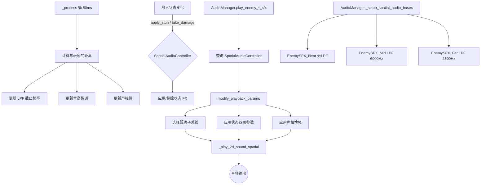

# 利用空间音频进行信息传递 (Spatial Audio for Information Delivery)

**版本:** 2.0
**最后更新:** 2026-02-12
**状态:** 已实现
**作者:** Manus AI
**优先级:** P2 — 第三优先级（提升体验）
**前置依赖:** OPT03 — 敌人乐器身份（可选，但配合效果最佳）
**关联模块:** `Audio_Design_Guide.md`, `Enemy_System_Design.md`, `AudioStreamPlayer2D`

> **关联代码:**
> - `scripts/systems/spatial_audio_controller.gd` — 空间音频控制器（核心）
> - `scripts/autoload/audio_manager.gd` — 音频管理器（已扩展空间音频总线和播放接口）
> - `scripts/entities/enemy_base.gd` — 敌人基类（已集成 SpatialAudioController）
> - `scripts/entities/enemies/elite_base.gd` — 精英基类（已集成状态音效切换）

---

## 1. 设计概述

### 1.1. 现状分析

`AudioManager` 中使用了 `AudioStreamPlayer2D`，表明系统已经具备了播放空间化音频的基础能力。然而，从现有文档来看，其主要用途仍停留在传统的"根据距离衰减音量"的层面，未能充分挖掘空间音频作为信息传递媒介的潜力。在弹幕密集、敌人众多的后期关卡，玩家的视觉通道往往不堪重负。

### 1.2. 设计目标

将空间音频从简单的沉浸感增强工具，转变为一个功能性的**非视觉信息通道**，实现：

- **听音辨位：** 通过声相（Panning）和音色变化精确传达敌人的方位和距离。
- **听音辨状态：** 通过特殊音频效果（FX）即时传达敌人的关键状态变化。
- **降低视觉过载：** 将部分信息从视觉通道转移到听觉通道，减轻认知负担。

### 1.3. 设计原则

- **信息优先：** 空间音频的首要目的是传递信息，其次才是沉浸感。
- **直觉映射：** 音频参数的变化必须与游戏状态建立直觉的、易于学习的映射关系。
- **性能友好：** 音频效果处理不应对帧率产生显著影响。

---

## 2. 核心机制

### 2.1. 基于方向的声相处理 (Directional Panning)

所有敌人的关键音效都应严格根据其在屏幕上的相对位置进行声相处理：

| 敌人位置 | 声相值 (Pan) | 效果 |
| :--- | :--- | :--- |
| 屏幕最左侧 | -1.0 | 声音完全从左声道发出 |
| 屏幕中央 | 0.0 | 声音从两个声道均匀发出 |
| 屏幕最右侧 | +1.0 | 声音完全从右声道发出 |

**实现方式：** `SpatialAudioController._calculate_pan()` 基于敌人相对于玩家的水平位置，以半个视口宽度为满幅，将相对位置映射到 `[-1.0, 1.0]`。`AudioManager._play_2d_sound_spatial()` 通过调整 `AudioStreamPlayer2D.panning_strength` 增强空间化效果。

### 2.2. 基于距离的音色动态调制

距离不仅影响音量，更应影响音色。我们通过三级距离子总线模拟真实世界中声音在空气中传播的物理衰减特性：

**低通滤波器 (Low-Pass Filter, LPF) 参数映射：**

| 距离范围 | 音量衰减 | LPF 截止频率 | 音高微调 | 听感效果 |
| :--- | :--- | :--- | :--- | :--- |
| 近距 (0-200px) | 线性衰减 | 20000 Hz（无效果） | 1.0（无变化） | 清晰、明亮 |
| 中距 (200-500px) | 对数衰减 | 8000-4000 Hz | 1.0 | 略显沉闷 |
| 远距 (500px+) | 强对数衰减 | 4000-1500 Hz | 1.0-1.03 | 模糊、遥远 |

**实现方式：** `SpatialAudioController._calculate_lpf_cutoff()` 和 `_calculate_pitch_scale()` 计算参数，通过 `modify_playback_params()` 传递给 `AudioManager`，由 `AudioManager` 将音效路由到对应的距离子总线。

### 2.3. 基于状态的特殊音效处理 (State-Based FX)

当敌人进入特定战斗状态时，其音效将被叠加独特的音频效果：

| 敌人状态 | 音频效果 | 实现方式 | 听感描述 |
| :--- | :--- | :--- | :--- |
| **眩晕 (Stunned)** | 镶边 (Flanger) | 音高振荡调制 (±0.15, 3Hz) | 周期性"嗖嗖"声，听起来"摇摇晃晃" |
| **精英/危险** | 失真 (Distortion) | 音高降低 (-0.15) + 音量增大 (+3dB) | 低沉的金属质感，更具"分量"和"威胁性" |
| **蓄力中** | 上升滤波扫频 | LPF Cutoff 渐增 (800→16000 Hz) | 声音从沉闷逐渐变得明亮，暗示即将释放 |
| **低血量** | 颤音 (Tremolo) | 音量振荡调制 (±6dB, 4Hz) | 声音忽大忽小，暗示虚弱/不稳定 |
| **护盾激活** | 移相 (Phaser) | 轻微音高振荡 (±0.08, 1.5Hz) + 音高微降 | 声音带有金属质感的相位移动 |

**实现方式：** `SpatialAudioController.get_state_fx_params()` 返回状态效果参数字典，`_apply_state_fx_to_params()` 将效果叠加到播放参数上。状态切换由 `enemy_base.gd` 和 `elite_base.gd` 在相应事件中触发。

### 2.4. 音频总线架构

为了高效管理空间音频效果，已扩展 Godot 的音频总线架构：

```
Master
├── Music (BGM)
├── SFX
│   ├── EnemySFX (敌人音效主总线)
│   │   ├── EnemySFX_Near (近距敌人 — 无 LPF，清晰明亮)
│   │   ├── EnemySFX_Mid  (中距敌人 — LPF 6000Hz，略显沉闷)
│   │   └── EnemySFX_Far  (远距敌人 — LPF 2500Hz，模糊遥远)
│   ├── PlayerSFX (玩家音效)
│   └── UI (UI 音效)
└── ...
```

**实现方式：** `AudioManager._setup_spatial_audio_buses()` 在启动时自动创建三个距离子总线，并通过 `_ensure_bus_lpf()` 为中距和远距总线挂载 `AudioEffectLowPassFilter`。

---

## 3. 代码实现

### 3.1. 空间音频控制器 (`spatial_audio_controller.gd`)

```gdscript
# 核心类，挂载在每个敌人节点上
class_name SpatialAudioController
extends Node

# 距离区间枚举
enum DistanceZone { NEAR, MID, FAR, OUT }

# 关键导出配置
@export var max_hearing_distance: float = 800.0
@export var near_distance: float = 200.0
@export var mid_distance: float = 500.0
@export var lpf_min_cutoff: float = 1500.0
@export var lpf_max_cutoff: float = 20000.0

# 核心公共接口
func modify_playback_params(base_volume_db, base_pitch, base_bus) -> Dictionary
func apply_state_fx(state: String) -> void
func clear_state_fx() -> void
func get_spatial_snapshot() -> Dictionary
func is_in_hearing_range() -> bool
```

### 3.2. 与敌人基类集成 (`enemy_base.gd`)

```gdscript
# _ready() 中自动创建并挂载 SpatialAudioController
_setup_spatial_audio()    # OPT06: 集成空间音频控制器

# 状态变化时通知控制器
func apply_stun(duration: float) -> void:
    # ... 原有逻辑 ...
    if _spatial_audio_ctrl:
        _spatial_audio_ctrl.apply_state_fx("stunned")

# 受伤时检查低血量状态
func take_damage(amount, knockback_dir, is_perfect_beat) -> void:
    # ... 原有逻辑 ...
    if _spatial_audio_ctrl and hp_ratio < 0.3:
        _spatial_audio_ctrl.apply_state_fx("low_health")

# 移动音效传递 self 以支持空间参数查询
func _play_quantized_step_sound() -> void:
    audio_mgr.play_enemy_move_sfx(_get_type_name(), global_position, self)
```

### 3.3. 与精英基类集成 (`elite_base.gd`)

```gdscript
# 精英初始化时默认应用 "elite" 状态（失真效果）
if _spatial_audio_ctrl:
    _spatial_audio_ctrl.apply_state_fx("elite")

# 攻击蓄力时切换到 "charging" 状态
if _spatial_audio_ctrl:
    _spatial_audio_ctrl.apply_state_fx("charging")

# 攻击结束后恢复 "elite" 状态
if _spatial_audio_ctrl:
    _spatial_audio_ctrl.apply_state_fx("elite")

# 护盾破碎时切换状态
if _elite_shield <= 0.0 and had_shield and _spatial_audio_ctrl:
    _spatial_audio_ctrl.apply_state_fx("elite")
```

### 3.4. AudioManager 扩展

```gdscript
# 新增空间音频距离子总线常量
const ENEMY_BUS_NEAR := "EnemySFX_Near"
const ENEMY_BUS_MID := "EnemySFX_Mid"
const ENEMY_BUS_FAR := "EnemySFX_Far"

# 新增带空间参数的播放方法
func _play_2d_sound_spatial(sound_name, position, volume_db, pitch, bus, pan)

# 所有敌人音效播放方法已扩展 enemy_node 参数
func play_enemy_hit_sfx(enemy_type, position, damage_amount, enemy_node = null)
func play_enemy_death_sfx(enemy_type, position, enemy_node = null)
func play_enemy_move_sfx(enemy_type, position, enemy_node = null)
func play_enemy_stun_sfx(position, enemy_node = null)

# 新增空间控制器查询辅助
func _get_spatial_controller(enemy_node) -> SpatialAudioController
```

---

## 4. 信号交互流程



---

## 5. 与现有系统的集成点

| 现有系统 | 集成方式 | 说明 |
| :--- | :--- | :--- |
| `AudioStreamPlayer2D` | 参数控制 | 利用 Godot 原生的 2D 空间化和声相处理，通过 `panning_strength` 增强 |
| `AudioEffectLowPassFilter` | 总线挂载 | 中距和远距子总线分别挂载不同截止频率的 LPF |
| `enemy_base.gd` | 自动集成 | `_ready()` 中动态创建 `SpatialAudioController` 子节点 |
| `elite_base.gd` | 状态联动 | 精英攻击、护盾、狂暴等状态自动切换空间音频效果 |
| `AudioManager` | 接口扩展 | 所有 `play_enemy_*` 方法支持可选 `enemy_node` 参数，向后兼容 |
| `Audio_Design_Guide.md` | 设计扩展 | 在现有音频设计基础上增加空间化信息传递维度 |

---

## 6. 性能考量

| 优化措施 | 说明 |
| :--- | :--- |
| **节流更新** | `SpatialAudioController` 每 50ms 更新一次（20Hz），而非每帧 |
| **超距静音** | 超出 `max_hearing_distance` 的敌人音效直接跳过播放 |
| **总线级 LPF** | 使用 Godot 原生总线效果而非逐个音效处理，GPU 级别高效 |
| **向后兼容** | `enemy_node` 参数可选，未挂载控制器的敌人仍使用原有逻辑 |
| **轻量状态效果** | 状态效果通过参数调制实现，不创建额外 AudioEffect 实例 |

---

## 7. 引用文档

- `Docs/Audio_Design_Guide.md` — 音频设计指南
- `Docs/Enemy_System_Design.md` — 敌人系统设计
- Godot 文档：`AudioStreamPlayer2D`, `AudioEffectLowPassFilter`, `AudioServer`
