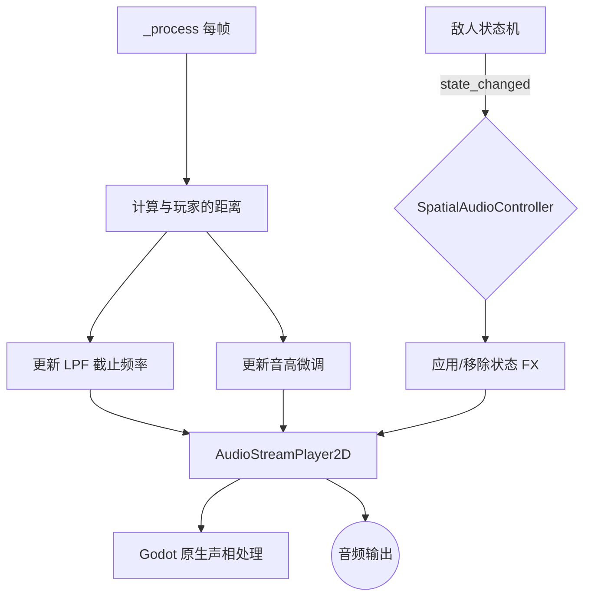

# 利用空间音频进行信息传递 (Spatial Audio for Information Delivery)

**版本:** 1.0
**最后更新:** 2026-02-12
**状态:** 设计稿
**作者:** Manus AI
**优先级:** P2 — 第三优先级（提升体验）
**前置依赖:** OPT03 — 敌人乐器身份（可选，但配合效果最佳）
**关联模块:** `Audio_Design_Guide.md`, `Enemy_System_Design.md`, `AudioStreamPlayer2D`

---

## 1. 设计概述

### 1.1. 现状分析

`AudioManager` 中使用了 `AudioStreamPlayer2D`，表明系统已经具备了播放空间化音频的基础能力。然而，从现有文档来看，其主要用途仍停留在传统的"根据距离衰减音量"的层面，未能充分挖掘空间音频作为信息传递媒介的潜力。在弹幕密集、敌人众多的后期关卡，玩家的视觉通道往往不堪重负。

### 1.2. 设计目标

将空间音频从简单的沉浸感增强工具，转变为一个功能性的**非视觉信息通道**，实现：

- **听音辨位：** 通过声相（Panning）和音色变化精确传达敌人的方位和距离。
- **听音辨状态：** 通过特殊音频效果（FX）即时传达敌人的关键状态变化。
- **降低视觉过载：** 将部分信息从视觉通道转移到听觉通道，减轻认知负担。

### 1.3. 设计原则

- **信息优先：** 空间音频的首要目的是传递信息，其次才是沉浸感。
- **直觉映射：** 音频参数的变化必须与游戏状态建立直觉的、易于学习的映射关系。
- **性能友好：** 音频效果处理不应对帧率产生显著影响。

---

## 2. 核心机制

### 2.1. 基于方向的声相处理 (Directional Panning)

所有敌人的关键音效都应严格根据其在屏幕上的相对位置进行声相处理：

| 敌人位置 | 声相值 (Pan) | 效果 |
| :--- | :--- | :--- |
| 屏幕最左侧 | -1.0 | 声音完全从左声道发出 |
| 屏幕中央 | 0.0 | 声音从两个声道均匀发出 |
| 屏幕最右侧 | +1.0 | 声音完全从右声道发出 |

Godot 的 `AudioStreamPlayer2D` 已原生支持此功能，需要确保所有敌人音效都使用 `AudioStreamPlayer2D` 而非 `AudioStreamPlayer`。

### 2.2. 基于距离的音色动态调制

距离不仅影响音量，更应影响音色。我们将模拟真实世界中声音在空气中传播的物理衰减特性：

**低通滤波器 (Low-Pass Filter, LPF) 参数映射：**

| 距离范围 | 音量衰减 | LPF 截止频率 | 音高微调 | 听感效果 |
| :--- | :--- | :--- | :--- | :--- |
| 近距 (0-200px) | 线性衰减 | 20000 Hz（无效果） | 1.0（无变化） | 清晰、明亮 |
| 中距 (200-500px) | 对数衰减 | 8000-4000 Hz | 1.0 | 略显沉闷 |
| 远距 (500px+) | 强对数衰减 | 4000-1500 Hz | 1.0-1.03 | 模糊、遥远 |

### 2.3. 基于状态的特殊音效处理 (State-Based FX)

当敌人进入特定战斗状态时，其音效将被叠加独特的音频效果：

| 敌人状态 | 音频效果 | Godot 实现方式 | 听感描述 |
| :--- | :--- | :--- | :--- |
| **眩晕 (Stunned)** | 镶边 (Flanger) | `AudioEffectFlanger` | 周期性"嗖嗖"声，听起来"摇摇晃晃" |
| **精英/危险** | 失真 (Distortion) | `AudioEffectDistortion` | 低沉的金属质感，更具"分量"和"威胁性" |
| **蓄力中** | 上升滤波扫频 | LPF Cutoff 渐增 | 声音从沉闷逐渐变得明亮，暗示即将释放 |
| **低血量** | 颤音 (Tremolo) | `AudioEffectTremolo` 或振幅调制 | 声音忽大忽小，暗示虚弱/不稳定 |
| **护盾激活** | 移相 (Phaser) | `AudioEffectPhaser` | 声音带有金属质感的相位移动 |

### 2.4. 音频总线架构

为了高效管理空间音频效果，建议扩展 Godot 的音频总线架构：

```
Master
├── Music (BGM)
├── SFX_Player (玩家音效)
├── SFX_Enemy (敌人音效)
│   ├── SFX_Enemy_Near (近距敌人 — 无 LPF)
│   ├── SFX_Enemy_Mid (中距敌人 — 中等 LPF)
│   └── SFX_Enemy_Far (远距敌人 — 强 LPF)
├── SFX_Summon (召唤物音效)
└── SFX_UI (UI 音效)
```

或者，使用动态 `AudioEffectFilter` 实例挂载到每个 `AudioStreamPlayer2D` 上，根据距离实时调整参数。

---

## 3. 代码实现（GDScript 接口定义）

### 3.1. 空间音频控制器

```gdscript
# spatial_audio_controller.gd — 挂载在敌人节点上

class_name SpatialAudioController
extends Node2D

@export var max_hearing_distance: float = 800.0  ## 最大听觉距离 (px)
@export var lpf_min_cutoff: float = 1500.0       ## 远距 LPF 截止频率
@export var lpf_max_cutoff: float = 20000.0      ## 近距 LPF 截止频率

var _audio_player: AudioStreamPlayer2D
var _lpf_effect: AudioEffectLowPassFilter
var _state_fx: AudioEffect = null  ## 当前状态效果

## 敌人状态到音频效果的映射
var _state_fx_map: Dictionary = {
    "stunned": _create_flanger_effect,
    "elite": _create_distortion_effect,
    "charging": _create_sweep_effect,
    "low_health": _create_tremolo_effect,
    "shielded": _create_phaser_effect,
}

func _ready() -> void:
    _audio_player = $AudioStreamPlayer2D
    _setup_lpf()

func _process(delta: float) -> void:
    _update_distance_effects()

## 根据距离更新音频参数
func _update_distance_effects() -> void:
    var player_pos = GameManager.get_player_position()
    var distance = global_position.distance_to(player_pos)
    var normalized_dist = clampf(distance / max_hearing_distance, 0.0, 1.0)
    
    # 更新 LPF 截止频率
    var cutoff = lerpf(lpf_max_cutoff, lpf_min_cutoff, normalized_dist)
    _lpf_effect.cutoff_hz = cutoff
    
    # 可选：远距微调音高
    if normalized_dist > 0.6:
        _audio_player.pitch_scale = lerpf(1.0, 1.03, (normalized_dist - 0.6) / 0.4)
    else:
        _audio_player.pitch_scale = 1.0

## 应用状态效果
func apply_state_fx(state: String) -> void:
    # 移除旧效果
    if _state_fx:
        _remove_bus_effect(_state_fx)
    
    # 应用新效果
    if state in _state_fx_map:
        _state_fx = _state_fx_map[state].call()
        _add_bus_effect(_state_fx)

## 移除状态效果
func clear_state_fx() -> void:
    if _state_fx:
        _remove_bus_effect(_state_fx)
        _state_fx = null

## 创建各种音频效果
func _create_flanger_effect() -> AudioEffectFlanger:
    var fx = AudioEffectFlanger.new()
    fx.rate = 0.5
    fx.depth = 0.8
    fx.feedback = 0.3
    return fx

func _create_distortion_effect() -> AudioEffectDistortion:
    var fx = AudioEffectDistortion.new()
    fx.mode = AudioEffectDistortion.MODE_OVERDRIVE
    fx.pre_gain = 6.0
    fx.post_gain = -3.0
    return fx
```

### 3.2. 与敌人状态机集成

```gdscript
# enemy_base.gd — 在敌人状态切换时通知音频控制器

@onready var spatial_audio: SpatialAudioController = $SpatialAudioController

func _on_state_changed(old_state: String, new_state: String) -> void:
    # ... 现有状态切换逻辑 ...
    
    # 通知空间音频控制器
    if new_state in ["stunned", "charging", "low_health", "shielded"]:
        spatial_audio.apply_state_fx(new_state)
    elif old_state in ["stunned", "charging", "low_health", "shielded"]:
        spatial_audio.clear_state_fx()
```

---

## 4. 信号交互流程



---

## 5. 与现有系统的集成点

| 现有系统 | 集成方式 | 说明 |
| :--- | :--- | :--- |
| `AudioStreamPlayer2D` | 参数控制 | 利用 Godot 原生的 2D 空间化和声相处理 |
| `AudioEffectFilter` | 动态挂载 | 根据距离实时调整 LPF 截止频率 |
| 敌人状态机 | 信号连接 | 监听状态变化以应用/移除音频效果 |
| `Audio_Design_Guide.md` | 设计扩展 | 在现有音频设计基础上增加空间化信息传递维度 |

---

## 6. 引用文档

- `Docs/Audio_Design_Guide.md` — 音频设计指南
- `Docs/Enemy_System_Design.md` — 敌人系统设计
- Godot 文档：`AudioStreamPlayer2D`, `AudioEffectLowPassFilter`, `AudioEffectFlanger`
