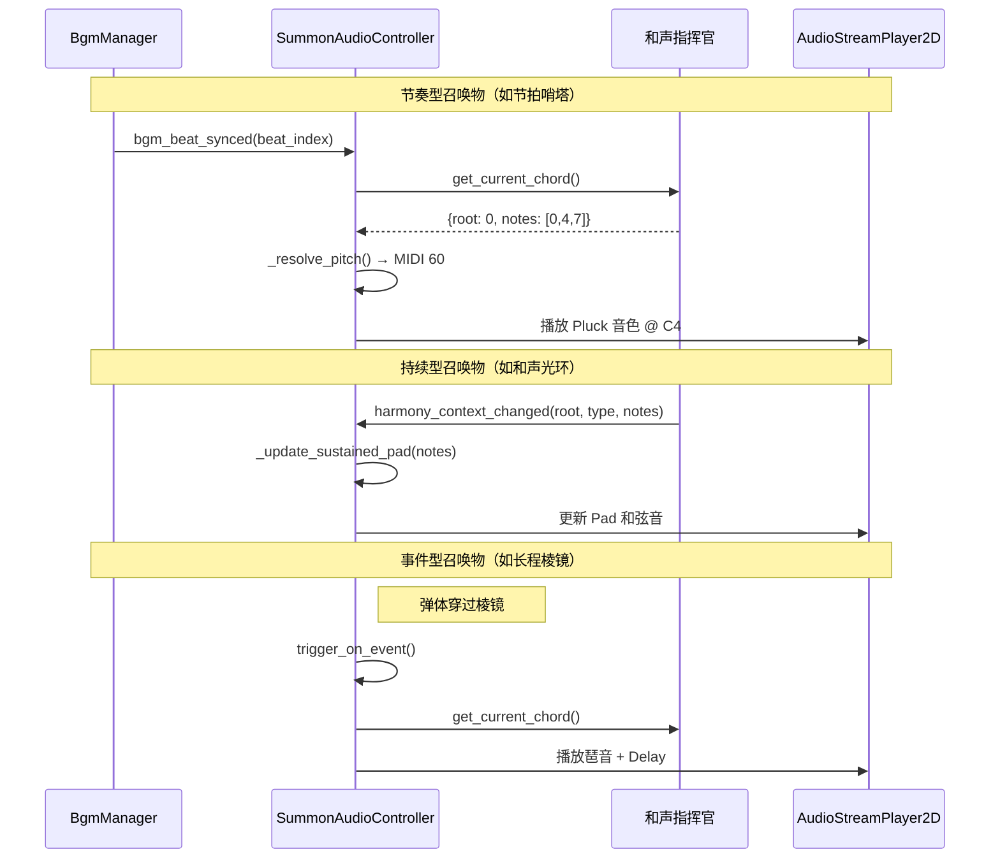

# 深化召唤物系统的音乐性 (Deepen the Musicality of the Summoning System)

**版本:** 2.0
**最后更新:** 2026-02-12
**状态:** 已实现
**作者:** Manus AI
**优先级:** P1 — 第二优先级（丰富声景）
**前置依赖:** OPT01 — 全局动态和声指挥官, OPT05 — Rez 式输入量化
**关联模块:** `SummoningSystem_Documentation.md`, `bgm_manager.gd`, `AudioManager`

---

## 1. 设计概述

### 1.1. 现状分析

`SummoningSystem_Documentation.md` 的设计极具远见，将召唤物定义为"幻影声部"和"伴奏声部"，其行为严格遵循节拍，生命周期以小节计算。然而，在音频的实际实现层面，文档并未明确这些"声部"是否会真正**发出声音**。如果召唤物的行为（如节拍哨塔的攻击）仅仅是视觉上的，而没有对应的音频事件，那么"伴奏声部"就成了一个无声的隐喻，其潜力大打折扣。

### 1.2. 设计目标

将"伴奏声部"的隐喻贯彻到底，让每一个召唤物的每一次行动都成为一个**真实的、与 BGM 同步的音频事件**。召唤系统将从一个空间布局策略游戏，升华为一个**临时的、空间化的音序器（Sequencer）**。玩家放置召唤物的行为，等同于在战场的不同位置写入了新的"音符序列"。

### 1.3. 设计原则

- **声部化：** 每种召唤物对应一个明确的音乐声部，拥有独特的音色和节奏模式。
- **节拍严格：** 所有召唤物的音频事件必须严格量化到节拍网格上（通过 OPT05 的量化系统）。
- **和声一致：** 所有有音高的召唤物音效必须经过和声指挥官的音阶锁定。
- **空间化：** 召唤物的音效应从其在战场上的实际位置发出（使用 `AudioStreamPlayer2D`）。

---

## 2. 核心机制

### 2.1. 召唤物音色分配表

基于 `SummoningSystem_Documentation.md` 中定义的七种构造体，为每种分配具体的音色和触发模式：

| 构造体名称 | 根音 | 行为模式 | 音色类型 | 音色描述 | 音高策略 |
| :--- | :--- | :--- | :--- | :--- | :--- |
| **节拍哨塔** | C | 每拍发射弹体 | Pluck / Rimshot | 清脆、短促的合成器拨弦音 | 和弦根音 |
| **长程棱镜** | D | 弹体穿过时触发 | Delay Echo | 上升琶音 + 延迟回声 | 和弦琶音序列 |
| **低频音墙** | E | 持续存在 | Gate Pulse | 节奏性的门限脉冲 | 和弦五音 |
| **净化信标** | F | 每小节触发 | De-noise Sweep | 从高到低的滤波扫频 | 下行音阶 |
| **重低音炮** | G | 强拍发射冲击波 | 808 Kick / Sub-Bass | 深沉、有冲击力的低频 | 和弦根音（低八度） |
| **和声光环** | A | 持续生效 | Pad / Drone | 柔和、缓慢演变的和声铺底 | 完整和弦音 |
| **高频陷阱** | B | 持续存在 | Hi-hat Pattern | 快速的高频节奏序列 | 无音高（纯打击乐） |

### 2.2. 音频事件触发机制

召唤物的音频事件触发与其行为模式严格绑定：

**节奏型召唤物（节拍哨塔、重低音炮、高频陷阱）：**
- 监听 `bgm_manager` 的节拍信号（`bgm_beat_synced` 或 `_tick_sixteenth`）。
- 在对应的节拍点触发音效。
- 节拍哨塔：每拍触发。重低音炮：仅强拍（1、3 拍）触发。高频陷阱：每十六分音符触发。

**事件型召唤物（长程棱镜、净化信标）：**
- 由游戏逻辑事件触发（弹体穿过、小节结束）。
- 音效通过 OPT05 的量化队列对齐到最近的节拍点。

**持续型召唤物（低频音墙、和声光环）：**
- 在召唤物存在期间持续播放循环音效。
- 监听 `harmony_context_changed` 信号，实时更新音高以匹配当前和弦。

### 2.3. 共鸣网络的音乐涌现

当多个同类型召唤物形成"共鸣网络"时，它们的音频事件将自然产生复杂的音乐织体：

- **三个节拍哨塔**以不同的相位偏移部署 → 形成交叉节奏（Polyrhythm）。
- **两个和声光环**覆盖不同区域 → 形成双声部和声铺底。
- **节拍哨塔 + 重低音炮 + 高频陷阱**组合 → 形成完整的鼓组节奏。

这些复杂的音乐行为完全由玩家的策略选择自然涌现，而非预设。

---

## 3. 代码实现（GDScript 接口定义）

### 3.1. 召唤物音频配置

```gdscript
# summon_audio_profile.gd

class_name SummonAudioProfile
extends Resource

## 音色类型标识
@export var timbre_id: String = "pluck"

## 触发模式
@export_enum("per_beat", "per_strong_beat", "per_sixteenth", "on_event", "sustained")
var trigger_mode: String = "per_beat"

## 音高策略
@export_enum("chord_root", "chord_arpeggio", "chord_fifth", "scale_descend", "chord_full", "no_pitch")
var pitch_strategy: String = "chord_root"

## 基础八度
@export var base_octave: int = 4

## 音量 (dB)
@export var volume_db: float = -12.0

## 是否使用空间化播放
@export var use_spatial: bool = true
```

### 3.2. 召唤物音频控制器

```gdscript
# summon_audio_controller.gd — 挂载在召唤物节点上

class_name SummonAudioController
extends Node2D

@export var audio_profile: SummonAudioProfile

var _audio_player: AudioStreamPlayer2D
var _arpeggio_index: int = 0  ## 琶音序列当前位置
var _is_active: bool = false

func _ready() -> void:
    _audio_player = AudioStreamPlayer2D.new()
    _audio_player.bus = "SFX_Summon"
    add_child(_audio_player)
    
    # 根据触发模式连接不同的信号
    match audio_profile.trigger_mode:
        "per_beat":
            BgmManager.bgm_beat_synced.connect(_on_beat)
        "per_strong_beat":
            BgmManager.bgm_beat_synced.connect(_on_beat_strong_only)
        "per_sixteenth":
            # 需要 bgm_manager 暴露十六分音符信号
            BgmManager.sixteenth_tick.connect(_on_sixteenth)
        "sustained":
            _start_sustained_playback()
    
    # 监听和声变更（用于持续型和琶音型）
    BgmManager.harmony_context_changed.connect(_on_harmony_changed)
    _is_active = true

## 每拍触发
func _on_beat(beat_index: int) -> void:
    if not _is_active:
        return
    _trigger_sound()

## 仅强拍触发
func _on_beat_strong_only(beat_index: int) -> void:
    if not _is_active:
        return
    if beat_index % 2 == 0:  # 强拍 (1, 3)
        _trigger_sound()

## 十六分音符触发
func _on_sixteenth() -> void:
    if not _is_active:
        return
    _trigger_sound()

## 事件触发（由游戏逻辑调用）
func trigger_on_event() -> void:
    if not _is_active:
        return
    _trigger_sound()

## 核心：触发音效
func _trigger_sound() -> void:
    var midi_note = _resolve_pitch()
    var frequency = 440.0 * pow(2.0, (midi_note - 69) / 12.0)
    
    # 通过程序化合成或采样播放
    _play_summon_tone(frequency, audio_profile.timbre_id)

## 解析音高
func _resolve_pitch() -> int:
    var chord = BgmManager.get_current_chord()
    var scale = BgmManager.get_current_scale()
    var base = audio_profile.base_octave * 12 + 12
    
    match audio_profile.pitch_strategy:
        "chord_root":
            return base + chord.root
        "chord_fifth":
            return base + BgmManager.quantize_to_scale((chord.root + 7) % 12)
        "chord_arpeggio":
            var notes = chord.notes
            var note = notes[_arpeggio_index % notes.size()]
            _arpeggio_index += 1
            return base + note
        "chord_full":
            # 用于 Pad 类型，返回和弦根音（实际播放和弦）
            return base + chord.root
        "scale_descend":
            var idx = _arpeggio_index % scale.size()
            _arpeggio_index += 1
            return base + scale[scale.size() - 1 - idx]
        "no_pitch":
            return -1  # 无音高，使用纯打击乐采样
        _:
            return base + chord.root

## 持续型播放
func _start_sustained_playback() -> void:
    # 生成并循环播放一个 Pad/Drone 音效
    var chord = BgmManager.get_current_chord()
    _play_sustained_pad(chord.notes, audio_profile.base_octave)

## 和声变更时更新
func _on_harmony_changed(root: int, type: int, notes: Array) -> void:
    if audio_profile.trigger_mode == "sustained":
        _update_sustained_pad(notes, audio_profile.base_octave)
    _arpeggio_index = 0  # 重置琶音序列

## 召唤物消失时清理
func deactivate() -> void:
    _is_active = false
    _audio_player.stop()
```

---

## 4. 信号交互流程



---

## 5. 与现有系统的集成点

| 现有系统 | 集成方式 | 说明 |
| :--- | :--- | :--- |
| `SummoningSystem_Documentation.md` | 设计扩展 | 为每种构造体添加 `SummonAudioProfile` 和 `SummonAudioController` |
| `bgm_manager.gd` | 信号连接 | 监听 `bgm_beat_synced`、`harmony_context_changed` 等信号 |
| OPT01 和声指挥官 | API 调用 | 通过 `get_current_chord()` 和 `quantize_to_scale()` 确保音高和谐 |
| OPT05 输入量化 | 队列集成 | 事件型召唤物的音效通过量化队列对齐到节拍 |
| 召唤物场景文件 | 节点添加 | 为每个构造体场景添加 `SummonAudioController` 和 `AudioStreamPlayer2D` |

---

## 6. 引用文档

- `Docs/SummoningSystem_Documentation.md` — 召唤物系统设计
- `Docs/Audio_Design_Guide.md` — 音频设计指南
- `godot_project/scripts/autoload/bgm_manager.gd` — BGM 管理器
- `Docs/Optimization_Modules/OPT01_GlobalDynamicHarmonyConductor.md` — 前置依赖
- `Docs/Optimization_Modules/OPT05_RezStyleInputQuantization.md` — 前置依赖

---

## 7. 实现报告

### 7.1. 实现概述

OPT07 已于 2026-02-12 完成实现，将设计稿中的所有核心机制落地到代码中。召唤系统现已升华为一个真正的空间化音序器，每种构造体对应一个明确的音乐声部。

### 7.2. 新增文件

| 文件路径 | 说明 |
| :--- | :--- |
| `godot_project/scripts/entities/summon_audio_profile.gd` | 召唤物音频配置资源 — 定义七种构造体的音色、触发模式、音高策略等参数 |
| `godot_project/scripts/entities/summon_audio_controller.gd` | 召唤物音频控制器 — 将构造体行为转化为与 BGM 同步的音频事件，包含程序化音色合成引擎 |

### 7.3. 修改文件

| 文件路径 | 修改内容 |
| :--- | :--- |
| `godot_project/scripts/autoload/bgm_manager.gd` | 新增 `sixteenth_tick` 和 `harmony_context_changed` 信号；新增和声指挥官 API（`get_current_chord()`、`get_current_scale()`、`quantize_to_scale()`）；新增和弦进行系统 |
| `godot_project/scripts/entities/summon_construct.gd` | 集成 SummonAudioController；在 `_ready()` 中初始化音频控制器；在行为触发、激励、淡出时同步音频事件 |
| `godot_project/scripts/systems/summon_manager.gd` | 添加 OPT07 注释；构造体信息中增加 `audio_info` 字段 |

### 7.4. 实现细节

**SummonAudioProfile** 使用枚举而非字符串定义触发模式和音高策略，提供类型安全和自动补全支持。每种构造体的默认配置通过静态工厂方法创建，并通过 `get_profile_for_root()` 统一映射。

**SummonAudioController** 内置程序化音色合成引擎，完全不依赖外部音频文件，与项目现有的 `bgm_manager.gd` 程序化合成哲学一致。支持以下音色：
- **Pluck** — 清脆拨弦音（节拍哨塔）
- **Delay Echo** — 延迟回声琐音（长程棱镜）
- **Gate Pulse** — 门限脉冲（低频音墙）
- **De-noise Sweep** — 滤波扫频（净化信标）
- **Sub-Bass 808** — 808 低音冲击（重低音炮）
- **Pad/Drone** — 和声铺底（和声光环）
- **Hi-hat Pattern** — 高频节奏（高频陷阱）

**BgmManager 扩展** 新增的和声指挥官 API 为未来的 OPT01 完整实现奠定基础。和弦进行表默认为 Am → G → F → Em 循环，与现有 Pad 和弦切换同步。

### 7.5. 测试要点

- 召唤七种构造体，确认每种都发出独特的音色
- 节拍型构造体的音效与 BGM 节拍严格对齐
- 持续型构造体在和弦切换时平滑更新音高
- 激励时触发额外音频事件
- 多个构造体同时存在时的音乐织体效果
- 构造体淡出时音频正确停止

---

## 版本变更记录

| 版本 | 日期 | 变更内容 | 作者 |
|------|------|---------|------|
| v2.0 | 2026-02-12 | 完成实现：新增 SummonAudioProfile、SummonAudioController，集成到 summon_construct.gd 和 summon_manager.gd，扩展 bgm_manager.gd | Manus AI |
| v1.0 | 2026-02-12 | 初始设计稿 | Manus AI |
