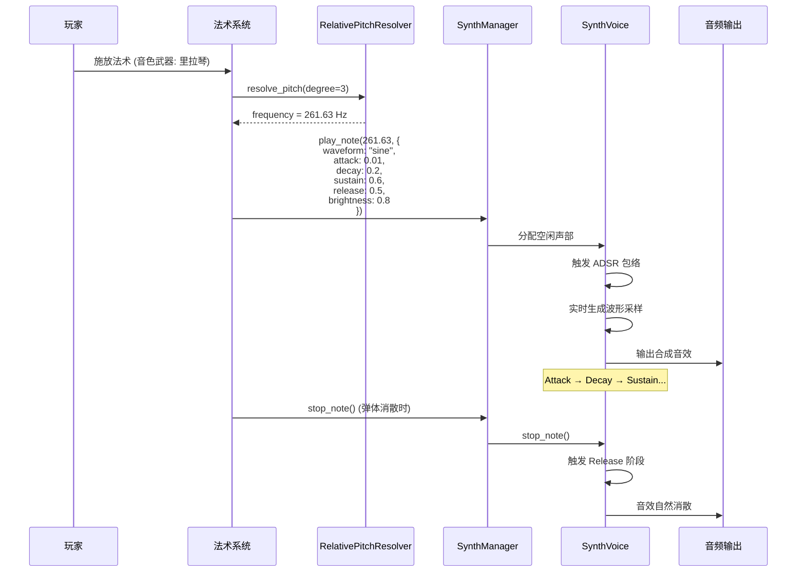

# 为音色武器系统引入程序化音色合成 (Procedural Timbre Synthesis for Timbre System)

**版本:** 1.0
**最后更新:** 2026-02-12
**状态:** 设计稿
**作者:** Manus AI
**优先级:** P3 — 第四优先级（深化系统）
**前置依赖:** OPT01 — 全局动态和声指挥官, OPT02 — 相对音高系统
**关联模块:** `TimbreSystem_Documentation.md`, `AudioManager`, `bgm_manager.gd`

---

## 1. 设计概述

### 1.1. 现状分析

`TimbreSystem_Documentation.md` 详细定义了音色武器的 ADSR（Attack/Decay/Sustain/Release）包络如何影响弹体的物理行为（速度、存在时间等）。这是一个将声音合成概念巧妙应用于游戏机制的绝佳设计。然而，在音效的实现上，文档倾向于为每种音色武器使用预制的、独特的采样。这虽然可行，但与项目整体的"程序化"和"系统性"理念略有脱节——弹体行为是动态的，但音效却是静态的。

### 1.2. 设计目标

将 ADSR 的设计贯彻到底，不仅用它来驱动弹体行为，更用它来**实时程序化合成法术的音效本身**。构建一个轻量级的减法合成器引擎，将音色武器的 ADSR 参数及其他属性直接映射到合成器参数上，实现"所听即所见"——音效与弹体行为的深度统一。

### 1.3. 设计原则

- **参数统一：** 同一套 ADSR 参数同时驱动弹体行为和音效合成。
- **实时生成：** 音效在施法时实时合成，而非播放预制采样。
- **无限变化：** 通过参数组合产生几乎无限种独特的音色。
- **性能可控：** 合成器设计以轻量级为目标，避免过度消耗 CPU。

---

## 2. 核心机制

### 2.1. 减法合成器架构

合成器由以下核心模块组成：

```
振荡器 (Oscillator) → 滤波器 (Filter) → 放大器 (Amplifier) → 输出
     ↑                      ↑                    ↑
  波形选择              LPF/HPF 包络          ADSR 包络
  (Waveform)           (Filter Envelope)     (Amp Envelope)
```

| 模块 | 职责 | Godot 实现方式 |
| :--- | :--- | :--- |
| **振荡器** | 生成基础波形（正弦、方波、锯齿、三角、噪音） | `AudioStreamGenerator` + 自定义波形生成 |
| **滤波器** | 塑造音色的频率特征 | `AudioEffectLowPassFilter` / `AudioEffectHighPassFilter` |
| **放大器** | 控制音量包络 | 代码控制 `volume_db` 随时间变化 |
| **ADSR 包络** | 定义音量和滤波器随时间的变化曲线 | 自定义 `ADSREnvelope` 类 |

### 2.2. 音色武器 ADSR 参数到合成器参数的映射

| 音色武器参数 | 弹体行为影响 | 合成器参数映射 | 听感效果 |
| :--- | :--- | :--- | :--- |
| **Attack (起音)** | 弹体加速时间 | 振幅包络起音时间 + 滤波器包络起音时间 | 快起音 = 打击感；慢起音 = 渐入感 |
| **Decay (衰减)** | 弹体从峰值速度衰减的时间 | 振幅包络衰减时间 | 快衰减 = 短促；慢衰减 = 绵延 |
| **Sustain (持续)** | 弹体稳定阶段的速度比例 | 振幅包络持续电平 (0.0-1.0) | 高持续 = 饱满；低持续 = 空灵 |
| **Release (释放)** | 弹体消散时间 | 振幅包络释放时间 | 快释放 = 干净截断；慢释放 = 自然消散 |
| **明亮度 (Brightness)** | 弹体视觉亮度 | LPF 截止频率 (500-15000 Hz) | 高明亮 = 尖锐明亮；低明亮 = 沉闷温暖 |
| **谐波量 (Harmonics)** | 弹体粒子复杂度 | 振荡器波形选择 | 正弦 = 纯净；锯齿 = 丰富；方波 = 空洞 |

### 2.3. 章节音色武器的合成器预设

基于 `TimbreSystem_Documentation.md` 中的七种章节音色武器，定义合成器预设：

| 章节 | 音色武器 | 振荡器波形 | 滤波器类型 | 特殊处理 |
| :--- | :--- | :--- | :--- | :--- |
| Ch1 | 里拉琴 (Lyre) | 正弦波 + 泛音叠加 | LPF (高截止) | 泛音比例基于毕达哥拉斯音程 |
| Ch2 | 管风琴 (Organ) | 多层正弦波叠加 | 无滤波 | 模拟管风琴的音栓混合 |
| Ch3 | 羽管键琴 (Harpsichord) | 锯齿波 | LPF (中截止) | 极短 Attack，无 Sustain |
| Ch4 | 钢琴 (Fortepiano) | 三角波 + 噪音层 | LPF (动态) | 力度影响 Attack 和 Brightness |
| Ch5 | 管弦全奏 (Tutti) | 超级锯齿波 (多振荡器) | LPF (低截止→高截止扫频) | 渐强渐弱的滤波器包络 |
| Ch6 | 铜管 (Brass) | 方波 | Band-Pass | 模拟铜管的"嘟"到"嘶"的起音 |
| Ch7 | 频谱合成器 (Spectral) | 噪音 + 共振滤波 | 多峰共振滤波器 | 随机频谱成分，每次施法不同 |

---

## 3. 代码实现（GDScript 接口定义）

### 3.1. ADSR 包络生成器

```gdscript
# adsr_envelope.gd

class_name ADSREnvelope

var attack_time: float = 0.01   ## 起音时间（秒）
var decay_time: float = 0.1     ## 衰减时间（秒）
var sustain_level: float = 0.7  ## 持续电平（0.0-1.0）
var release_time: float = 0.3   ## 释放时间（秒）

enum Stage { IDLE, ATTACK, DECAY, SUSTAIN, RELEASE }
var _stage: Stage = Stage.IDLE
var _current_value: float = 0.0
var _elapsed: float = 0.0

## 触发包络（Note On）
func trigger() -> void:
    _stage = Stage.ATTACK
    _elapsed = 0.0

## 释放包络（Note Off）
func release() -> void:
    _stage = Stage.RELEASE
    _elapsed = 0.0

## 每帧更新，返回当前包络值 (0.0-1.0)
func process(delta: float) -> float:
    _elapsed += delta
    
    match _stage:
        Stage.IDLE:
            _current_value = 0.0
        Stage.ATTACK:
            if attack_time > 0:
                _current_value = minf(_elapsed / attack_time, 1.0)
            else:
                _current_value = 1.0
            if _current_value >= 1.0:
                _stage = Stage.DECAY
                _elapsed = 0.0
        Stage.DECAY:
            if decay_time > 0:
                var t = minf(_elapsed / decay_time, 1.0)
                _current_value = lerpf(1.0, sustain_level, t)
            else:
                _current_value = sustain_level
            if _elapsed >= decay_time:
                _stage = Stage.SUSTAIN
        Stage.SUSTAIN:
            _current_value = sustain_level
        Stage.RELEASE:
            if release_time > 0:
                var t = minf(_elapsed / release_time, 1.0)
                _current_value = lerpf(sustain_level, 0.0, t)
            else:
                _current_value = 0.0
            if _current_value <= 0.001:
                _stage = Stage.IDLE
                _current_value = 0.0
    
    return _current_value

func is_active() -> bool:
    return _stage != Stage.IDLE
```

### 3.2. 轻量级合成器引擎

```gdscript
# synth_voice.gd — 单个合成器声部

class_name SynthVoice
extends Node

var _generator: AudioStreamGenerator
var _playback: AudioStreamGeneratorPlayback
var _player: AudioStreamPlayer2D

var _amp_envelope: ADSREnvelope = ADSREnvelope.new()
var _filter_envelope: ADSREnvelope = ADSREnvelope.new()

var _frequency: float = 440.0
var _phase: float = 0.0
var _waveform: String = "sine"  ## "sine", "square", "sawtooth", "triangle", "noise"

## 滤波器参数
var _filter_cutoff_base: float = 5000.0
var _filter_cutoff_env_amount: float = 3000.0  ## 包络调制量
var _filter_resonance: float = 0.5

## 合成器采样率
const SAMPLE_RATE: float = 44100.0

func _ready() -> void:
    _generator = AudioStreamGenerator.new()
    _generator.mix_rate = SAMPLE_RATE
    _generator.buffer_length = 0.05  # 50ms 缓冲
    
    _player = AudioStreamPlayer2D.new()
    _player.stream = _generator
    _player.bus = "SFX_Player"
    add_child(_player)

## 触发一个音符
func play_note(frequency: float, timbre_params: Dictionary) -> void:
    _frequency = frequency
    _waveform = timbre_params.get("waveform", "sine")
    
    # 从音色武器参数设置 ADSR
    _amp_envelope.attack_time = timbre_params.get("attack", 0.01)
    _amp_envelope.decay_time = timbre_params.get("decay", 0.1)
    _amp_envelope.sustain_level = timbre_params.get("sustain", 0.7)
    _amp_envelope.release_time = timbre_params.get("release", 0.3)
    
    # 滤波器包络（更快的起音，用于音色塑造）
    _filter_envelope.attack_time = timbre_params.get("attack", 0.01) * 0.5
    _filter_envelope.decay_time = timbre_params.get("decay", 0.1) * 1.5
    _filter_envelope.sustain_level = timbre_params.get("brightness", 0.5)
    _filter_envelope.release_time = timbre_params.get("release", 0.3)
    
    _filter_cutoff_base = timbre_params.get("brightness", 0.5) * 10000.0 + 500.0
    
    _amp_envelope.trigger()
    _filter_envelope.trigger()
    _phase = 0.0
    
    _player.play()
    _playback = _player.get_stream_playback()

func _process(delta: float) -> void:
    if _playback == null or not _amp_envelope.is_active():
        return
    
    var amp = _amp_envelope.process(delta)
    var filter_mod = _filter_envelope.process(delta)
    
    # 填充音频缓冲区
    var frames_available = _playback.get_frames_available()
    for i in range(frames_available):
        var sample = _generate_sample()
        sample *= amp
        _playback.push_frame(Vector2(sample, sample))

## 生成单个采样
func _generate_sample() -> float:
    var sample: float = 0.0
    var increment = _frequency / SAMPLE_RATE
    
    match _waveform:
        "sine":
            sample = sin(_phase * TAU)
        "square":
            sample = 1.0 if fmod(_phase, 1.0) < 0.5 else -1.0
        "sawtooth":
            sample = 2.0 * fmod(_phase, 1.0) - 1.0
        "triangle":
            var t = fmod(_phase, 1.0)
            sample = 4.0 * absf(t - 0.5) - 1.0
        "noise":
            sample = randf_range(-1.0, 1.0)
    
    _phase += increment
    if _phase >= 1.0:
        _phase -= 1.0
    
    return sample * 0.3  # 主音量缩放，防止削波

## 停止音符（触发 Release）
func stop_note() -> void:
    _amp_envelope.release()
    _filter_envelope.release()
```

### 3.3. 合成器管理器（复音管理）

```gdscript
# synth_manager.gd — Autoload 单例

class_name SynthManager
extends Node

const MAX_VOICES: int = 8  ## 最大同时发声数

var _voices: Array[SynthVoice] = []
var _voice_index: int = 0

func _ready() -> void:
    for i in range(MAX_VOICES):
        var voice = SynthVoice.new()
        add_child(voice)
        _voices.append(voice)

## 播放一个合成音符
func play_note(frequency: float, timbre_params: Dictionary, position: Vector2 = Vector2.ZERO) -> void:
    var voice = _get_next_voice()
    voice._player.global_position = position
    voice.play_note(frequency, timbre_params)

## 轮询分配声部（Round-Robin）
func _get_next_voice() -> SynthVoice:
    var voice = _voices[_voice_index]
    _voice_index = (_voice_index + 1) % MAX_VOICES
    
    # 如果该声部正在使用，强制停止
    if voice._amp_envelope.is_active():
        voice.stop_note()
    
    return voice
```

---

## 4. 信号交互流程



---

## 5. 性能考量

| 关注点 | 策略 |
| :--- | :--- |
| **CPU 开销** | 限制最大同时发声数为 8；使用简单的波形生成算法（无 FFT） |
| **音频延迟** | `AudioStreamGenerator` 缓冲区设为 50ms，在可接受范围内 |
| **内存占用** | 无预制采样，内存占用极低 |
| **降级方案** | 在低端设备上可回退到预制采样模式 |

---

## 6. 与现有系统的集成点

| 现有系统 | 集成方式 | 说明 |
| :--- | :--- | :--- |
| `TimbreSystem_Documentation.md` | 参数复用 | 直接使用音色武器的 ADSR 参数驱动合成器 |
| OPT02 相对音高系统 | 频率输入 | 由相对音高解析器提供目标频率 |
| OPT01 和声指挥官 | 间接依赖 | 通过 OPT02 间接获取和声上下文 |
| `MetaProgressionSystem` | 参数联动 | 局外成长系统升级 ADSR 参数时，合成器音色同步变化 |
| `AudioManager` | 替代方案 | 在支持程序化合成的场景中替代传统的采样播放 |

---

## 7. 引用文档

- `Docs/TimbreSystem_Documentation.md` — 音色武器系统
- `Docs/MetaProgressionSystem_Documentation.md` — 局外成长系统
- `godot_project/scripts/autoload/bgm_manager.gd` — BGM 管理器
- `Docs/Optimization_Modules/OPT01_GlobalDynamicHarmonyConductor.md` — 前置依赖
- `Docs/Optimization_Modules/OPT02_RelativePitchSystem.md` — 前置依赖
- Godot 文档：`AudioStreamGenerator`, `AudioStreamGeneratorPlayback`
