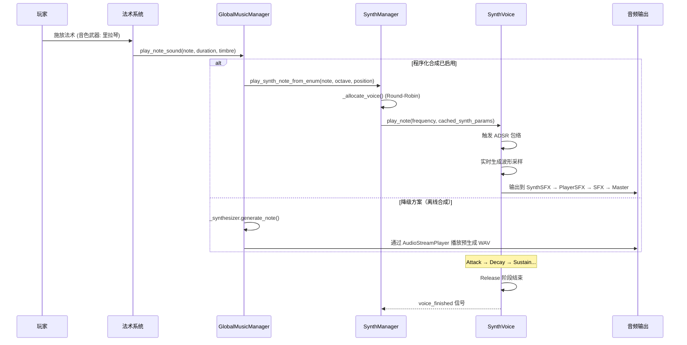

# 为音色武器系统引入程序化音色合成 (Procedural Timbre Synthesis for Timbre System)

**版本:** 2.0
**最后更新:** 2026-02-12
**状态:** 已实现
**作者:** Manus AI
**优先级:** P3 — 第四优先级（深化系统）
**前置依赖:** OPT01 — 全局动态和声指挥官, OPT02 — 相对音高系统
**关联模块:** `TimbreSystem_Documentation.md`, `AudioManager`, `bgm_manager.gd`

---

## 1. 设计概述

### 1.1. 现状分析

`TimbreSystem_Documentation.md` 详细定义了音色武器的 ADSR（Attack/Decay/Sustain/Release）包络如何影响弹体的物理行为（速度、存在时间等）。这是一个将声音合成概念巧妙应用于游戏机制的绝佳设计。然而，在音效的实现上，文档倾向于为每种音色武器使用预制的、独特的采样。这虽然可行，但与项目整体的"程序化"和"系统性"理念略有脱节——弹体行为是动态的，但音效却是静态的。

### 1.2. 设计目标

将 ADSR 的设计贯彻到底，不仅用它来驱动弹体行为，更用它来**实时程序化合成法术的音效本身**。构建一个轻量级的减法合成器引擎，将音色武器的 ADSR 参数及其他属性直接映射到合成器参数上，实现"所听即所见"——音效与弹体行为的深度统一。

### 1.3. 设计原则

- **参数统一：** 同一套 ADSR 参数同时驱动弹体行为和音效合成。
- **实时生成：** 音效在施法时实时合成，而非播放预制采样。
- **无限变化：** 通过参数组合产生几乎无限种独特的音色。
- **性能可控：** 合成器设计以轻量级为目标，避免过度消耗 CPU。

---

## 2. 核心机制

### 2.1. 减法合成器架构

合成器由以下核心模块组成：

```
振荡器 (Oscillator) → 滤波器 (Filter) → 放大器 (Amplifier) → 输出
     ↑                      ↑                    ↑
  波形选择              LPF/HPF 包络          ADSR 包络
  (Waveform)           (Filter Envelope)     (Amp Envelope)
```

| 模块 | 职责 | Godot 实现方式 |
| :--- | :--- | :--- |
| **振荡器** | 生成基础波形（正弦、方波、锯齿、三角、噪音、超级锯齿、脉冲） | `AudioStreamGenerator` + 自定义波形生成 |
| **滤波器** | 塑造音色的频率特征（低通/高通/带通/多峰共振） | 自定义一阶 IIR 滤波器实现 |
| **放大器** | 控制音量包络 | `ADSREnvelope` 类驱动采样级振幅 |
| **ADSR 包络** | 定义音量和滤波器随时间的变化曲线 | 自定义 `ADSREnvelope` 类（支持线性/指数曲线） |

### 2.2. 音色武器 ADSR 参数到合成器参数的映射

| 音色武器参数 | 弹体行为影响 | 合成器参数映射 | 听感效果 |
| :--- | :--- | :--- | :--- |
| **Attack (起音)** | 弹体加速时间 | 振幅包络起音时间 + 滤波器包络起音时间 | 快起音 = 打击感；慢起音 = 渐入感 |
| **Decay (衰减)** | 弹体从峰值速度衰减的时间 | 振幅包络衰减时间 | 快衰减 = 短促；慢衰减 = 绵延 |
| **Sustain (持续)** | 弹体稳定阶段的速度比例 | 振幅包络持续电平 (0.0-1.0) | 高持续 = 饱满；低持续 = 空灵 |
| **Release (释放)** | 弹体消散时间 | 振幅包络释放时间 | 快释放 = 干净截断；慢释放 = 自然消散 |
| **明亮度 (Brightness)** | 弹体视觉亮度 | LPF 截止频率 (500-15000 Hz) | 高明亮 = 尖锐明亮；低明亮 = 沉闷温暖 |
| **谐波量 (Harmonics)** | 弹体粒子复杂度 | 振荡器波形选择 + 自定义泛音叠加 | 正弦 = 纯净；锯齿 = 丰富；方波 = 空洞 |

### 2.3. 章节音色武器的合成器预设

基于 `TimbreSystem_Documentation.md` 中的七种章节音色武器，定义合成器预设：

| 章节 | 音色武器 | 振荡器波形 | 滤波器类型 | 特殊处理 |
| :--- | :--- | :--- | :--- | :--- |
| Ch1 | 里拉琴 (Lyre) | 正弦波 + 泛音叠加 | LPF (高截止) | 泛音比例基于毕达哥拉斯音程 |
| Ch2 | 管风琴 (Organ) | 多层正弦波叠加 | 无滤波 | 模拟管风琴的音栓混合 |
| Ch3 | 羽管键琴 (Harpsichord) | 锯齿波 | LPF (中截止) | 极短 Attack，无 Sustain |
| Ch4 | 钢琴 (Fortepiano) | 三角波 + 噪音层 | LPF (动态) | 力度影响 Attack 和 Brightness |
| Ch5 | 管弦全奏 (Tutti) | 超级锯齿波 (多振荡器) | LPF (低截止→高截止扫频) | 渐强渐弱的滤波器包络 |
| Ch6 | 铜管 (Brass) | 方波 | Band-Pass | 模拟铜管的"嘟"到"嘶"的起音 |
| Ch7 | 频谱合成器 (Spectral) | 噪音 + 共振滤波 | 多峰共振滤波器 | 随机频谱成分，每次施法不同 |

---

## 3. 实现文件清单

### 3.1. 新增文件

| 文件路径 | 类名 | 职责 |
| :--- | :--- | :--- |
| `scripts/audio/synth/adsr_envelope.gd` | `ADSREnvelope` | ADSR 包络生成器，支持线性/指数曲线，提供 `trigger()`/`release()`/`process()` 接口 |
| `scripts/audio/synth/synth_voice.gd` | `SynthVoice` | 单个合成器声部，包含振荡器、滤波器、放大器完整信号链路 |
| `scripts/audio/synth/synth_manager.gd` | `SynthManager` | 合成器管理器（Autoload 单例），管理声部池、参数缓存、Round-Robin 分配 |
| `scripts/audio/synth/timbre_synth_presets.gd` | `TimbreSynthPresets` | 章节音色武器的合成器预设数据，含电子乐变体覆盖参数 |

### 3.2. 修改文件

| 文件路径 | 修改内容 |
| :--- | :--- |
| `scripts/autoload/global_music_manager.gd` | 添加 OPT08 集成：当 SynthManager 可用时优先使用实时合成路径，否则回退到离线合成 |
| `project.godot` | 注册 `SynthManager` 为 Autoload 单例 |
| `audio_bus_layout.tres` | 添加 `SynthSFX` 音频总线（发送到 `PlayerSFX`） |

### 3.3. ADSREnvelope 类接口

```gdscript
class_name ADSREnvelope
extends RefCounted

# 参数
var attack_time: float = 0.01
var decay_time: float = 0.1
var sustain_level: float = 0.7
var release_time: float = 0.3
var use_exponential: bool = true

# 状态
enum Stage { IDLE, ATTACK, DECAY, SUSTAIN, RELEASE }

# 公共接口
func trigger() -> void          ## Note On — 开始 Attack
func release() -> void          ## Note Off — 进入 Release
func force_stop() -> void       ## 立即归零
func process(delta: float) -> float  ## 每帧更新，返回 0.0~1.0
func is_active() -> bool        ## 是否活跃
func get_stage() -> Stage
func get_value() -> float

# 工厂方法
static func from_params(params: Dictionary) -> ADSREnvelope
static func create_filter_envelope(params: Dictionary) -> ADSREnvelope
```

### 3.4. SynthVoice 类接口

```gdscript
class_name SynthVoice
extends Node

signal voice_finished()

# 公共接口
func play_note(frequency: float, timbre_params: Dictionary) -> void
func stop_note() -> void        ## 触发 Release
func force_stop() -> void       ## 立即静音
func is_playing() -> bool
func set_voice_position(pos: Vector2) -> void

# 支持的合成路径
# - 标准路径：振荡器 + 泛音叠加 + 副振荡器
# - FM 合成路径：载波 + 调制器
# - 频谱合成路径：随机泛音 + 噪音
# - 超级锯齿波路径：多振荡器失谐叠加
```

### 3.5. SynthManager 类接口

```gdscript
# Autoload 单例
extends Node

signal synth_note_played(frequency: float, timbre: int)
signal synth_note_stopped(voice_index: int)
signal synthesis_mode_changed(enabled: bool)

const MAX_VOICES: int = 8

# 公共接口
func play_synth_note(frequency: float, position: Vector2 = Vector2.ZERO) -> void
func play_synth_note_with_params(frequency: float, timbre_params: Dictionary, position: Vector2 = Vector2.ZERO) -> void
func play_synth_note_from_enum(note: int, octave: int = 4, position: Vector2 = Vector2.ZERO) -> void
func stop_all() -> void
func force_stop_all() -> void
func set_synthesis_enabled(enabled: bool) -> void
func is_synthesis_enabled() -> bool
func update_timbre(chapter_timbre: int, electronic_variant: int = MusicData.ElectronicVariant.NONE) -> void
func get_active_voice_count() -> int
func get_synth_params_for_timbre(chapter_timbre: int, electronic_variant: int = MusicData.ElectronicVariant.NONE) -> Dictionary
```

---

## 4. 信号交互流程



---

## 5. 性能考量

| 关注点 | 策略 |
| :--- | :--- |
| **CPU 开销** | 限制最大同时发声数为 8；使用简单的波形生成算法（无 FFT）；最大泛音数限制为 8 |
| **音频延迟** | `AudioStreamGenerator` 缓冲区设为 50ms，在可接受范围内 |
| **内存占用** | 无预制采样，内存占用极低；参数缓存避免重复计算 |
| **降级方案** | 当 SynthManager 不可用时自动回退到 NoteSynthesizer 离线合成 |
| **软限幅** | 使用 `tanh()` 软限幅防止削波，保护听觉 |

---

## 6. 与现有系统的集成点

| 现有系统 | 集成方式 | 说明 |
| :--- | :--- | :--- |
| `GlobalMusicManager` | **直接集成** | `play_note_sound()` 等方法优先调用 SynthManager，回退到 NoteSynthesizer |
| `TimbreSystem_Documentation.md` | 参数复用 | 直接使用音色武器的 ADSR 参数驱动合成器 |
| `MusicData.CHAPTER_TIMBRE_ADSR` | 数据源 | 合成器预设的 ADSR 参数来自此数据表 |
| OPT02 相对音高系统 | 频率输入 | 由相对音高解析器提供目标频率 |
| OPT01 和声指挥官 | 间接依赖 | 通过 OPT02 间接获取和声上下文 |
| `MetaProgressionSystem` | 参数联动 | 局外成长系统升级 ADSR 参数时，合成器音色同步变化 |
| `AudioManager` | 解耦 | SFX 请求通过信号桥接，合成器不直接依赖 AudioManager |
| `audio_bus_layout.tres` | 新增总线 | 添加 `SynthSFX` 总线，发送到 `PlayerSFX` |
| `project.godot` | Autoload 注册 | `SynthManager` 注册为全局 Autoload 单例 |

---

## 7. 引用文档

- `Docs/TimbreSystem_Documentation.md` — 音色武器系统
- `Docs/MetaProgressionSystem_Documentation.md` — 局外成长系统
- `godot_project/scripts/autoload/bgm_manager.gd` — BGM 管理器
- `godot_project/scripts/autoload/global_music_manager.gd` — 全局音乐管理器（OPT08 集成点）
- `godot_project/scripts/audio/synth/adsr_envelope.gd` — ADSR 包络生成器
- `godot_project/scripts/audio/synth/synth_voice.gd` — 合成器声部引擎
- `godot_project/scripts/audio/synth/synth_manager.gd` — 合成器管理器
- `godot_project/scripts/audio/synth/timbre_synth_presets.gd` — 合成器预设数据
- `Docs/Optimization_Modules/OPT01_GlobalDynamicHarmonyConductor.md` — 前置依赖
- `Docs/Optimization_Modules/OPT02_RelativePitchSystem.md` — 前置依赖
- Godot 文档：`AudioStreamGenerator`, `AudioStreamGeneratorPlayback`
