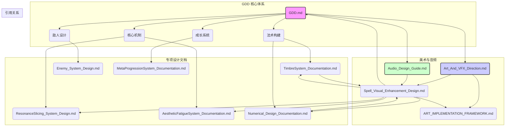

```mermaid
graph TD
    subgraph GDD 核心体系
        GDD(GDD.md) --> Mechanics(核心机制)
        GDD --> Spellcraft(法术构建)
        GDD --> Enemy(敌人设计)
        GDD --> Progression(成长系统)
    end

    subgraph 专项设计文档
        Mechanics --> ResonanceSlicing(ResonanceSlicing_System_Design.md)
        Mechanics --> AestheticFatigue(AestheticFatigueSystem_Documentation.md)
        Spellcraft --> Timbre(TimbreSystem_Documentation.md)
        Spellcraft --> Numerical(Numerical_Design_Documentation.md)
        Enemy --> EnemyDesign(Enemy_System_Design.md)
        Progression --> MetaProgression(MetaProgressionSystem_Documentation.md)
    end

    subgraph 美术与音频
        ArtDirection(Art_And_VFX_Direction.md) --> SpellVisual(Spell_Visual_Enhancement_Design.md)
        ArtDirection --> ArtImplementation(ART_IMPLEMENTATION_FRAMEWORK.md)
        AudioDesign(Audio_Design_Guide.md) --> SpellVisual
    end

    subgraph 引用关系
        GDD --> ArtDirection
        GDD --> AudioDesign
        SpellVisual --> GDD
        SpellVisual --> Timbre
        SpellVisual --> Numerical
        SpellVisual --> ResonanceSlicing
        SpellVisual --> AestheticFatigue
        SpellVisual --> ArtImplementation
        Timbre --> SpellVisual
        Numerical --> SpellVisual
    end

    style GDD fill:#f9f,stroke:#333,stroke-width:2px
    style ArtDirection fill:#ccf,stroke:#333,stroke-width:2px
    style AudioDesign fill:#cfc,stroke:#333,stroke-width:2px
```
```
