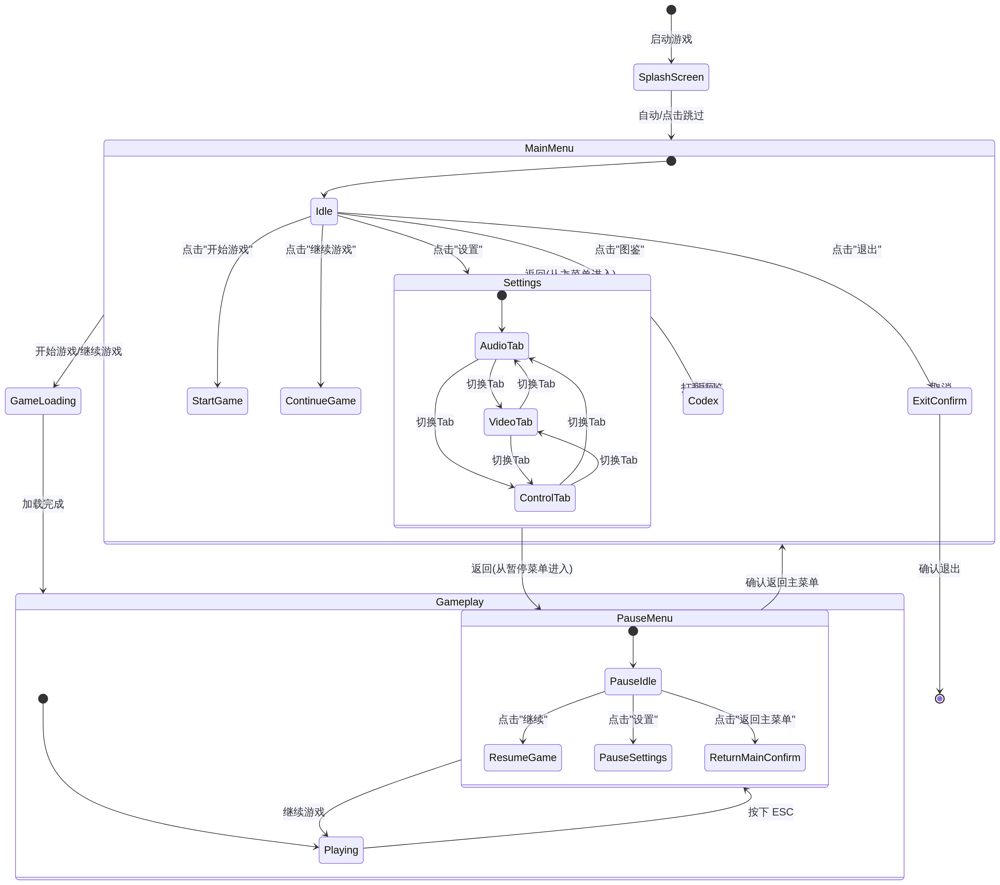

# Project Harmony UI 设计文档：模块1 - 主菜单与导航系统

**作者：** Manus AI
**版本：** 1.1
**日期：** 2026年2月12日

---

## 1. 概述

本文档为《Project Harmony》游戏提供【模块1：主菜单与导航系统】的完整用户界面（UI）设计方案。设计严格遵循项目确立的“科幻神学/极简几何/故障艺术”双极美学体系，旨在为玩家提供一个沉浸、直观且风格统一的入口体验。文档内容涵盖界面布局、视觉概念、色彩字体、交互流程、动效设计以及在 Godot 引擎中的实现建议。

## 2. 全局 UI 主题规范

所有菜单和导航相关的 UI 元素均须严格遵守已在 `Art_And_VFX_Direction.md` 中定义的全局主题规范。以下是对本次设计范围核心规范的重申：

| UI 元素 | 规范细节 | 视觉描述 |
| :--- | :--- | :--- |
| **H1 标题** | 等宽/科幻字体, 28px, #EAE6FF | 晶体白色，应用 `scanline_glow.gdshader` 扫光效果 |
| **H2 副标题** | 等宽字体, 20px, #A098C8 | 次级文本色，用于描述或非交互性标题 |
| **正文** | 无衬线字体, 16px, #EAE6FF | 晶体白色，用于设置项描述等 |
| **按钮 (正常)** | 等宽字体, 18px, #9D6FFF | 主强调色，带有柔和的边框辉光 |
| **按钮 (悬停)** | 亮度 +20%, 缩放 1.05x | 辉光效果增强，提供清晰的视觉反馈 |
| **按钮 (按下)** | 亮度 -20%, 缩放 0.95x | 触发向内收缩的粒子效果，模拟能量内聚 |
| **面板背景** | #141026, 80% 不透明 | 星空紫色，带有微弱的程序化噪点纹理 |
| **面板边框** | #9D6FFF, 40% 不透明, 1px | 主强调色，应用发光效果，营造科技感轮廓 |

## 3. 视觉概念与模拟图

以下概念图展示了核心菜单界面的最终视觉目标，融合了科幻神学的美学和故障艺术的动态感。

### 3.1. 主菜单 (Main Menu)


*图1：主菜单界面概念设计，展示了整体布局、Logo、按钮风格和背景动态效果。*

### 3.2. 暂停菜单 (Pause Menu)


*图2：暂停菜单概念设计，展示了游戏画面模糊背景、居中面板和简洁的选项。*

### 3.3. 设置菜单 (Settings Menu)


*图3：设置菜单概念设计，展示了标签页结构和具体的控件样式（如滑块）。*

## 4. 界面布局描述

所有界面设计均基于 1920x1080 分辨率，并采用相对布局（百分比）以适应不同屏幕尺寸。

### 4.1. 主菜单界面 (Scene: `main_menu.tscn`)

主菜单是玩家进入游戏世界的第一个界面，设计上追求简洁、聚焦，并充满神秘感（参考图1）。

- **层级关系**: 
  1. 背景视觉效果 (Z-Index: -10)
  2. 游戏Logo (Z-Index: 0)
  3. 导航按钮 (Z-Index: 1)
  4. 页面转场层 (Z-Index: 100)
- **布局描述**:
  - **游戏 Logo**: 位于屏幕顶部中央（Y轴 20% 处），采用 H1 标题规范，带有强烈的扫光和辉光效果。
  - **导航按钮**: 垂直排列于屏幕中央（`VBoxContainer`），整体居中。按钮从上至下依次为：
    - **继续 (Continue)**: 仅当存在有效存档时可见。
    - **开始游戏 (Start Game)**
    - **设置 (Settings)**
    - **图鉴 (Codex)**
    - **退出 (Exit)**
  - **尺寸与位置**: 按钮容器宽度为屏幕宽度的 30%，每个按钮高度为 60px，间距为 20px。

### 4.2. 暂停菜单 (Scene: `pause_menu.tscn`)

暂停菜单以模态面板的形式叠加在游戏画面之上，提供即时操作选项（参考图2）。

- **层级关系**: 
  1. 游戏画面截图/模糊层 (Z-Index: 0)
  2. 面板背景 (Z-Index: 1)
  3. 导航按钮 (Z-Index: 2)
- **布局描述**:
  - **背景效果**: 游戏画面被暂停，应用高斯模糊（`blur > 5px`）和饱和度降低（`-50%`）的着色器效果，同时叠加一层 50% 透明度的深渊黑色（`#0A0814`）以突出前景菜单。
  - **面板**: 位于屏幕正中央，尺寸为 600x400px，遵循全局面板背景和边框规范。
  - **导航按钮**: 垂直居中排列，从上至下依次为：
    - **继续 (Continue)**
    - **设置 (Settings)**
    - **返回主菜单 (Return to Main Menu)**

### 4.3. 设置菜单 (Scene: `settings_menu.tscn`)

设置菜单提供详细的自定义选项，采用标签页设计以保持界面整洁（参考图3）。

- **布局描述**:
  - **面板**: 占据屏幕中央大部分区域，尺寸为 1200x800px。
  - **标签页容器 (`TabContainer`)**: 位于面板顶部，提供三个标签页：
    - **音频 (Audio)**: 包含主音量、音乐音量、音效音量的 `HSlider` 滑块控件。
    - **画面 (Video)**: 包含分辨率、全屏/窗口模式、垂直同步、辉光强度等选项的 `OptionButton` 和 `CheckBox` 控件。
    - **控制 (Controls)**: 显示按键绑定的列表，提供“恢复默认”按钮。
  - **返回按钮**: 位于面板右下角，用于关闭设置菜单返回上一级界面。

## 5. 交互流程图

下图展示了主菜单与导航系统的核心状态转换流程，涵盖了从游戏启动到进入 gameplay 的完整路径，以及暂停和设置等子模块的交互关系。



*图4：主菜单与导航系统状态转换图。该图由 Mermaid.js 绘制，源文件位于 `Docs/diagrams/menu_state_flow.mmd`。*

## 6. 动效与转场设计

动效是提升 UI “多汁感”和传达“科幻神学”美学的关键。

### 6.1. 按钮状态与动效

按钮交互是 UI 反馈的核心，其不同状态的视觉表现如下：


*图5：按钮的正常、悬停和按下三种状态的视觉参考。*

### 6.2. 全局导航框架与转场

- **页面转场动效**: 设计为“数字故障切换 (Digital Glitch Transition)”。
  - **效果描述**: 当从一个全屏菜单切换到另一个时（如主菜单 -> 图鉴），当前屏幕会触发一次短暂（约 250ms）的强烈故障艺术效果。画面会分解为水平的像素条并错位，同时伴有强烈的色差（Chromatic Aberration）和扫描线效果，然后在新场景中“重组”恢复正常。这个过程模拟了在不同“数据空间”之间传送的体验。
  - **实现**: 通过一个置于顶层的 `CanvasLayer` 和一个全屏 `ColorRect` 实现。该 `ColorRect` 挂载一个专用的 `glitch_transition.gdshader`，通过 `uniform` 变量控制动画进程。


*图6：数字故障转场效果的五帧分解示意图。*

### 6.3. 背景视觉效果

菜单背景并非静态图片，而是一个动态的、与游戏主题深度融合的视觉系统。

- **粒子系统**: 
  - **效果**: 无数的微小光点（星尘）在三维空间中缓慢漂浮，形成深邃的宇宙感。部分粒子会周期性地汇聚成短暂的几何形状（如八面体），然后再次散开。
  - **实现**: 使用 `GPUParticles3D` 节点，配合自定义的粒子着色器，实现复杂的群体行为和长生命周期。
- **波形动画**: 
  - **效果**: 屏幕底部会有一条由多个叠加的正弦波构成的、不断流动的“谐振波形”。它的颜色、振幅和频率会随时间缓慢变化，营造出一种“宇宙正在呼吸”的生命感。
  - **实现**: 使用一个 `TextureRect` 节点，并应用一个基于时间的 `waveform.gdshader` 来程序化生成和驱动波形动画。

## 7. Godot 实现建议

以下为在 Godot 4.x 中实现此 UI 模块的技术建议。

### 7.1. 节点结构

建议为每个主界面创建一个独立的场景（`.tscn` 文件），并通过一个全局单例（Autoload）的场景管理器（`SceneManager.gd`）来处理场景切换和转场。

**`main_menu.tscn` 示例结构:**

```
- MainMenu (Control)
  - BackgroundVFX (SubViewportContainer) # 用于渲染3D背景
    - SubViewport
      - Node3D
        - WorldEnvironment
        - Camera3D
        - GPUParticles3D_Stars
  - Waveform (TextureRect)  # 应用波形Shader
  - CenterContainer
    - VBoxContainer (MenuButtons)
      - Logo (Label)
      - ContinueButton (Button)
      - StartButton (Button)
      - ...
  - SceneTransition (CanvasLayer) # 负责转场动画
    - GlitchRect (ColorRect)
```

### 7.2. 信号连接

UI 的交互性主要通过信号实现。例如，在 `main_menu.gd` 脚本中：

```gdscript
func _ready():
    $CenterContainer/VBoxContainer/StartButton.pressed.connect(_on_start_button_pressed)
    $CenterContainer/VBoxContainer/SettingsButton.pressed.connect(_on_settings_button_pressed)

func _on_start_button_pressed():
    # 调用全局场景管理器，并指定转场类型
    SceneManager.switch_scene("res://scenes/gameplay.tscn", "glitch")

func _on_settings_button_pressed():
    # 也可以将设置菜单作为子场景实例弹出
    var settings_menu = preload("res://scenes/settings_menu.tscn").instantiate()
    add_child(settings_menu)
```

### 7.3. 动效实现

- **按钮动效**: 使用 `Tween` 或 `AnimationPlayer` 来实现按钮在 `mouse_entered`, `mouse_exited`, `gui_input` (按下/释放) 事件中的缩放和亮度变化。按下的粒子效果可以通过实例化一个配置为 `one_shot = true` 的 `GPUParticles2D` 节点来实现。
- **转场着色器 (`glitch_transition.gdshader`)**: 

```glsl
shader_type canvas_item;

uniform float progress : hint_range(0.0, 1.0); // 由 Tween 控制
uniform sampler2D SCREEN_TEXTURE : hint_screen_texture, filter_linear_mipmap;

float random(vec2 uv) { return fract(sin(dot(uv, vec2(12.9898, 78.233))) * 43758.5453); }

void fragment() {
    float block_height = 0.05;
    float displacement = 0.2;

    // 在动画中段效果最强
    float effect_strength = 1.0 - abs(progress - 0.5) * 2.0;

    vec2 uv = SCREEN_UV;
    float block_seed = floor(uv.y / block_height);
    float offset = (random(vec2(block_seed)) - 0.5) * displacement * effect_strength;

    // 水平位移
    uv.x += offset;

    // 色差
    vec4 color;
    color.r = texture(SCREEN_TEXTURE, uv + vec2(0.01 * effect_strength, 0.0)).r;
    color.g = texture(SCREEN_TEXTURE, uv).g;
    color.b = texture(SCREEN_TEXTURE, uv - vec2(0.01 * effect_strength, 0.0)).b;
    color.a = 1.0;

    // 屏幕边缘变暗
    float vignette = 1.0 - length(uv - 0.5) * 0.5;
    color.rgb *= vignette;

    COLOR = color;
}
```

通过以上设计和技术实现，【模块1：主菜单与导航系统】将不仅是功能性的入口，更是《Project Harmony》独特艺术风格和世界观的第一次有力呈现。
