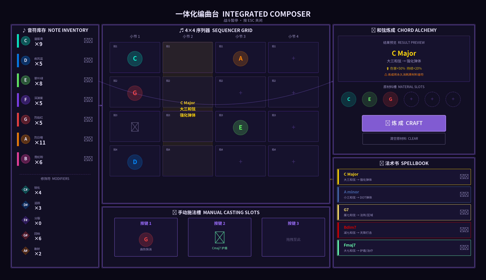
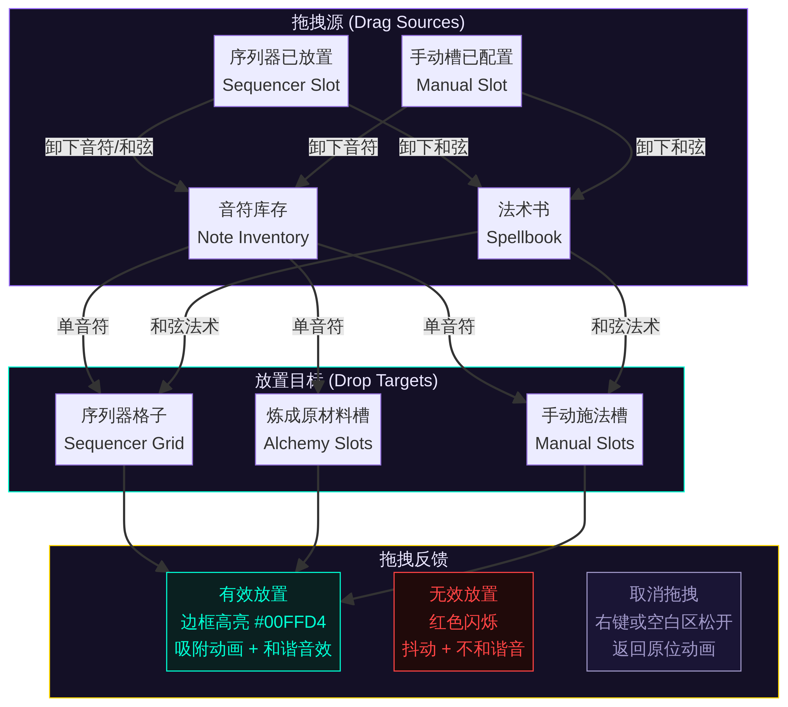
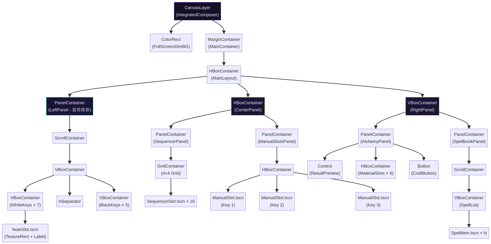

# UI 设计文档：模块3 - 一体化编曲台 (Integrated Composer)

**版本:** 1.0
**最后更新:** 2026-02-12
**状态:** 已定稿
**作者:** Manus AI

---

## 1. 概述与设计哲学

### 1.1. 文档目的

本文档为《Project Harmony》v3.0 版本的核心交互界面——**一体化编曲台 (Integrated Composer)**——提供了一套完整、详尽的用户界面（UI）与用户体验（UX）设计方案。该设计旨在响应游戏设计文档（GDD）中的核心要求，即将原先分散的音符库存、序列器、和弦炼成及手动施法槽配置等多个功能面板，整合于一个统一、高效的全屏视图中，从而“在一个视图内完成所有法术编辑工作” [1]。

### 1.2. 设计哲学：沉浸式创作流

一体化编曲台的设计哲学核心为**“沉浸式创作流” (Immersive Composition Flow)**。此界面不仅是玩家管理资源的菜单，更是在战斗间隙进行音乐创作和战术规划的核心工作台。所有设计决策均服务于以下三大支柱：

*   **无缝操作 (Seamless Flow):** 通过深思熟虑的空间布局和直观的拖拽交互，最大程度地减少玩家在“寻找资源”、“编排序列”和“创造法术”这三个核心动作之间的认知负荷与操作成本。
*   **信息清晰 (Information Clarity):** 在严格遵循项目既定“抽象矢量主义”美术风格 [2] 的前提下，确保库存数量、音符属性、序列器状态、和弦预览等关键信息清晰易读，使玩家能够快速做出精准的战术决策。
*   **通感反馈 (Synesthetic Feedback):** 将 UI 的每一次交互都与游戏的音乐核心深度绑定。无论是成功的拖拽、和弦的炼成，还是无效的操作，都必须伴随符合音乐逻辑的视觉与听觉反馈，从而在系统层面强化“战斗即创作”的核心体验。

### 1.3. 全局 UI 主题规范

本设计严格遵循《美术与VFX方向总文档》[2] 中定义的全局 UI 主题规范，以确保与游戏整体视觉风格的高度统一性。下表总结了应用于此模块的关键样式参数。

| UI 元素 | 规范细节 |
| :--- | :--- |
| **面板背景** | 星空紫 (`#141026`), 80% 不透明度，并叠加一层微弱的、程序化生成的噪点纹理以增加质感。 |
| **面板边框** | 主强调色 (`#9D6FFF`), 40% 不透明度，并应用 1px 的辉光（Glow）效果，营造出能量感。 |
| **文本** | 晶体白 (`#EAE6FF`)。标题使用科幻风格的等宽字体，正文则使用清晰易读的无衬线字体。 |
| **按钮** | 主强调色 (`#9D6FFF`)，边框带有辉光效果，并具备明确的悬停（Hover）和按下（Pressed）状态的动态视觉反馈。 |

---

## 2. 界面分区与布局

一体化编曲台是一个在战斗暂停时激活的全屏覆盖界面。其整体布局遵循一个从左至右的、符合创作直觉的逻辑流程：“**资源 → 编排 → 创造与配置**”。这种布局旨在引导玩家自然地完成从获取原材料到最终形成战斗策略的完整过程。

*图 1：一体化编曲台的整体界面分区与布局线框图。*

如上图所示，屏幕空间被划分为三个主要垂直区域：

*   **左侧区域 (占屏幕宽度 20%): 音符库存区 (Note Inventory)**
    *   垂直排列所有12种基础音符（7个白键音符和5个黑键修饰符）的库存。作为核心资源区，它被明确地放置在整个工作流的起点。

*   **中央区域 (占屏幕宽度 50%): 核心编曲区 (Sequencer & Manual Slots)**
    *   **上半部分:** 占据中央区域主要空间的 **4x4 序列器网格 (Sequencer Grid)**。这是玩家进行自动施法乐句编排的核心工作区。
    *   **下半部分:** 横向排列的 **3个手动施法槽 (Manual Casting Slots)**。它们紧邻序列器下方，方便玩家进行快速、高优先级的战术配置。

*   **右侧区域 (占屏幕宽度 30%): 法术创造与管理区 (Alchemy & Spellbook)**
    *   **上半部分:** **和弦炼成区 (Chord Alchemy Area)**，包含原材料槽、结果预览和确认按钮，是创造新法术的功能模块。
    *   **下半部分:** **法术书 (Spellbook)**，以列表形式展示所有已炼成的和弦法术，作为炼成区的产出容器和可供拖拽的法术源。

---

## 3. 核心交互设计：拖拽与放置

流畅的交互是实现“沉浸式创作流”的关键。**拖拽与放置 (Drag & Drop)** 是本界面的核心交互范式，其设计旨在提供清晰、一致且富有表现力的操作体验。

*图 2：核心拖拽交互流程图，展示了不同UI面板之间的有效交互路径。*

### 3.1. 拖拽流程与视觉反馈

拖拽操作的完整生命周期被设计为一系列具有明确视觉反馈的步骤，以引导用户并确认其操作的有效性。

1.  **开始拖拽:** 玩家在任何有效的拖拽源（如“音符库存”、“法术书”中的项目）上按下鼠标左键并移动，即可“拾取”一个可拖拽对象。
2.  **拖拽中视觉:** 被拖拽的音符或法术图标将以半透明状态跟随光标移动，其尺寸会略微放大并带有持续的辉光效果，确保在复杂的背景中依然清晰可见。
3.  **放置区高亮:** 当拖拽对象悬停在任何有效的放置目标（如序列器空格、炼成原材料槽）上时，该目标区域的边框会高亮为谐振青 (`#00FFD4`)，并发出柔和的脉冲辉光，明确指示这是一个合法的放置目标。
4.  **无效区反馈:** 若悬停在无效区域，目标区域将无任何变化，或显示一个红色的禁止图标。同时，被拖拽对象本身可能会轻微抖动并闪烁红色，向玩家提供明确的负反馈。
5.  **完成放置:** 在有效区域松开鼠标左键，拖拽对象会伴随一个快速的缩放和粒子效果“吸附”到目标槽位中，并触发相应的听觉反馈。
6.  **取消拖拽:** 在拖拽过程中随时点击鼠标右键，或将对象拖拽到任何非放置区域后松开，拖拽物会以一个平滑的动画返回其原始位置，不产生任何状态改变。

### 3.2. 关键状态反馈设计

清晰的状态反馈能有效降低玩家的困惑，并增强操作的满足感。下表定义了几个关键场景的反馈机制。

| 状态 | 触发条件 | 视觉反馈 | 听觉反馈 |
| :--- | :--- | :--- | :--- |
| **炼成成功** | 点击“炼成”按钮且配方有效 | 原材料槽中的音符化为光点飞入预览区，预览区的法术图标放大并发出耀眼光芒，随后平滑地飞入下方的法术书。 | 一个悦耳、完整的三和弦或七和弦琶音，调性与和弦根音一致。 |
| **炼成失败** | 原材料组合无法构成有效和弦 | 原材料槽中的音符剧烈抖动，整体闪烁红色，然后恢复原状。预览区显示“不和谐组合”的错误提示。 | 一段短促、刺耳的不和谐音簇（Cluster）。 |
| **库存不足** | 尝试拖拽数量为0的音符 | 对应的音符库存槽位整体闪烁红色，并显示一个“0”的数字动画。 | 一个沉闷、表示“空了”的点击音效。 |

---

## 4. 视觉编码系统

为了让玩家在不依赖阅读文字的情况下也能快速做出判断，我们建立了一套严格的视觉编码系统，主要通过**颜色**和**形状**这两个维度来传递信息。

### 4.1. 音符颜色编码

音符的颜色编码严格遵循《美术与VFX方向总文档》[2] 中定义的“七音符色彩映射”规范。这套规范不仅应用于UI，也统一应用于游戏世界中的弹体视觉效果，确保了视觉语言的一致性与玩家学习成本的降低。

| 音符 | 色彩名称 | 十六进制 | 助记（关联音符特性） |
| :--- | :--- | :--- | :--- |
| C | 谐振青 | `#00FFD4` | 均衡型 — 中性、基础的冷色 |
| D | 疾风蓝 | `#0088FF` | 极速远程 — 代表速度的冷色调 |
| E | 翠叶绿 | `#66FF66` | 巨型缓行 — 代表生长与范围的颜色 |
| F | 深渊紫 | `#8844FF` | 超持久缓行 — 代表神秘与持久的颜色 |
| G | 烈焰红 | `#FF4444` | 高伤快消 — 代表伤害与攻击性的暖色 |
| A | 烈日橙 | `#FF8800` | 持久高伤 — 代表持续能量的暖色 |
| B | 霓虹粉 | `#FF44AA` | 高速高伤 — 代表锐利与穿透感的颜色 |

黑键音符 (C#, D#, F#, G#, A#) 作为修饰符，其图标设计为对应白键音符图标的“锐化”或“暗化”版本，颜色上保持与主音符的色相关联，但饱和度与亮度有所区别，并在图标上增加 `#` 或 `b` 的符号标记以作区分。

### 4.2. 和弦法术形状编码

和弦法术的UI图标形状直接预示了其在游戏世界中的行为模式，这同样与GDD [1] 和美术文档 [2] 中定义的法术形态保持严格一致，旨在建立直观的“形意结合”。

| 和弦类型 | 法术形态 | UI 图标核心形状 | 设计思路 |
| :--- | :--- | :--- | :--- |
| 大三和弦 | 强化弹体 | **向上的实心箭头 / 加号** | 稳定和谐 → 增强基础属性 |
| 小三和弦 | DOT 弹体 | **水滴 / 腐蚀性波浪线** | 忧郁持续 → 持续性伤害 |
| 增三和弦 | 爆炸弹体 | **向外扩散的放射状箭头** | 膨胀扩张 → 范围性爆炸 |
| 减三和弦 | 冲击波 | **向内汇聚的螺旋箭头** | 收缩紧张 → 内爆式冲击 |
| 属七和弦 | 法阵/区域 | **带有中心点的稳定圆环** | 需要“解决” → 持续存在的区域 |
| 减七和弦 | 天降打击 | **向下劈落的闪电符号** | 极度不稳定 → 毁灭性打击 |
| 大七和弦 | 护盾/治疗法阵 | **坚固的盾牌 / 发光的十字** | 温暖丰满 → 保护与恢复 |
| 小七和弦 | 召唤/构造 | **堆叠的方块 / 塔楼轮廓** | 深沉厚重 → 创造地面构造物 |
| 挂留和弦 | 蓄力弹体 | **旋转的沙漏 / 蓄能螺旋** | 悬而未决 → 延迟与蓄力释放 |

---

## 5. Godot 实现建议

为了将此UI设计高效、稳健地在Godot 4.x引擎中实现，兹提出以下技术架构与实现建议。

*图 3：推荐的 Godot 场景树结构，展示了如何使用容器节点来组织布局。*

*   **根节点结构:** 整个一体化编曲台应作为一个独立的场景 `IntegratedComposer.tscn`，其根节点为 `CanvasLayer`，以确保它始终渲染在所有游戏内容的顶层。主控制脚本可命名为 `integrated_composer.gd`。

*   **布局与容器:** 强烈建议广泛使用Godot的容器（Container）节点来管理布局，如 `HBoxContainer`、`VBoxContainer` 和 `GridContainer`。这可以确保UI在不同分辨率下的自适应能力，并极大地简化布局调整的工作。

*   **拖拽系统:** 应当优先使用Godot内置的 `Control` 节点的拖拽功能。通过在各个UI槽位脚本中实现 `_get_drag_data`, `_can_drop_data`, 和 `_drop_data` 这三个核心虚函数，可以构建一个强大且高效的拖拽系统。在 `_get_drag_data` 中传递包含音符或法术信息的字典，并使用 `set_drag_preview` 方法来创建自定义的、跟随光标的视觉元素。

*   **数据驱动设计:** 整个UI的状态（如库存数量、序列器内容）应由一个统一的数据模型（例如一个名为 `PlayerData` 的全局单例或 `Resource` 文件）来驱动。UI元素本身不存储状态，而是监听该数据模型的信号（例如 `player_data.note_count_changed`）并据此更新自身的视觉表现。这种模式有助于保持代码的清晰、解耦和可维护性。

*   **主题与样式:** 将所有在《美术与VFX方向总文档》[2] 中定义的颜色、字体和样式配置到全局主题资源 `GlobalTheme.tres` 中，并将其应用到编曲台场景的根节点。这可以全局统一所有子 `Control` 节点的外观，方便未来进行统一的风格迭代。辉光、噪点和边框等复杂视觉效果，可以通过为 `PanelContainer` 或 `NinePatchRect` 节点附加自定义的 `ShaderMaterial` 来高效实现。

---

## 6. 参考文献

[1] Manus AI. (2026, Feb 12). *游戏设计文档：Project Harmony v3.0*. gdszyy/project-harmony-gdd. [Online]. Available: `/home/ubuntu/project-harmony-gdd/GDD.md`

[2] Manus AI. (2026, Feb 11). *美术与VFX方向总文档 v2.1*. gdszyy/project-harmony-gdd. [Online]. Available: `/home/ubuntu/project-harmony-gdd/Docs/Art_And_VFX_Direction.md`
