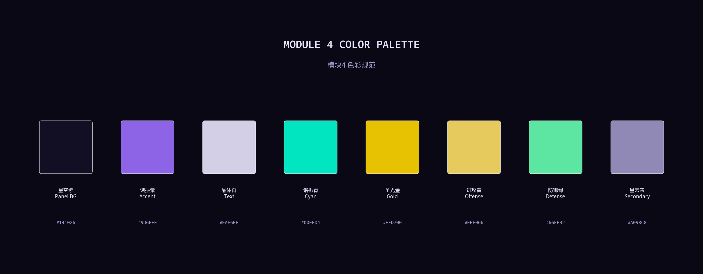
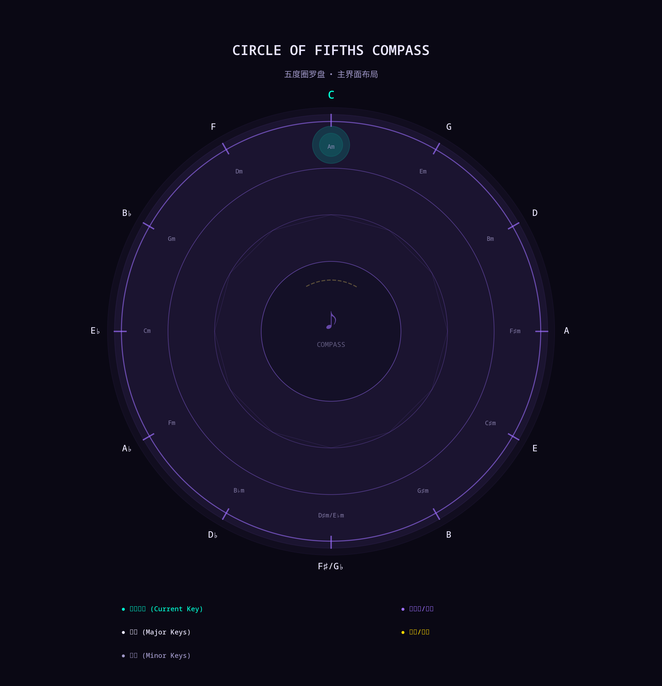
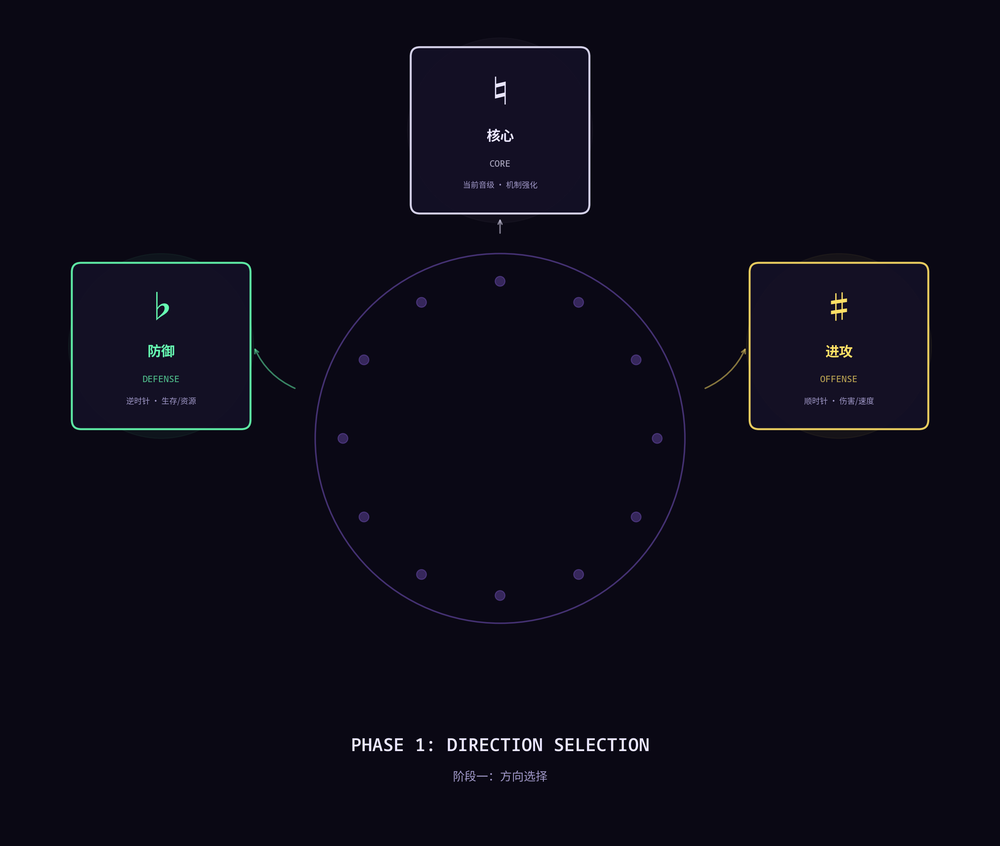
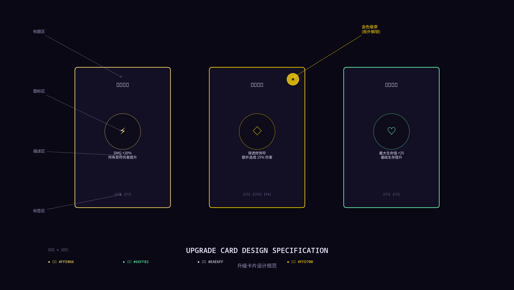
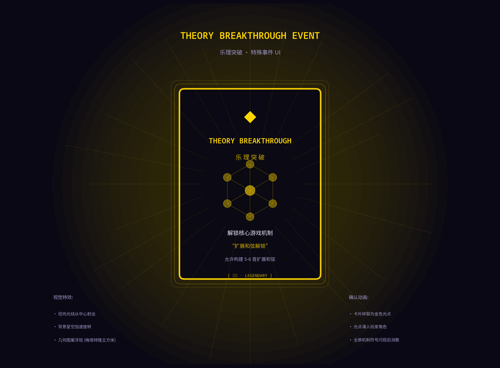
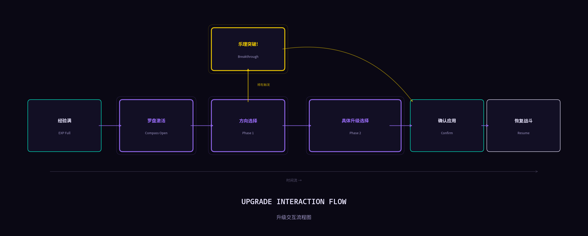

# UI 设计文档：模块4 — 五度圈罗盘升级系统

**版本:** 1.0  
**最后更新:** 2026-02-12  
**状态:** 设计稿  
**作者:** Manus AI (根据 gdszyy 的创意与反馈迭代)

> **文档定位：UI/UX 详细设计与 Godot 实现指南**  
> 本文档为《Project Harmony》v3.0 核心局内升级系统——"五度圈罗盘 (Circle of Fifths Compass)"——提供完整的用户界面、用户体验设计方案与 Godot 引擎实现建议。设计严格遵循 **[《美术与VFX方向总文档》](./Art_And_VFX_Direction.md)** 中确立的"抽象矢量主义"美学体系和全局 UI 规范，并与 **[《GDD v3.0》](../GDD.md)** 第6章定义的升级机制完全对齐。

---

## 目录

1. [设计哲学与全局规范](#1-设计哲学与全局规范)
2. [主界面：五度圈罗盘](#2-主界面五度圈罗盘)
3. [阶段一：方向选择](#3-阶段一方向选择)
4. [阶段二：具体升级选择](#4-阶段二具体升级选择)
5. [升级卡片设计规范](#5-升级卡片设计规范)
6. [金色高亮标识：局外解锁](#6-金色高亮标识局外解锁)
7. [特殊事件：乐理突破](#7-特殊事件乐理突破)
8. [图鉴 / 百科全书 (Codex)](#8-图鉴--百科全书-codex)
9. [解锁弹窗与通知系统](#9-解锁弹窗与通知系统)
10. [游戏机制说明面板](#10-游戏机制说明面板)
11. [动效与转场设计](#11-动效与转场设计)
12. [Godot 实现建议](#12-godot-实现建议)

---

## 1. 设计哲学与全局规范

### 1.1. 核心设计原则

五度圈罗盘系统的 UI 设计承载着将游戏核心音乐理论机制 **"具象化"** 与 **"直觉化"** 的双重使命。它不仅仅是一个功能性菜单，更是游戏世界观的物理延伸——一个充满星辰与谐振能量的古代星盘，玩家通过拨动它来调谐自身与宇宙的和谐频率。

设计遵循三大原则：

**通感 (Synesthesia):** 将抽象的乐理概念（调性明暗、和谐倾向、音级距离）转化为清晰、可感的视觉语言。玩家应当能够"看到"音乐的方向——顺时针的明亮感、逆时针的柔和感、以及当前调性的稳定感。

**沉浸式叙事 (Diegetic Storytelling):** UI 本身就是游戏世界的一部分。所有交互都应强化"在宇宙中拨动和谐之弦"的体验，而非将玩家从战斗中抽离到一个外部菜单。

**信息层级 (Information Hierarchy):** 两阶段选择流程的设计，从"宏观策略方向"到"微观具体升级"，确保玩家在每一步都面对清晰、可管理的信息量，避免决策疲劳。

### 1.2. 全局 UI 主题规范

所有 UI 元素严格遵守已定义的全局主题，确保与游戏其他界面（HUD、编曲台、暂停菜单等）的视觉一致性。

| UI 元素 | 规范 | 十六进制 | 用途 |
| :--- | :--- | :--- | :--- |
| **面板背景** | 星空紫，80% 不透明 | `#141026` | 所有面板、卡片的底色；带微妙的程序化星点噪点纹理 |
| **强调色 / 边框** | 谐振紫 | `#9D6FFF` | 按钮、高亮、面板边框等交互元素的默认色 |
| **主文本** | 晶体白 | `#EAE6FF` | 标题、描述、数值等主要信息文本 |
| **次级文本** | 星云灰 | `#A098C8` | 辅助说明、标签、已禁用选项 |
| **进攻方向色** | Dominant 黄 | `#FFE066` | 进攻方向的所有 UI 元素 |
| **防御方向色** | 治愈绿 | `#66FFB2` | 防御方向的所有 UI 元素 |
| **核心方向色** | 晶体白 | `#EAE6FF` | 核心方向的所有 UI 元素 |
| **传说 / 特殊高亮** | 圣光金 | `#FFD700` | "乐理突破"事件和局外解锁的特殊标识 |
| **当前调性高亮** | 谐振青 | `#00FFD4` | 罗盘上当前调性的发光标识 |


*图1：模块4 五度圈罗盘升级系统的完整色彩规范。*

### 1.3. 字体规范

| 用途 | 字体类型 | 字号 | 颜色 | 备注 |
| :--- | :--- | :--- | :--- | :--- |
| **罗盘音级标签** | 等宽/科幻字体 | 16px (当前调性 18px) | 晶体白 / 谐振青(当前) | 当前调性加粗 |
| **方向选择标题** | 等宽/科幻字体 | 22px | 各方向色 | 加粗，带辉光 |
| **方向选择描述** | 无衬线字体 | 12px | 次级文本 | 简短一行 |
| **卡片标题** | 等宽/科幻字体 | 16px | 晶体白 / 圣光金(传说) | 居中 |
| **卡片描述** | 无衬线字体 | 13px | 晶体白 | 关键数值用强调色高亮 |
| **卡片标签** | 等宽字体 | 10px | 次级文本 | 方括号包裹 |

---

## 2. 主界面：五度圈罗盘

罗盘是整个升级系统的核心视觉锚点，一个恒定存在于游戏世界中的宇宙星盘。


*图2：五度圈罗盘主界面布局。C 大调位于 12 点钟方向，顺时针为升号调方向（更明亮），逆时针为降号调方向（更柔和）。*

### 2.1. 结构与布局

罗盘采用标准的十二音五度圈布局，由外而内共四层同心结构：

**外圈 — 大调音级环 (Major Key Ring):** 刻有 12 个大调的根音字母，按五度圈标准排列。C 位于 12 点钟方向（正上方），顺时针依次为 G, D, A, E, B, F♯/G♭；逆时针依次为 F, B♭, E♭, A♭, D♭。每个音级占据一个 30° 的扇区。玩家当前所处的调性（由章节或游戏进程决定）会被高亮，散发柔和的 `谐振青` (#00FFD4) 光晕，并有微弱的呼吸脉动。

**中圈 — 关系小调环 (Relative Minor Ring):** 刻有 12 个关系小调的根音字母（Am, Em, Bm...），字号略小，亮度稍暗（使用 `次级文本` 颜色），作为乐理辅助信息。

**内圈 — 连接线网络 (Connection Web):** 由纤细的、发光的 `谐振紫` 线条连接相邻音级，形成五度圈的十二边形几何结构。这些线条在玩家交互时会有相应的辉光反馈。

**核心 — 星云区 (Nebula Core):** 罗盘中心是一个深邃的圆形区域，以 `星空紫` 为底，内部有缓慢旋转的程序化星云粒子效果。在升级选择的第二阶段，具体的升级卡片将在此区域呈现。

### 2.2. 待机状态与激活

**待机状态:** 在正常战斗中，罗盘以缩小的形态存在于 HUD 的某个角落（建议左上角或右上角），作为当前调性和升级进度的指示器。整体有微弱的呼吸感，中心星云缓慢旋转，当前调性刻度持续发光。

**激活触发:** 当玩家获得足够经验值触发升级时：
1. 游戏时间平滑减速至暂停（使用 `Engine.time_scale` 的 Tween 过渡）。
2. 其他 HUD 元素（血条、序列器、疲劳指示器）淡出至 30% 不透明度。
3. 罗盘从 HUD 位置放大并移动至屏幕中央，伴随径向模糊和轻微色差效果。
4. 光芒增强，外圈辉光亮起，进入"方向选择"阶段。

---

## 3. 阶段一：方向选择

当罗盘激活后，三个代表不同升级方向的"谐振符文 (Resonance Rune)"会在罗盘外围的三个关键位置浮现。


*图3：方向选择阶段 UI。三个方向分别位于罗盘的右侧（进攻/顺时针）、左侧（防御/逆时针）和正上方（核心/当前）。*

### 3.1. 三方向视觉设计

| 属性 | 进攻 (Offense) | 防御 (Defense) | 核心 (Core) |
| :--- | :--- | :--- | :--- |
| **位置** | 罗盘右侧（3点钟方向） | 罗盘左侧（9点钟方向） | 罗盘正上方（12点钟方向） |
| **调性走向** | 顺时针 — 更"明亮"的调 | 逆时针 — 更"柔和"的调 | 停留在当前音级 |
| **图标** | 升号 `♯` / 顺时针箭头 | 降号 `♭` / 逆时针箭头 | 还原号 `♮` / 完美圆形 |
| **主色** | `Dominant 黄` (#FFE066) | `治愈绿` (#66FFB2) | `晶体白` (#EAE6FF) |
| **辉光风格** | 快速脉冲，向外扩散的粒子 | 缓慢呼吸，向内流动的能量 | 稳定持续的光环 |
| **升级倾向** | 伤害、速度、进攻性词条 | 生存、疲劳抗性、资源获取 | 核心机制强化、音符获取 |
| **描述文本** | "强化伤害与速度" | "提升生存与资源" | "深化核心机制" |
| **音效** | 上行五度音程（如 C→G） | 下行五度音程（如 C→F） | 同度齐奏，加混响 |

### 3.2. 交互细节

**悬停 (Hover):** 当玩家将光标移至某个方向的符文上时：
- 符文图标放大至 1.1 倍，辉光增强 30%。
- 罗盘上对应的调性路径高亮——例如选择"进攻"时，从当前调性（假设 C）出发，C→G→D... 的路径会依次短暂闪亮，形成一条"光之轨迹"。
- 符文下方显示简短的倾向描述文本。
- 播放对应的音效提示。

**选择 (Select):** 玩家确认选择后：
- 被选中的符文发出一道强光脉冲。
- 未选中的两个符文快速淡出并缩小消失。
- 罗盘执行一个快速的旋转动画，将选定方向对应的调性区域旋转至视觉焦点位置。
- 过渡至阶段二。

### 3.3. 键盘/手柄支持

为确保多平台操作体验，方向选择支持以下输入方式：

| 输入方式 | 进攻 | 核心 | 防御 |
| :--- | :--- | :--- | :--- |
| **鼠标** | 点击右侧符文 | 点击上方符文 | 点击左侧符文 |
| **键盘** | `D` 或 `→` | `W` 或 `↑` | `A` 或 `←` |
| **手柄** | 右摇杆右推 | 右摇杆上推 | 右摇杆左推 |

---

## 4. 阶段二：具体升级选择

选定方向后，罗盘中心的星云区域会展开，2-3 张具体的升级卡片从中浮现，呈弧形排列供玩家选择。

### 4.1. 卡片布局

卡片围绕罗盘中心呈弧形排列。当存在 2 张卡片时，它们分别位于中心偏左和偏右；当存在 3 张卡片时，它们均匀分布在一个 120° 的弧段上。当前选中的卡片会略微上移并放大至 1.15 倍，未选中的卡片保持原始大小并降低至 70% 不透明度。

### 4.2. 信息展示

每张卡片在被选中（悬停）时，会在卡片下方或罗盘底部区域显示一个"效果预览面板"，包含：
- **数值变化预览:** 以 `当前值 → 新值` 的格式显示受影响的属性变化，新值使用强调色高亮。
- **Build 协同提示:** 如果该升级与玩家当前已拥有的其他升级存在协同效应，会显示一个小的"协同"图标和简短说明。

### 4.3. 确认与退出

玩家选择一张卡片后：
1. 选中的卡片发出光芒，然后以缩小+粒子拖尾的形式飞向 HUD 中的升级指示区域。
2. 未选中的卡片碎裂成与其方向色对应的光粒子，缓缓消散。
3. 罗盘缩小并返回其 HUD 待机位置。
4. 游戏时间平滑恢复正常。

---

## 5. 升级卡片设计规范

升级卡片是信息传达的核心载体，其设计必须在有限的空间内清晰、一致且美观地呈现升级信息。


*图4：升级卡片设计规范。左：进攻方向卡片；中：局外解锁卡片（金色边框+徽章）；右：防御方向卡片。*

### 5.1. 卡片结构

| 区域 | 内容 | 设计规范 |
| :--- | :--- | :--- |
| **顶部 — 标题区** | 升级名称 | 等宽科幻字体，16px，`晶体白`，居中。传说级前缀 `◆`。 |
| **中部 — 图标区** | 抽象几何图标 | 圆形容器（`深渊黑` 背景 + 方向色边框），内含用方向色描绘的抽象矢量图标。 |
| **下部 — 描述区** | 效果描述 | 无衬线字体，13px，`晶体白`。关键数值（如 `+20%`）使用 `强调色` 高亮。最多3行。 |
| **底部 — 标签区** | 分类标签 | 等宽字体，10px，`次级文本`。方括号包裹，如 `[进攻] [伤害]`。 |

### 5.2. 卡片尺寸与样式

- **尺寸:** 宽 240px × 高 320px（3:4 比例），圆角半径 12px。
- **背景:** `星空紫` (#141026)，80% 不透明度。
- **边框:** 1.5px 宽的辉光边框，颜色取决于升级方向（进攻黄/防御绿/核心白）。
- **阴影:** 向右下偏移 4px 的柔和暗影，增加层次感。

### 5.3. 卡片状态

| 状态 | 视觉变化 |
| :--- | :--- |
| **默认** | 标准样式，70% 不透明度（未聚焦时） |
| **悬停/聚焦** | 100% 不透明度，放大至 1.15 倍，边框辉光增强，上移 8px |
| **选中确认** | 短暂闪白（0.1s），然后缩小飞向 HUD |
| **不可选（已满）** | 50% 不透明度，灰色覆盖，标签显示"已达上限" |

### 5.4. 稀有度视觉分级

| 稀有度 | 边框样式 | 图标容器 | 特殊效果 |
| :--- | :--- | :--- | :--- |
| **普通** | 单层方向色边框，1.5px | 单层边框 | 无 |
| **稀有** | 双层方向色边框，内层 1.5px + 外层 0.5px 辉光 | 双层边框 | 卡片背景有微弱的粒子流动 |
| **史诗** | 三层渐变边框（方向色→白色渐变） | 旋转的几何边框 | 卡片边缘有持续的光粒子环绕 |
| **传说** | `圣光金` 边框，3px，双层辉光 | 金色几何图案 | 全卡片金色粒子流动 + 背景星云加速 |

---

## 6. 金色高亮标识：局外解锁

通过"和谐殿堂"局外成长系统解锁并加入到升级池中的选项，需要有明确的视觉区分，以增强玩家的获得感和局内外成长的联动性。

### 6.1. 视觉实现

**金色边框替换:** 卡片的辉光边框从方向色变为 `圣光金` (#FFD700)，保持原有的边框宽度和辉光强度。

**殿堂徽章 (Hall Badge):** 在卡片右上角添加一个直径 24px 的圆形金色徽章。徽章内部是一个简化的"和谐殿堂"符号（一个小型的五角星或音叉图标），使用 `深渊黑` 描绘。徽章有持续的微弱脉动辉光。

**标签标注:** 在卡片底部的标签区，额外添加一个 `[殿堂]` 标签，使用 `圣光金` 颜色。

### 6.2. 设计意图

这种高亮不仅是对玩家局外努力的视觉奖励，也在信息层面暗示了该升级可能具有更高的价值或独特性。金色在游戏的色彩体系中代表"完美"与"传说"，将其应用于局外解锁的升级，强化了"和谐殿堂"作为玩家长线成长目标的吸引力。

---

## 7. 特殊事件：乐理突破

"乐理突破 (Theory Breakthrough)"是一种稀有的、能直接解锁核心游戏机制的特殊升级事件。其 UI 表现必须具有足够的冲击力和仪式感，让玩家感受到"顿悟"的时刻。


*图5：乐理突破事件的特殊 UI 表现。黑金配色的传说级卡片，伴随径向光线和几何图案。*

### 7.1. 触发机制

当"乐理突破"事件被触发时，常规的两阶段选择流程被完全跳过。整个屏幕变暗（除罗盘外的区域降至 10% 亮度），聚光灯效果汇聚到罗盘中心。

### 7.2. 视觉表现

**入场动画 (Entrance):**
1. 罗盘中心的星云突然加速旋转，颜色从紫色渐变为金色。
2. 从中心点射出 24 条金色径向光线，快速扩散至屏幕边缘后消散。
3. 一张独特的、尺寸更大的传说级卡片（宽 320px × 高 440px）从罗盘中心缓缓升起。
4. 伴随专属的、宏大的圣咏音效（低频共鸣 + 高频泛音）。

**卡片设计:**
- **背景:** 流动的金色星云纹理，而非标准的 `星空紫`。
- **边框:** `圣光金` (#FFD700)，3px 宽，双层辉光（内层实线 + 外层 0.3 不透明度的扩散辉光）。
- **标题:** 前缀 `◆` 菱形传说标志，使用 `圣光金` 颜色。
- **图标:** 复杂的神圣几何图案（如简化的梅塔特隆立方体），使用金色线条描绘，带有缓慢旋转动画。

**背景效果:**
- 罗盘背景的星空加速旋转。
- 浮现出与所解锁机制相关的大型几何图案——例如解锁"扩展和弦"时，背景会出现复杂的十二面体或星形多边形。

### 7.3. 确认动画

玩家确认选择后：
1. 卡片碎裂成无数金色光点。
2. 光点以螺旋轨迹涌入玩家角色位置。
3. 屏幕上出现一个巨大的、代表新机制的符号（如一个展开的和弦图谱），持续 1.5 秒后缓缓消散。
4. 全屏短暂闪白（0.15s），然后恢复正常。

---

## 8. 图鉴 / 百科全书 (Codex)

图鉴系统为玩家提供了一个回顾和学习所有已发现升级、乐理知识和游戏机制的百科全书式界面。

### 8.1. 入口

图鉴可从以下位置访问：
- 主菜单的"图鉴"按钮。
- 暂停菜单的"图鉴"选项。
- 升级卡片上的"详情"快捷按钮（如果空间允许）。

### 8.2. 布局设计

采用经典的**双栏布局**：

**左栏 — 分类导航 (Category Navigation):**
- 宽度占屏幕的 25%。
- 使用 `星空紫` 背景，`谐振紫` 分割线。
- 分类列表：
    - **音符 (Notes):** 7 个白键 + 5 个黑键的详细信息。
    - **和弦 (Chords):** 所有已发现的和弦类型及其法术形态。
    - **升级 (Upgrades):** 按方向（进攻/防御/核心）分组的所有升级项。
    - **敌人 (Enemies):** 已遭遇的敌人类型及其三相位形态。
    - **乐理 (Theory):** 游戏中涉及的乐理知识解释。
- 已解锁条目：`晶体白` 文本，左侧有对应的彩色图标。
- 未解锁条目：`次级文本` 颜色，文本显示为 `???`，左侧有灰色锁定图标。

**右栏 — 详细内容 (Detail Panel):**
- 宽度占屏幕的 75%。
- 顶部：条目标题 + 稀有度标签。
- 中部：详细的文字说明、数值表格、相关的乐理知识。
- 底部：一个可交互的视觉预览区域——例如，可以旋转查看和弦法术的几何形态，或播放升级效果的动画预览。

### 8.3. 视觉风格

图鉴的整体视觉风格延续游戏内的 UI 主题，但增加了"古籍"的质感——面板边框使用更精细的装饰性线条，标题使用带有微弱扫光效果的科幻字体，营造出"翻阅古代乐理典籍"的沉浸感。

---

## 9. 解锁弹窗与通知系统

当玩家首次获得某个升级、发现新的图鉴条目、或完成某个里程碑时，会触发一个非阻塞式的解锁通知弹窗。

### 9.1. 设计规范

| 属性 | 规范 |
| :--- | :--- |
| **位置** | 屏幕右上角，距顶部 80px，距右侧 20px |
| **尺寸** | 宽 300px × 高 80px，圆角 8px |
| **背景** | `星空紫`，90% 不透明度 |
| **边框** | 1px `谐振紫` 辉光边框 |
| **内容** | 左侧：条目图标（40×40px）；右侧：条目名称（`晶体白`，14px）+ "已添加至图鉴"（`次级文本`，11px） |
| **入场动画** | 从屏幕右侧滑入，持续 0.3s，缓出曲线 |
| **停留时间** | 3 秒 |
| **退场动画** | 向右滑出，持续 0.3s，缓入曲线 |
| **堆叠** | 多个通知同时触发时，向下堆叠，间距 8px |

### 9.2. 特殊通知

对于"乐理突破"等重大解锁事件，通知弹窗会使用 `圣光金` 边框，并在图标区域添加闪光粒子效果，以突出其重要性。

---

## 10. 游戏机制说明面板

为了帮助玩家理解五度圈罗盘系统的运作方式，设计了多层次的机制说明系统。

### 10.1. 首次引导 (First-Time Tutorial)

玩家首次触发升级时，会出现一个简短的引导序列：
1. **步骤1:** 高亮罗盘，显示提示："这是五度圈罗盘，你的升级之路。"
2. **步骤2:** 依次高亮三个方向，解释每个方向的含义。
3. **步骤3:** 模拟选择一个方向，展示卡片出现的过程。
4. **步骤4:** 提示玩家进行实际选择。

引导使用半透明的暗色遮罩 + 高亮聚焦的方式，确保玩家注意力集中在被解释的元素上。

### 10.2. 帮助面板 (Help Panel)

在升级界面的角落（建议右下角）提供一个 `?` 按钮，点击后展开一个简洁的帮助面板，使用图文结合的方式解释：
- 五度圈的基本概念（顺时针 = 升号 = 更明亮；逆时针 = 降号 = 更柔和）。
- 三个方向的升级倾向。
- 金色标识的含义。
- "乐理突破"事件的说明。

帮助面板的设计与升级卡片风格一致，但尺寸更大（占屏幕 60%），使用 `星空紫` 背景和 `谐振紫` 边框。

---

## 11. 动效与转场设计

流畅且有意义的动效是提升 UI/UX 品质的关键。所有动效都应服务于信息传达和沉浸感，避免纯粹的装饰性动画。


*图6：完整的升级交互流程图，展示从经验满到恢复战斗的全流程，包括"乐理突破"的稀有分支。*

### 11.1. 全局动效参数

| 参数 | 值 | 用途 |
| :--- | :--- | :--- |
| **标准过渡时长** | 0.3s | 大多数 UI 元素的出现/消失 |
| **强调过渡时长** | 0.5s | 罗盘激活/关闭等重要转场 |
| **缓动曲线** | `EASE_OUT_CUBIC` | 出现动画（快速启动，缓慢停止） |
| **缓入曲线** | `EASE_IN_CUBIC` | 消失动画（缓慢启动，快速结束） |
| **弹性曲线** | `EASE_OUT_BACK` | 卡片出现时的轻微过冲效果 |

### 11.2. 关键动效序列

**罗盘激活序列 (Compass Activation):**
1. `[0.0s - 0.2s]` 游戏时间从 1.0 减速至 0.0（Tween `Engine.time_scale`）。
2. `[0.1s - 0.4s]` HUD 元素淡出至 30% 不透明度。
3. `[0.2s - 0.5s]` 全屏径向模糊效果从 0 增至 0.3（后处理 Shader）。
4. `[0.2s - 0.7s]` 罗盘从 HUD 位置放大并移至屏幕中央（`EASE_OUT_CUBIC`）。
5. `[0.5s - 0.8s]` 三个方向符文依次浮现（间隔 0.1s），带有淡入+缩放动画。
6. `[0.8s]` 径向模糊消退，界面完全就绪。

**方向选择 → 卡片展示过渡 (Direction → Cards Transition):**
1. `[0.0s - 0.2s]` 未选中的方向符文淡出。
2. `[0.0s - 0.4s]` 罗盘快速旋转至选定方向（旋转角度取决于方向）。
3. `[0.3s - 0.5s]` 罗盘中心星云加速旋转，颜色微调至方向色。
4. `[0.4s - 0.8s]` 2-3 张升级卡片从中心依次弹出（`EASE_OUT_BACK`），间隔 0.1s。

**卡片选择 → 恢复战斗 (Card Select → Resume):**
1. `[0.0s - 0.1s]` 选中卡片闪白。
2. `[0.1s - 0.4s]` 选中卡片缩小并飞向 HUD（贝塞尔曲线轨迹）。
3. `[0.1s - 0.3s]` 未选中卡片碎裂为粒子消散。
4. `[0.3s - 0.6s]` 罗盘缩小返回 HUD 位置。
5. `[0.4s - 0.7s]` HUD 元素恢复至 100% 不透明度。
6. `[0.5s - 0.8s]` 游戏时间从 0.0 恢复至 1.0。

---

## 12. Godot 实现建议

本章提供将上述 UI 设计在 Godot 4.x 引擎中实现的技术建议和架构参考。

### 12.1. 场景树结构

```
CircleOfFifthsUpgrade (Control)  # 根节点，管理整体流程
├── BackgroundOverlay (ColorRect)  # 全屏暗色遮罩 + 后处理 Shader
├── CompassRoot (Control)  # 罗盘主体容器
│   ├── OuterRing (Control)  # 外圈大调音级
│   │   ├── KeySlot_C (TextureRect + Label)
│   │   ├── KeySlot_G (TextureRect + Label)
│   │   └── ... (共12个)
│   ├── MiddleRing (Control)  # 中圈关系小调
│   │   └── ... (共12个)
│   ├── ConnectionWeb (Line2D / _draw())  # 连接线
│   ├── NebulaCoreVFX (GPUParticles2D)  # 中心星云粒子
│   └── CurrentKeyHighlight (TextureRect)  # 当前调性高亮
├── DirectionSelectionLayer (Control)  # 方向选择层
│   ├── OffenseRune (Button + ShaderMaterial)
│   ├── DefenseRune (Button + ShaderMaterial)
│   └── CoreRune (Button + ShaderMaterial)
├── CardSelectionLayer (Control)  # 卡片选择层
│   ├── CardSlot1 (UpgradeCard.tscn)
│   ├── CardSlot2 (UpgradeCard.tscn)
│   └── CardSlot3 (UpgradeCard.tscn)
├── TheoryBreakthroughLayer (CanvasLayer)  # 乐理突破特效层
│   ├── RadialLinesVFX (GPUParticles2D)
│   ├── LegendaryCard (UpgradeCard.tscn)
│   └── GeometryPatternVFX (GPUParticles2D)
├── EffectPreviewPanel (PanelContainer)  # 效果预览面板
├── HelpButton (Button)  # 帮助按钮
└── NotificationStack (VBoxContainer)  # 通知弹窗堆叠容器
```

### 12.2. 核心脚本架构

**`circle_of_fifths_upgrade_v3.gd` — 主控制器:**

```gdscript
extends Control

## 五度圈罗盘升级系统 v3.0 主控制器
## 管理两阶段选择流程、动画序列和数据交互

signal upgrade_selected(upgrade_data: UpgradeData)
signal upgrade_cancelled

enum Phase { INACTIVE, DIRECTION_SELECT, CARD_SELECT, THEORY_BREAKTHROUGH }

@export var compass_root: Control
@export var direction_layer: Control
@export var card_layer: Control
@export var breakthrough_layer: CanvasLayer
@export var background_overlay: ColorRect

var current_phase: Phase = Phase.INACTIVE
var current_direction: String = ""  # "offense", "defense", "core"
var available_upgrades: Array[UpgradeData] = []

func activate_compass() -> void:
    """激活罗盘，开始升级流程。"""
    current_phase = Phase.DIRECTION_SELECT
    _play_activation_sequence()
    
    # 检查是否触发乐理突破
    if _check_theory_breakthrough():
        current_phase = Phase.THEORY_BREAKTHROUGH
        _show_theory_breakthrough()
    else:
        _show_direction_selection()

func _play_activation_sequence() -> void:
    """播放罗盘激活动画序列。"""
    var tween = create_tween().set_parallel(true)
    # 游戏减速
    tween.tween_property(Engine, "time_scale", 0.0, 0.2)
    # 背景遮罩淡入
    tween.tween_property(background_overlay, "modulate:a", 0.7, 0.3)
    # 罗盘放大移至中央
    tween.tween_property(compass_root, "scale", Vector2(1.0, 1.0), 0.5)\
         .set_ease(Tween.EASE_OUT).set_trans(Tween.TRANS_CUBIC)
    tween.tween_property(compass_root, "position", _get_center_position(), 0.5)\
         .set_ease(Tween.EASE_OUT).set_trans(Tween.TRANS_CUBIC)

func _on_direction_selected(direction: String) -> void:
    """处理方向选择。"""
    current_direction = direction
    current_phase = Phase.CARD_SELECT
    available_upgrades = UpgradePoolManager.get_upgrades(direction, 3)
    _transition_to_card_selection()

func _on_card_selected(card_index: int) -> void:
    """处理卡片选择。"""
    var selected = available_upgrades[card_index]
    upgrade_selected.emit(selected)
    _play_card_confirm_animation(card_index)
    _deactivate_compass()
```

**`UpgradeCard.tscn` / `upgrade_card.gd` — 卡片组件:**

```gdscript
extends PanelContainer
class_name UpgradeCard

## 升级卡片 UI 组件

@export var title_label: Label
@export var icon_texture: TextureRect
@export var description_label: RichTextLabel
@export var tags_label: Label
@export var border_glow: NinePatchRect  # 辉光边框
@export var gold_badge: TextureRect  # 局外解锁金色徽章

var card_data: UpgradeData
var is_meta_unlocked: bool = false

func setup(data: UpgradeData) -> void:
    """根据数据配置卡片显示。"""
    card_data = data
    title_label.text = data.title
    icon_texture.texture = data.icon
    description_label.text = _format_description(data)
    tags_label.text = _format_tags(data)
    
    # 设置方向色
    var direction_color = _get_direction_color(data.direction)
    border_glow.modulate = direction_color
    
    # 检查局外解锁
    is_meta_unlocked = MetaProgressionManager.is_upgrade_from_meta(data.id)
    if is_meta_unlocked:
        border_glow.modulate = Color("#FFD700")  # 圣光金
        gold_badge.visible = true

func _format_description(data: UpgradeData) -> String:
    """格式化描述文本，高亮关键数值。"""
    var text = data.description
    # 使用 BBCode 高亮数值
    text = text.replace(data.value_text, 
        "[color=#9D6FFF]%s[/color]" % data.value_text)
    return text
```

**`UpgradeData.gd` — 数据资源（待实现）:**

> **注意**: `UpgradeData.gd` 文件当前尚未在项目中创建，以下为设计参考。

```gdscript
extends Resource
class_name UpgradeData

## 升级数据资源

@export var id: StringName
@export var title: String
@export var description: String
@export var value_text: String  # 用于高亮的数值文本
@export var icon: Texture2D
@export var direction: String  # "offense", "defense", "core"
@export var rarity: int  # 0=普通, 1=稀有, 2=史诗, 3=传说
@export var tags: PackedStringArray
@export var is_theory_breakthrough: bool = false
@export var meta_unlock_id: StringName = &""  # 关联的局外解锁ID
```

### 12.3. Shader 参考

**罗盘辉光边框 Shader (`compass_glow_border.gdshader`)（待实现）:**

> **注意**: `compass_glow_border.gdshader` 文件当前尚未在项目中创建，以下为设计参考。

```glsl
shader_type canvas_item;

uniform vec4 glow_color : source_color = vec4(0.616, 0.435, 1.0, 1.0);  // #9D6FFF
uniform float glow_intensity : hint_range(0.0, 3.0) = 1.0;
uniform float pulse_speed : hint_range(0.0, 5.0) = 1.5;
uniform float border_width : hint_range(0.0, 0.1) = 0.02;

void fragment() {
    vec2 uv = UV;
    float dist = length(uv - vec2(0.5));
    
    // 圆形边框
    float border = smoothstep(0.48 - border_width, 0.48, dist) 
                 - smoothstep(0.48, 0.48 + border_width, dist);
    
    // 呼吸脉动
    float pulse = sin(TIME * pulse_speed) * 0.3 + 0.7;
    
    // 辉光扩散
    float glow = exp(-pow((dist - 0.48) * 20.0, 2.0));
    
    vec4 color = glow_color * (border + glow * 0.3) * glow_intensity * pulse;
    COLOR = color;
}
```

**星云核心 Shader (`nebula_core.gdshader`)（待实现）:**

> **注意**: `nebula_core.gdshader` 文件当前尚未在项目中创建，以下为设计参考。

```glsl
shader_type canvas_item;

uniform float rotation_speed : hint_range(0.0, 2.0) = 0.3;
uniform vec4 nebula_color_1 : source_color = vec4(0.078, 0.063, 0.149, 1.0);  // 星空紫
uniform vec4 nebula_color_2 : source_color = vec4(0.616, 0.435, 1.0, 0.3);    // 谐振紫
uniform float noise_scale : hint_range(1.0, 10.0) = 3.0;

// 简化的噪声函数
float hash(vec2 p) {
    return fract(sin(dot(p, vec2(127.1, 311.7))) * 43758.5453);
}

float noise(vec2 p) {
    vec2 i = floor(p);
    vec2 f = fract(p);
    f = f * f * (3.0 - 2.0 * f);
    float a = hash(i);
    float b = hash(i + vec2(1.0, 0.0));
    float c = hash(i + vec2(0.0, 1.0));
    float d = hash(i + vec2(1.0, 1.0));
    return mix(mix(a, b, f.x), mix(c, d, f.x), f.y);
}

void fragment() {
    vec2 uv = UV - vec2(0.5);
    float dist = length(uv);
    
    // 旋转UV
    float angle = atan(uv.y, uv.x) + TIME * rotation_speed;
    vec2 rotated_uv = vec2(cos(angle), sin(angle)) * dist;
    
    // 多层噪声
    float n = noise(rotated_uv * noise_scale + TIME * 0.1);
    n += noise(rotated_uv * noise_scale * 2.0 - TIME * 0.15) * 0.5;
    
    // 径向衰减
    float fade = smoothstep(0.5, 0.0, dist);
    
    vec4 color = mix(nebula_color_1, nebula_color_2, n * fade);
    color.a *= fade;
    
    COLOR = color;
}
```

### 12.4. 性能优化建议

| 优化项 | 策略 | 预期收益 |
| :--- | :--- | :--- |
| **卡片实例化** | 预实例化 3 张卡片并复用，通过 `setup()` 更新数据 | 避免频繁的场景实例化开销 |
| **粒子系统** | 星云核心使用 `GPUParticles2D`，最大粒子数限制在 200 | GPU 驱动，不占用 CPU |
| **Shader 编译** | 在游戏启动时预编译所有 UI Shader（通过不可见的预热渲染） | 避免首次打开时的卡顿 |
| **动画系统** | 使用 `Tween` 而非 `AnimationPlayer` 处理程序化动画 | 更灵活，代码可控 |
| **遮罩层** | `BackgroundOverlay` 使用简单的 `ColorRect` + alpha，不使用模糊 Shader | 全屏模糊开销过大 |
| **通知堆叠** | 最多同时显示 3 条通知，超出部分排队等待 | 避免 UI 元素过多 |

### 12.5. 可访问性 (Accessibility)

为确保所有玩家都能舒适地使用升级系统，需考虑以下可访问性设计：

- **色盲模式:** 三个方向除了颜色区分外，还通过图标形状（升号/降号/还原号）和位置（右/左/上）进行区分，确保色盲玩家也能轻松辨识。
- **字体大小:** 所有文本支持通过设置菜单调整字体大小（80%-150%）。
- **键盘完全支持:** 所有交互都可以通过键盘完成，不依赖鼠标。
- **屏幕阅读器:** 为所有 UI 元素提供 `tooltip` 属性，支持屏幕阅读器读取。
- **动画减弱:** 提供"减少动画"选项，将所有过渡动画简化为简单的淡入淡出。

---

> **相关文档：**
> - [游戏设计文档 (GDD v3.0)](../GDD.md) — 第6章：局内升级系统
> - [美术与VFX方向总文档](./Art_And_VFX_Direction.md) — 第10章：UI 与 HUD 美术整合
> - [局外成长系统设计文档](./MetaProgressionSystem_Documentation.md) — 第3章：UI 实现建议
> - [数值设计文档](./Numerical_Design_Documentation.md) — 第3章：肉鸽数值成长系统
