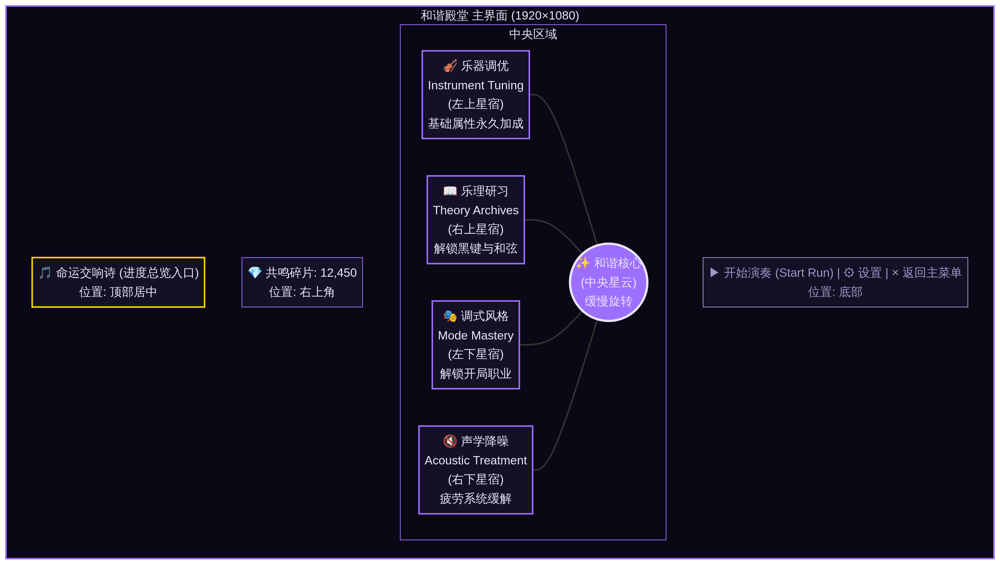
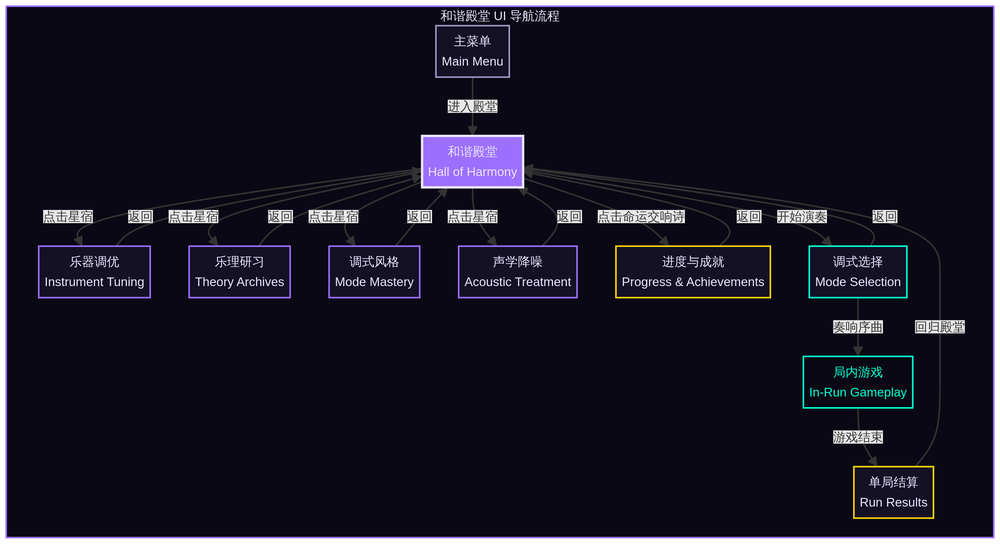
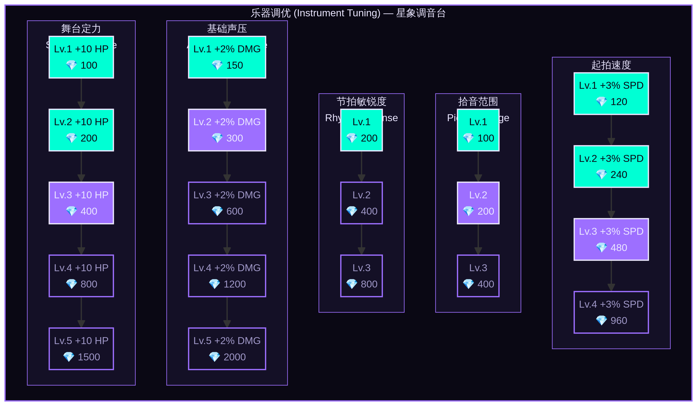
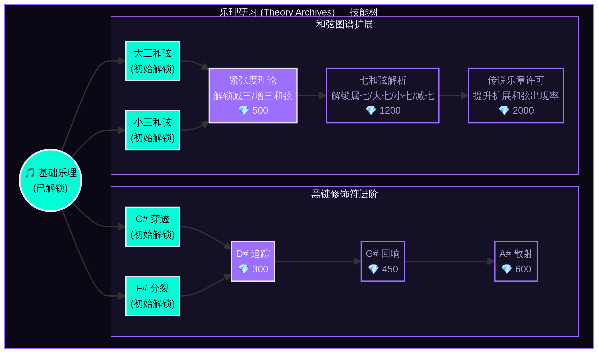
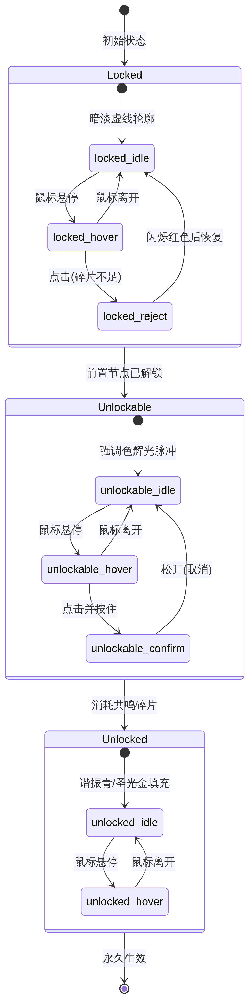
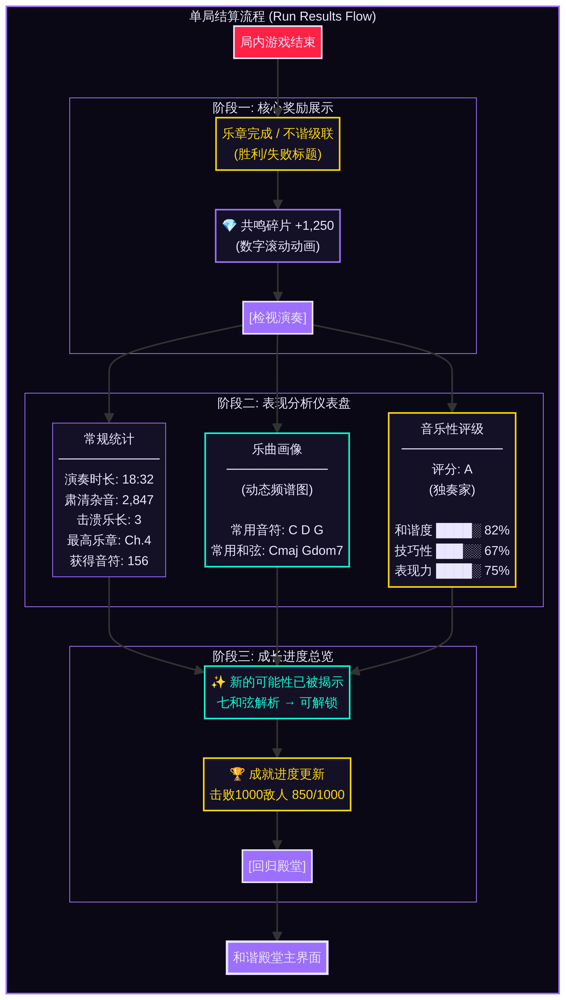
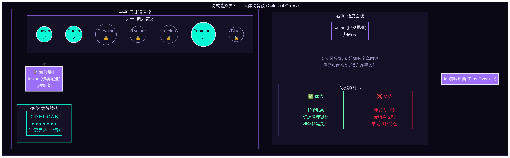

# Project Harmony: UI 设计文档 - 模块5：和谐殿堂 (Hall of Harmony)

**版本:** 1.0
**最后更新:** 2026-02-12
**状态:** 初稿
**设计师:** Manus AI

---

## 0. 文档概述

本文档为《Project Harmony》的局外成长系统——**和谐殿堂 (Hall of Harmony)**——提供完整、详细的 UI/UX 设计规范。设计旨在将游戏核心的“音乐理论与魔法”主题深度融入用户交互的每一个细节，同时遵循项目已确立的“科幻神学 / 极简几何 / 故障艺术”美术方向 [1]。

设计范围涵盖和谐殿堂的主界面、四大核心模块的技能树、节点状态、单局结算界面、调式选择界面以及相关的动效与交互细节，并提供在 Godot 引擎中实现的建议。

## 1. 设计哲学与全局规范

### 1.1. 设计哲学：星图中的交响诗

和谐殿堂的 UI 设计将摒弃传统的菜单列表，以一种更具沉浸感和叙事性的方式呈现。其核心概念是**“星图中的交响诗”**：

> 玩家的每一次成长，都是在宇宙这张无垠的乐谱上，点亮一颗新的星辰，连接成一首宏伟的交响诗。整个界面就是一个可交互的星图，每一次解锁都是一次“调谐宇宙”的仪式。

这种设计哲学旨在：
- **强化主题**：将“成长”这一行为与“音乐创作”和“宇宙和谐”的宏大叙事相结合。
- **引导探索**：通过视觉上的关联和引导，鼓励玩家探索不同的成长路径。
- **提供呼吸空间**：在紧张的局内战斗之后，提供一个宁静、深邃、充满神秘感的空间供玩家沉淀与思考。

### 1.2. 全局 UI 主题规范

所有界面元素将严格遵循已定义的全局 UI 主题规范 [2]，确保视觉统一性。

| UI 元素 | 规范 | 十六进制 / 字体 | 备注 |
| :--- | :--- | :--- | :--- |
| **面板背景** | 星空紫，80%不透明 | `#141026` (alpha: 0.8) | 背景带有缓慢移动的星尘粒子和微弱的噪点纹理，营造深空感。 |
| **强调色** | 主强调色 | `#9D6FFF` | 用于可交互元素、边框、高亮和技能树连接线。 |
| **文本颜色** | 晶体白 | `#EAE6FF` | 用于所有主要文本内容。 |
| **次级文本** | 次级文本色 | `#A098C8` | 用于辅助说明、已解锁项的描述等。 |
| **标题字体** | 等宽/科幻字体 | (未指定) | 遵循 `GlobalTheme.tres`。 |
| **正文字体** | 无衬线字体 | (未指定) | 遵循 `GlobalTheme.tres`。 |

### 1.3. 货币展示：共鸣碎片 (Resonance Fragments)

共鸣碎片的 UI 展示需要直观且符合主题。

- **位置**: 恒定出现在屏幕的**右上角**，无论在哪一个子界面中。
- **构成**: 由三部分组成：
    1. **图标**: 一个由强调色 `#9D6FFF` 构成的、不断轻微振荡的**音叉**或**克拉尼图形**图标。
    2. **数值**: 图标右侧是以“晶体白” `#EAE6FF` 显示的当前拥有碎片数量。
    3. **背景**: 一个独立的、带有描边的深色UI元素，将其与游戏背景区分开。
- **交互**: 当玩家花费或获得碎片时，数值会快速滚动变化，并伴随清脆的音效和粒子效果。

---

## 2. 和谐殿堂：主界面布局

主界面是玩家进入局外成长系统的第一个画面，必须直观地展示四大模块的入口，并建立起“星图交响诗”的核心意象。

### 2.1. 布局概念：中央星云与四大星宿

- **中央视觉**: 屏幕中心是一个缓慢旋转的、由`谐振青`和`圣光金`构成的明亮星云，代表玩家的“和谐核心”。
- **四大入口**: 四个核心成长模块以**“星宿”**的形式，分布在中央星云的四个对角方向（左上、右上、左下、右下）。每个星宿由数个小光点（代表其中的技能节点）组成一个具有象征意义的图案。
    - **左上 (乐器调优)**: 图案形似一个**里拉琴 (Lyre)** 或**竖琴**，象征基础属性的“调音”。
    - **右上 (乐理研习)**: 图案形似一个展开的**五线谱**或**螺旋星系**，象征知识的“探索”。
    - **左下 (调式风格)**: 图案形似一个**万花尺**或**分形图案**，象征不同风格的“变化”。
    - **右下 (声学降噪)**: 图案形似一个**声波的干涉图样**或**防御符文**，象征对负面效果的“消解”。
- **导航与交互**:
    - 玩家使用鼠标或手柄摇杆移动光标，光标本身是一个彗星状的拖尾光点。
    - 当光标悬停在某个星宿上时，该星宿会整体变亮，发出`强调色`的光芒，并在屏幕下方显示该模块的名称和简短描述（如：“乐器调优：永久强化你的基础能力”）。
    - 点击星宿后，镜头会平滑地“飞入”该星宿，进入对应的技能树界面。

*图 1: 和谐殿堂主界面布局线框图*

下图展示了和谐殿堂内部以及与游戏主流程相关的整体UI导航流。

*图 2: UI 导航流程图*

### 2.2. 背景与氛围

- **背景**: 深邃的星空，与全局规范一致。背景中除了星尘，还有一些极远处、模糊的星系作为视差滚动的层次。
- **动效**: 整个场景并非静止。中央星云在呼吸，星宿在微光闪烁，背景中的星尘在缓慢流动。这创造了一种宁静而充满生命力的氛围。
- **音效**: 背景音乐是空灵、宁静的氛围音乐 (Ambient Music)，带有合成器铺底和零星的钟琴/钢片琴音色。光标移动和悬停时会触发悦耳的音符声。

---

## 3. 技能树可视化 (Skill Tree Visualization)

每个模块的技能树/网状图设计是该系统的核心。设计必须在视觉上清晰传达节点间的关系、解锁路径和玩家的成长进度，同时要符合各自模块的音乐主题。

### 3.1. 乐器调优 (Instrument Tuning): 星象调音台

*图 3: 乐器调优模块技能树示意图，展示了垂直的、类似推杆的升级路径。*

- **视觉隐喻**: 将基础属性的提升比作在宇宙级的**“调音台”**上调整参数。
- **布局**: 采用线性、垂直的布局。每个可升级的属性（如舞台定力、基础声压）都是一根发光的“推杆”或“轨道”。
- **节点**: 每个等级是一个轨道上的节点。玩家投入“共鸣碎片”后，节点会向上移动一格，同时推杆的辉光会更强，视觉上模拟“推高音量”。
- **连接**: 轨道之间有微弱的能量束连接，表明它们同属于一个系统，但升级路径是独立的，玩家可以自由选择强化哪个属性。

### 3.2. 乐理研习 (Theory Archives): 知识的螺旋星云

*图 4: 乐理研习模块技能树示意图，展示了中心辐射状的解锁路径。*

- **视觉隐喻**: 解锁乐理知识如同探索一个不断向外延伸的**螺旋星系**。
- **布局**: 采用中心辐射状的网状图。中心是基础的乐理概念（如“基础三和弦”），更高级的概念（如“七和弦解析”、“黑键修饰符”）在星系的旋臂上向外延伸。
- **节点**: 每个节点是一颗恒星。核心节点（如解锁七和弦）更大、更亮。依赖关系通过清晰的`强调色`光束连接。
- **交互**: 当玩家解锁一个节点时，该恒星会被“点燃”，发出强烈的光芒，并向其连接的下一个未解锁节点发送一道能量脉冲，使其变为“可解锁”状态。

### 3.3. 调式风格 (Mode Mastery): 晶格化的职业星座

- **视觉隐喻**: 解锁新的开局职业（调式）如同在天空中发现并激活一个新的**“星座”**。
- **布局**: 采用非线性的星座图布局。每个调式（如 Ionian, Dorian）是一个独立的星座，由数个代表其核心特性的“特性节点”组成。
- **解锁流程**: 玩家首先需要花费大量碎片解锁星座的“主星”，这会激活该调式。之后，可以花费少量碎片点亮星座内的其他“辅星”，以获得该调式的次要加成或变体。
- **视觉表现**: 未解锁的星座是暗淡的星点轮廓。解锁后，星座的连线会亮起，主星发出稳定的光芒。当玩家选择一个调式作为下一局的开局时，该星座会变得格外明亮。

### 3.4. 声学降噪 (Acoustic Treatment): 谐振的防御场

- **视觉隐喻**: 强化听感疲劳抗性如同构建一个环绕自身的**“谐振防御场”**。
- **布局**: 采用环形、分层的布局，类似一个复杂的魔法阵或日冕仪。中心是玩家的和谐核心，向外分为数个同心圆环，每个圆环代表一类抗性（如单调值、密度值）。
- **节点**: 节点是圆环上的符文。解锁一个符文会使其亮起，并让其所在的圆环转速加快或光芒更盛，视觉上强化“防御场”的稳定感。
- **连接**: 某些高级符文需要前置圆环上的数个符文都被激活才能解锁，通过从内环到外环的能量流来表示这种依赖关系。

---

## 4. 节点设计 (Node Design)

所有技能树中的节点都必须有清晰、统一的三种状态视觉表现，以便玩家快速识别。下图的状态机清晰地展示了节点状态间的流转关系。

*图 5: 节点状态机示意图*

| 状态 | 视觉表现 | 交互反馈 | 音效 |
| :--- | :--- | :--- | :--- |
| **未解锁 (Locked)** | - 节点为一个暗淡的、由虚线构成的几何形状（圆形/六边形）。 - 内部图标为灰色剪影。 - 没有辉光。 | - 悬停时，节点轻微放大，虚线轮廓变为实线，并显示解锁所需“共鸣碎片”数量。 - 点击时，若碎片不足，节点会闪烁红色并发出“错误”音效。 | 悬停时发出低沉的嗡鸣声。 |
| **可解锁 (Unlockable)** | - 节点轮廓变为实线，并发出稳定的`强调色`辉光。 - 内部图标清晰可见，但仍为单色。 - 有微弱的粒子从前置节点流向该节点。 | - 悬停时，辉光增强，节点有轻微的“呼吸”缩放效果。 - 点击并按住时，碎片图标的能量会流入节点，节点中心的几何图形会开始“填充”色彩。 | 悬停时发出清脆的、带有音高的共鸣声。 |
| **已解锁 (Unlocked)** | - 节点完全被`谐振青`或`圣光金`填充，并发出强烈、稳定的光芒。 - 内部图标变为全彩，并可能有轻微的动画效果。 - 节点会向下一个未解锁节点发射能量流。 | - 悬停时，显示该节点的详细效果描述，文本颜色为`次级文本`色。 - 点击已解锁节点无特殊效果，或可查看更详细的 lore 信息。 | 悬停时发出持续、和谐的背景铺底音 (Pad Sound)。 |

---

## 5. 单局结算界面 (Run Results)

单局结算是连接“局内”与“局外”的关键环节，其 UI 设计需要清晰地向玩家传达其表现、奖励和成长，以驱动下一轮游戏的动力。我们采用一个三阶段的序列化信息展示流程，避免信息过载，并创造富有节奏感的体验。下图详细描绘了此流程。

*图 6: 单局结算界面信息流转示意图*

### 5.1. 阶段一：核心奖励展示

当一局游戏结束时（无论胜败），屏幕会首先淡入一个简洁而有力的总结画面。

- **标题**: 根据结果显示 “**乐章完成 (Opus Complete)**” (胜利) 或 “**不谐级联 (Dissonant Cascade)**” (失败)。标题使用 H1 样式，带有强烈的发光和粒子效果。
- **核心信息**: 屏幕中央以巨大、醒目的数字显示本局获得的 **共鸣碎片 (Resonance Fragments)** 总量。数字从 0 快速滚动到最终值，每跳动一个数量级（十、百、千）都会有一次强化的音效和视觉冲击。
- **行动号召 (Call to Action)**: 屏幕下方只有一个按钮：“**检视演奏 (Review Performance)**”。
- **设计目的**: 立即给予玩家最关心的正反馈（奖励），将失败的挫败感转化为对成长的期待。

### 5.2. 阶段二：表现分析仪表盘

点击“检视演奏”后，进入一个详细的数据分析界面，信息架构如下：

| 区域 | 内容 | 设计细节 |
| :--- | :--- | :--- |
| **左侧面板：常规统计** | - **演奏时长**: Time Survived - **肃清杂音**: Enemies Defeated - **击溃乐长**: Bosses Slain - **最高乐章**: Furthest Chapter Reached - **获得音符**: Notes Collected | 纯文本与图标的结合，简洁明了。数据使用`晶体白`，标签使用`次级文本`。 |
| **中央面板：乐曲画像** | - **主视觉**: 一个动态生成的**圆形频谱图**或**示波器图形**，代表本局游戏“主旋律”的整体画像。图形的复杂度和稳定性由玩家的“和谐度”决定。 - **数据点**: 图形周围会标注出本局使用最多的3个**音符 (Notes)** 和3个**和弦 (Chords)**。 | 这是最具特色的部分。和谐的局次会产生平滑、对称的图形；混乱的局次则产生尖锐、不稳定的图形。这为玩家的表现提供了一个直观、感性的总结。 |
| **右侧面板：音乐性评级** | - **最终评分**: 一个从 S 到 D 的字母评级（如 S: 协奏大师, A: 独奏家, B: 乐手, C: 练习生）。 - **评分维度**: 评级下方是三个核心维度的雷达图：   1. **和谐度 (Harmony)**: 不和谐值与密度值的控制情况。   2. **技巧性 (Technique)**: 完美节拍率、和弦构建复杂度。   3. **表现力 (Expression)**: 音符与节奏的多样性（对应听感疲劳系统 [3]）。 | 将游戏的核心机制转化为一个易于理解的“音乐会成绩单”，鼓励玩家不仅要生存，更要“演奏”得漂亮。 |

### 5.3. 阶段三：成长进度总览

在表现分析仪表盘的下方，是第二个行动号召按钮：“**回归殿堂 (Return to the Hall)**”。点击后，在返回主界面的过渡动画中，会浮现出本次解锁的进度信息。

- **形式**: 以浮动的、半透明卡片形式短暂出现。
- **内容**:
    - **新解锁提示**: 如果本次获得的碎片或达成的条件解锁了和谐殿堂中的新节点或新功能，会以高亮卡片的形式提示：“**新的可能性已被揭示 (New possibilities have been revealed)**”。
    - **成就进度**: 如果本局游戏推进了任何成就的进度，会显示成就图标和更新后的进度条（如 “击败1000个敌人 750/1000 -> 850/1000”）。
- **设计目的**: 在玩家返回成长系统前，最后一次强化其成就感，并为其在和谐殿堂中的下一步操作提供明确指引。

---

## 6. 调式选择界面 (Mode Selection Interface)

在每局游戏开始前，玩家需要选择一个“调式风格 (Mode Mastery)”作为其开局职业。此界面的设计需要清晰地展示不同调式的优劣势，帮助玩家做出有策略性的选择。

### 6.1. 视觉隐喻与布局：天体调音仪 (Celestial Orrery)

*图 7: 调式选择界面布局线框图*

- **视觉隐喻**: 将选择调式比作校准一个精密的天体运行仪或“调音仪”，玩家正在为即将开始的“乐章”设定基础的“调性”。
- **布局**: 
    - 屏幕中心是一个大型、华丽的同心圆环结构。每个已解锁的调式都是镶嵌在外环上的一个**符文宝石**。
    - 当前选中的调式符文会移动到顶部的“12点钟”位置，变得更大、更亮，并将其能量注入到仪器核心。
    - 仪器的核心区域会动态展示该调式的**音阶结构**，例如，对于“五声音阶”，核心会显示一个由5个亮起的光点和2个暗淡光点组成的圆环，直观传达其音符构成。

### 6.2. 交互流程

- 玩家使用鼠标点击或手柄肩键来旋转外环，每次旋转都会将下一个调式切换到选中位置。
- 当一个新的调式被选中时，其详细信息会平滑地显示在屏幕右侧的面板上，同时中央仪器的音阶结构也会随之变化。

### 6.3. 信息架构

右侧的信息面板是玩家决策的关键依据，必须清晰、准确。

| 区域 | 内容 | 设计细节 |
| :--- | :--- | :--- |
| **标题与定位** | **调式名称** (如: Ionian) **风格定位** (如: [均衡者]) | 强调调式的身份和核心玩法风格。 |
| **风味描述** | 1-2句富有主题色彩的描述文字。 | 增强沉浸感和角色扮演感。 |
| **优劣势对比表** | 一个清晰的两栏表格，用于对比**优势 (Advantages)** 与 **劣势 (Disadvantages)**。 | 这是最重要的决策区域。优势使用绿色或“+”号图标，劣势使用红色或“-”号图标，形成强烈的视觉对比，让玩家对风险与回报一目了然。 |
| **视觉符号** | 一个代表该调式风格的抽象动态符号或角色剪影。 | 提供感性层面的区分度。 |

- **确认操作**: 当玩家选定一个调式后，屏幕下方的“**奏响序曲 (Play Overture)**”按钮会被激活。点击后，镜头将从调音仪拉远，直接过渡到游戏场景的开场。

---

## 7. 解锁进度与成就展示

为了给玩家提供长期的目标和满足感，一个专门的区域需要用来展示其在和谐殿堂中的总体解锁进度和已获得的成就。

### 7.1. 入口与位置

- **入口**: 在和谐殿堂的主界面，除了四大星宿外，在屏幕正上方增加一个额外的、更宏大的星座——“**命运交响诗 (Symphony of Fates)**”。点击此星座即可进入进度总览界面。

### 7.2. 视觉隐喻与布局：宇宙织锦

- **视觉隐喻**: 将玩家的整个游戏历程比作一幅正在被编织的、记录其所有功绩的**宇宙织锦**。
- **总体进度**: 界面顶部是一个巨大的、横跨屏幕的进度条，被设计成一卷展开的**星图乐谱**。每当玩家在和谐殿堂中解锁一个节点，这个乐谱上就会被点亮一个新的音符。进度条的百分比直观显示了玩家的总完成度。
- **成就网格**: 乐谱下方是一个可滚动的成就网格。成就被分为“**战斗**”、“**探索**”、“**成长**”和“**精通**”等类别，玩家可以进行筛选查看。

### 7.3. 成就徽章设计

网格中的每一个成就都是一个精心设计的“徽章”或“纹章”，并具有三种状态：

| 状态 | 视觉表现 | 交互 |
| :--- | :--- | :--- |
| **未解锁** | 一个灰色的、仅有轮廓的空徽章。 | 悬停时显示成就名称及其解锁条件。 |
| **进行中** | 徽章的边框被点亮，内部有一个圆形的进度条，显示当前的完成进度 (如 345/500)。 | 悬停时显示具体进度数字和描述。 |
| **已解锁** | 徽章被完全点亮，呈现出`圣光金`的华丽色彩，中央的图案栩栩如生并带有动画效果。 | 悬停时显示成就名称、描述和解锁日期。 |

---

## 8. 动效与转场设计 (Animation & Transition Design)

动效是 UI 的灵魂，它将静态的界面转化为富有生命力的交互体验。所有动效都应遵循“通感” (Synesthesia) 的核心美学哲学 [1]，让玩家感觉自己正在与音乐和宇宙本身互动。

### 8.1. 核心原则

- **节奏同步**: 许多背景和待机动画（如辉光、粒子流动）的脉冲频率应与背景音乐的 BPM (Beats Per Minute) 同步，创造出整个界面在“呼吸”的感觉。
- **缓动曲线**: 动画曲线优先使用 `Ease-in/Ease-out` (缓入缓出)，特别是 `EaseOutQuart` 或 `EaseOutCubic`，以创造流畅、自然的运动感，避免线性运动的机械感。
- **粒子与 Shader**: 动效将大量使用粒子系统 (`GPUParticles2D/3D`) 和自定义 Shader 来实现，而非依赖传统的精灵序列帧动画，以达到更高的视觉质量和性能。

### 8.2. 具体动效设计

| 场景/元素 | 动效描述 | 实现细节 |
| :--- | :--- | :--- |
| **主界面转场** | 当玩家从主界面点击一个“星宿”进入技能树时，镜头会模拟一次“曲速飞行”。背景的星辰会拉伸成线状，镜头快速前推，最终平滑地停在技能树的中心。 | 使用 `Tween` 节点或 `AnimationPlayer` 控制 `Camera3D` 的 `transform`。星辰拉伸效果可以通过一个全屏的 `ShaderMaterial` 实现，在转场期间动态增加径向模糊的强度。 |
| **节点解锁** | 当一个节点被解锁时，会触发一个快速的、向外扩散的**冲击波**效果。冲击波是`谐振青`色的光环，扫过屏幕，同时伴随大量的金色粒子从节点中心爆发出来，然后被吸入右上角的“共鸣碎片”图标中。 | 冲击波使用一个简单的环形 Mesh 和一个自定义 Shader 实现，通过 `uniform` 控制其半径和消散。粒子效果使用 `GPUParticles2D`，设置 `explosiveness` 为1，并使用 `attractor` 将其引向货币图标。 |
| **货币变化** | 当“共鸣碎片”数量增加或减少时，数字会快速滚动。增加时，数字颜色短暂变为`治愈绿`；减少时，短暂变为`错误红`，然后恢复`晶体白`。 | 使用 `Tween` 节点来驱动 `Label` 的数值变化，可以自定义一个 `interpolate_property` 方法来实现滚动效果。颜色变化可以直接设置 `modulate` 属性。 |
| **悬停反馈** | 所有可交互元素在悬停时都会有**辉光增强**和**轻微缩放**的效果。辉光使用 Godot 内置的 `WorldEnvironment` 的 `Glow` 效果实现，通过在悬停时增加元素的 `modulate` 的 HDR 值来增强辉光。 | 在元素的 `_on_mouse_entered()` 和 `_on_mouse_exited()` 信号中，使用 `Tween` 来平滑地改变 `scale` 和 `modulate` 属性。 |

---

## 9. Godot 实现建议

为了将上述设计高效、可维护地在 Godot 4.x 中实现，提出以下技术建议。

### 9.1. 场景结构与节点组织

- **主场景 (`hall_of_harmony.tscn`)**: 使用 `Control` 节点作为根节点。背景的星空和粒子效果可以使用 `SubViewport` 在 3D 环境下渲染 (`WorldEnvironment` + `Camera3D` + `GPUParticles3D`)，然后通过 `SubViewportContainer` 显示在 2D UI 的底层。
- **模块化 UI**: 将四大模块的技能树、结算界面、调式选择界面等都创建为独立的场景 (`.tscn` 文件)。在主场景中通过一个 `CanvasLayer` 和脚本逻辑来动态加载、实例化和切换它们。这有助于保持代码的整洁和独立性。
- **节点复用**: 将技能树中的“节点”创建为一个可复用的场景 (`SkillNode.tscn`)。该场景应包含所有状态（未解锁、可解锁、已解锁）的视觉元素，并通过一个脚本来控制其状态切换和交互逻辑。

### 9.2. 主题与样式

- **全局主题 (`GlobalTheme.tres`)**: 强烈建议使用 Godot 的 `Theme` 资源。在项目设置中指定一个全局主题文件，定义好所有标准 `Control` 节点的默认字体、颜色和样式。这将确保所有 UI 元素（`Label`, `Button`, `Panel` 等）在创建时就自动应用正确的外观，极大提升开发效率和一致性 [2]。
- **样式覆盖**: 对于需要特殊样式的元素（如高亮按钮），使用 `ThemeBox` 相关的 `StyleBoxFlat` 和 `StyleBoxTexture` 资源，并在 `Theme` 中为特定控件的特定状态（如 `Button` 的 `hover`, `pressed`）指定覆盖样式。

### 9.3. 动效与着色器

- **动画播放器 (`AnimationPlayer`)**: 对于复杂的、多轨道的、时间精确的动画（如转场动画），`AnimationPlayer` 是最佳选择。它可以对场景中任何节点的任何属性制作动画。
- **补间动画 (`Tween`)**: 对于简单的、一次性的、由代码触发的动画（如悬停缩放、颜色变化），使用 `create_tween()` 是更轻量、更便捷的方式。
- **着色器 (`.gdshader`)**: UI 中所有非标准的视觉效果（如辉光脉冲、星辰拉伸、故障效果）都应通过自定义 Shader 实现。将 Shader 代码作为 `ShaderMaterial` 应用于 `TextureRect`、`Panel` 或 `ColorRect` 上。通过 `material.set_shader_parameter("param_name", value)` 从 GDScript 中动态控制 Shader 的参数。

### 9.4. 数据驱动

- **解耦逻辑与表现**: UI 的状态应由底层的玩家数据驱动。例如，`MetaProgressionManager` 单例应负责存储所有节点的解锁状态。UI 场景在 `_ready()` 函数中读取这些数据来初始化自身的视觉表现。当玩家解锁一个节点时，UI 发出一个信号，`MetaProgressionManager` 接收信号、处理数据（扣除货币、保存状态），然后再发出一个“数据已更新”的信号，UI 场景响应该信号来更新视觉，从而形成一个单向数据流，避免混乱。

---

## 10. 参考文献

[1] gdszyy/project-harmony-gdd, `Docs/Art_And_VFX_Direction.md`, 2026-02-11.

[2] gdszyy/project-harmony-gdd, `Docs/Art_And_VFX_Direction.md`, "10.1. 全局 UI 主题规范", 2026-02-11.

[3] gdszyy/project-harmony-gdd, `Docs/AestheticFatigueSystem_Documentation.md`, 2026-02-11.
