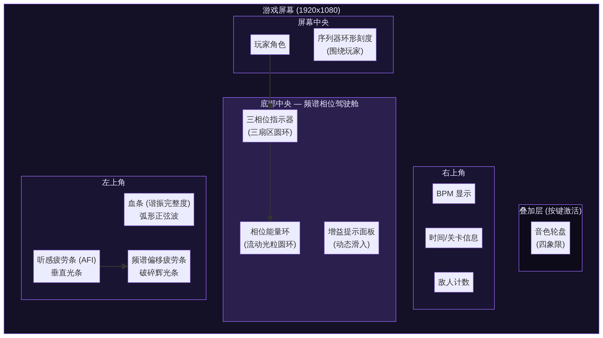
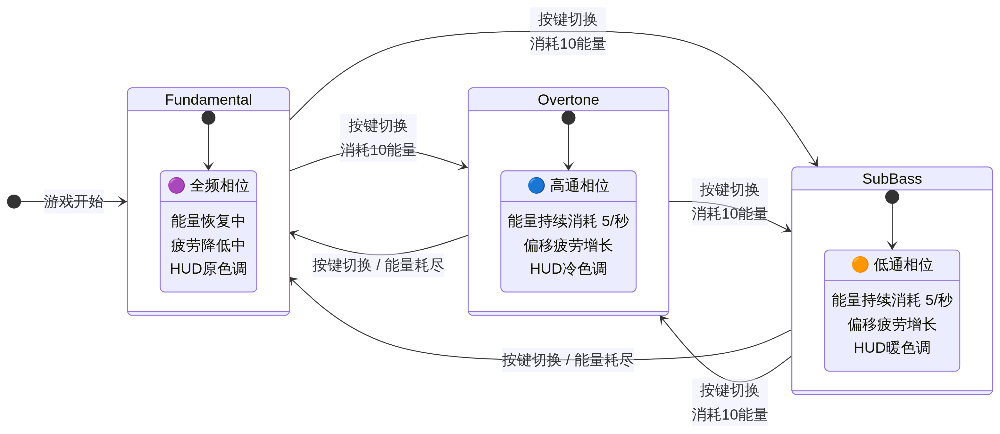

# 模块6：频谱相位系统 UI 设计文档 (Resonance Slicing)

**作者：** Manus AI
**版本：** 1.0
**日期：** 2026年2月12日
**状态：** 设计稿
**关联文档：** [ResonanceSlicing_System_Design.md](./ResonanceSlicing_System_Design.md) | [Art_And_VFX_Direction.md](./Art_And_VFX_Direction.md) | [TimbreSystem_Documentation.md](./TimbreSystem_Documentation.md) | [AestheticFatigueSystem_Documentation.md](./AestheticFatigueSystem_Documentation.md)

---

## 目录

1. [设计概述](#1-设计概述)
2. [核心 HUD 布局与新增元素](#2-核心-hud-布局与新增元素)
3. [三相位切换指示器](#3-三相位切换指示器)
4. [相位能量条](#4-相位能量条)
5. [频谱偏移疲劳指示](#5-频谱偏移疲劳指示)
6. [音色轮盘 UI](#6-音色轮盘-ui)
7. [全屏视觉过渡效果](#7-全屏视觉过渡效果)
8. [HUD 色调变化方案](#8-hud-色调变化方案)
9. [相位增益提示 UI](#9-相位增益提示-ui)
10. [Godot 实现总览](#10-godot-实现总览)
11. [参考资料](#11-参考资料)

---

## 1. 设计概述

### 1.1. 文档定位

本文档为《Project Harmony》的核心战斗解谜机制——**频谱相位系统 (Resonance Slicing)**——提供完整的用户界面 (UI) 和用户体验 (UX) 设计方案。频谱相位系统允许玩家在三种频率相位（高通 Overtone、低通 Sub-Bass、全频 Fundamental）之间切换，每种相位拥有截然不同的视觉风格、玩家属性修正和战术优势。本文档详细定义了该系统所需的全部 UI 组件的视觉设计、交互逻辑、动画规范以及 Godot 引擎的技术实现建议。

### 1.2. UI 设计三大目标

| 目标 | 描述 | 对应 UI 组件 |
| :--- | :--- | :--- |
| **即时信息 (Information)** | 玩家无需思考即可获取当前相位、剩余能量和疲劳程度等关键状态信息。 | 三相位指示器、相位能量条、频谱偏移疲劳条 |
| **动态反馈 (Feedback)** | 为每一个操作（切换相位、能量增减、获得增益）提供即时、显著的视觉与听觉反馈，强化操作与结果之间的因果联系。 | 全屏过渡效果、HUD 色调变化、指示器动画 |
| **辅助决策 (Decision)** | 将不同音色在特定相位下的增益效果清晰化，帮助玩家在瞬息万变的战场上做出最优战术决策。 | 音色轮盘、相位增益提示面板 |

### 1.3. 设计原则

**通感美学 (Synesthesia)。** UI 不仅是信息容器，更是音乐的视觉延伸。所有 UI 元素都将与游戏的节拍 (`beat_energy`)、音效和视觉特效 (VFX) 联动，实现"看见声音"的通感体验。相位指示器的辉光随节拍脉动，能量条的粒子流速与 BPM 同步，全屏过渡效果伴随频率扫描音效。

**信息优先级 (Information Hierarchy)。** 核心战斗信息（相位状态、能量）占据最核心的视觉焦点，辅助信息（疲劳度、音色选择）位于次级位置。在激烈战斗中，玩家的视觉注意力应自然聚焦于屏幕底部中央的"频谱驾驶舱"。

**无缝整合 (Seamless Integration)。** 新增 UI 元素将无缝融入现有 HUD 布局 (`hud.gd`)，与血条（谐振完整度）、听感疲劳度、序列器等现有元素形成统一、和谐的视觉整体，严格遵循全局美术规范 [1]。

**动态与静态的平衡 (Balance of Dynamic & Static)。** 核心指示器采用动态、富有生命感的设计（流动粒子、脉动辉光），而静态的文本和图标则保证在任何情况下都清晰可读。所有动态效果均可在设置中降低强度以适应光敏感玩家。

---

## 2. 核心 HUD 布局与新增元素

为容纳频谱相位系统，我们在现有 HUD 布局的基础上进行扩展。新增元素集中在屏幕底部中央，围绕玩家角色形成一个功能性的**"频谱驾驶舱 (Spectrum Cockpit)"**。

### 2.1. 布局总览



上图展示了频谱相位系统 UI 在整体 HUD 中的定位。核心新增区域为"底部中央 — 频谱相位驾驶舱"，包含三相位指示器、相位能量环和增益提示面板。频谱偏移疲劳条则紧邻现有的听感疲劳条 (AFI)，保持疲劳类信息的空间聚合。

### 2.2. 元素清单与定位

| 元素 | 屏幕位置 | 层级 | 描述 |
| :--- | :--- | :--- | :--- |
| **三相位指示器** | 底部中央，玩家角色正下方 | 核心 (Primary) | 显示当前相位与切换状态的三扇区圆环。 |
| **相位能量环** | 包围三相位指示器的外环 | 核心 (Primary) | 以动态流光粒子形式展示能量的消耗与恢复。 |
| **频谱偏移疲劳条** | 左侧，现有 AFI 条下方 | 次级 (Secondary) | 独立的、增长迅速的破碎辉光警告条。 |
| **音色轮盘** | 屏幕中央，按键激活 (`Tab`) | 叠加层 (Overlay) | 四象限径向菜单，展示音色系别与相位增益。 |
| **相位增益提示** | 左侧或右侧，动态弹出 | 瞬态 (Transient) | 切换相位时短暂显示当前相位的增益/减益效果。 |

### 2.3. 相位状态机



上图展示了三种相位之间的切换关系。玩家从全频相位 (Fundamental) 开始，可以通过按键切换到高通 (Overtone) 或低通 (Sub-Bass)。每次切换消耗 10 点能量，停留在极端相位会持续消耗能量并积累偏移疲劳。能量耗尽时将被强制拉回全频相位。

---

## 3. 三相位切换指示器

这是整个频谱相位系统的**核心视觉焦点**，需要做到极高的辨识度和美学表现力。

### 3.1. 概念设计


指示器设计为一个由三个扇区组成的**中心圆环**，位于玩家角色正下方。三个扇区分别代表高通 (Overtone)、低通 (Sub-Bass) 和全频 (Fundamental) 三种相位，每个扇区拥有独特的图标、色彩和视觉风格。包围圆环的外层是由流动光粒组成的**相位能量环**。

### 3.2. 三扇区视觉规范

| 属性 | 高通 (Overtone) | 全频 (Fundamental) | 低通 (Sub-Bass) |
| :--- | :--- | :--- | :--- |
| **扇区位置** | 圆环顶部 (12 点钟方向) | 圆环右下 (4 点钟方向) | 圆环左下 (8 点钟方向) |
| **图标** | 锐利的向上三角形，内部线框结构 | 稳定的圆形，内部正弦波符号 | 厚重的倒三角形，内部液态填充 |
| **主色调** | 冷色青蓝 `#4DFFF3` | 强调色紫 `#9D6FFF` | 暖色橙 `#FF8C42` |
| **激活态** | 图标放大 120%，边缘锐利，色差效果，放射状光晕 | 图标放大 120%，柔和稳定发光，均匀圆形光晕 | 图标放大 120%，边缘模糊，动态模糊，脉动光晕 |
| **未激活态** | 图标缩小至 80%，仅保留轮廓光，亮度降至 30% | 同左 | 同左 |
| **图标内部动画** | 线框结构闪烁，模拟高频信号 | 正弦波平稳流动 | 液态填充缓慢涌动 |

### 3.3. 切换动画

当玩家按下切换键时，指示器将播放一个持续约 **0.2 秒**的切换动画：

1.  **光弧扫过 (Arc Sweep)**：一道明亮的光弧从当前激活扇区沿圆环弧线扫向目标扇区。光弧的颜色为当前相位色与目标相位色的渐变混合。
2.  **源扇区渐暗 (Source Fade-Out)**：原激活扇区的辉光在 0.15 秒内平滑衰减，图标从 120% 缩回 80%。
3.  **目标扇区渐亮 (Target Fade-In)**：目标扇区的辉光在 0.15 秒内从 0% 升至 100%，图标从 80% 放大至 120%。
4.  **能量脉冲 (Energy Pulse)**：外层能量环在切换瞬间产生一次短暂的亮度脉冲，模拟能量消耗的"冲击"。

### 3.4. Godot 实现建议

**控件结构：**

```
PhaseIndicator (Control)
├── SectorOvertone (TextureRect + ShaderMaterial)
├── SectorFundamental (TextureRect + ShaderMaterial)
├── SectorSubBass (TextureRect + ShaderMaterial)
├── ArcSweepEffect (Line2D or custom _draw())
└── PhaseEnergyRing (见第4节)
```

**核心 Shader — `phase_sector.gdshader`：**

该 Shader 负责渲染每个扇区的基础形状、辉光、色差和畸变效果。接收以下 `uniform` 变量：

| Uniform 变量 | 类型 | 描述 |
| :--- | :--- | :--- |
| `phase_type` | `int` | 0=Fundamental, 1=Overtone, 2=SubBass |
| `active_progress` | `float` | 0.0（未激活）到 1.0（完全激活）的过渡值 |
| `glow_color` | `vec4` | 当前扇区的主辉光颜色 |
| `beat_energy` | `float` | 来自 `GlobalMusicManager` 的节拍能量值，驱动辉光脉动 |
| `time` | `float` | 时间变量，驱动内部动画 |

**GDScript 切换逻辑：**

```gdscript
# phase_indicator_ui.gd
extends Control

signal phase_switch_requested(target_phase: int)

const PHASE_COLORS := {
    0: Color("#9D6FFF"),  # Fundamental
    1: Color("#4DFFF3"),  # Overtone
    2: Color("#FF8C42"),  # SubBass
}

var _current_phase: int = 0
var _sectors: Array[Control] = []

func _ready() -> void:
    _sectors = [$SectorFundamental, $SectorOvertone, $SectorSubBass]
    PhaseManager.phase_changed.connect(_on_phase_changed)
    GlobalMusicManager.beat_tick.connect(_on_beat_tick)

func _on_phase_changed(new_phase: int) -> void:
    var old_phase := _current_phase
    _current_phase = new_phase
    _animate_switch(old_phase, new_phase)

func _animate_switch(from: int, to: int) -> void:
    # 光弧扫过动画
    _play_arc_sweep(from, to)
    
    for i in 3:
        var sector := _sectors[i]
        var tween := create_tween().set_parallel(true)
        if i == to:
            tween.tween_property(
                sector.material, "shader_parameter/active_progress",
                1.0, 0.2
            ).set_ease(Tween.EASE_OUT).set_trans(Tween.TRANS_CUBIC)
            tween.tween_property(
                sector, "scale",
                Vector2(1.2, 1.2), 0.2
            ).set_ease(Tween.EASE_OUT).set_trans(Tween.TRANS_BACK)
        else:
            tween.tween_property(
                sector.material, "shader_parameter/active_progress",
                0.0, 0.15
            )
            tween.tween_property(
                sector, "scale",
                Vector2(0.8, 0.8), 0.15
            )

func _on_beat_tick() -> void:
    # 节拍脉动：激活扇区的辉光随节拍微弱膨胀
    var active_sector := _sectors[_current_phase]
    var pulse_tween := create_tween()
    pulse_tween.tween_property(
        active_sector.material, "shader_parameter/beat_energy",
        1.0, 0.05
    )
    pulse_tween.tween_property(
        active_sector.material, "shader_parameter/beat_energy",
        0.0, 0.3
    )
```

---

## 4. 相位能量条

### 4.1. 视觉设计


相位能量条设计为包裹在三相位指示器外的一个**完整圆环**。与传统的填充式进度条不同，能量条由**流动的光粒 (Flowing Light Particles)** 组成，赋予其生命感和动态美学。

**光粒行为规则：**

| 能量范围 | 光粒密度 | 光粒速度 | 光粒颜色 | 特殊效果 |
| :--- | :--- | :--- | :--- | :--- |
| **100% - 50%** | 高密度 | 快速流动 | 晶体白 `#EAE6FF` | 无 |
| **50% - 30%** | 中密度 | 中速流动 | 晶体白 → 黄色渐变 | 无 |
| **30% - 10%** | 低密度 | 缓慢流动 | 黄色 `#FFD700` | 光粒开始闪烁 |
| **10% - 0%** | 极低密度 | 几乎静止 | 危险红 `#FF4D4D` | 剧烈闪烁 + 圆环边缘出现"裂纹" |

**能量消耗动画：** 当能量被消耗时（切换相位或持续停留在极端相位），光粒会从圆环的缺口处向外"蒸发"散逸，产生微小的粒子拖尾效果。

**能量恢复动画：** 当玩家处于全频相位并恢复能量时，光粒会从圆环底部的一个"源点"汇入，逐渐填满圆环。恢复速度的视觉表现与 AFI 负相关——低 AFI 时光粒汇入速度快，高 AFI 时汇入速度慢。

### 4.2. 数值标记

圆环上设置四个不透明度较低的刻度标记，分别位于 **100%、75%、50%、25%** 的位置，帮助玩家快速估算剩余能量。在能量低于 30% 时，一个小型的数字标签（如 "23"）会出现在圆环中心下方，提供精确数值。

### 4.3. Godot 实现建议

**方案 A：GPUParticles2D（推荐）**

使用 `GPUParticles2D` 节点，将粒子的发射区域设置为圆环形状。通过代码动态控制 `amount`（密度）、`speed_scale`（速度）和 `color`（颜色），实现能量变化的视觉反馈。

```gdscript
# phase_energy_bar.gd
extends GPUParticles2D

@export var max_particles: int = 200
var _energy_ratio: float = 1.0

func update_energy(current: float, maximum: float) -> void:
    _energy_ratio = current / maximum
    
    # 密度随能量线性变化
    amount = int(max_particles * _energy_ratio)
    
    # 速度随能量变化
    speed_scale = lerp(0.1, 1.5, _energy_ratio)
    
    # 颜色渐变
    if _energy_ratio > 0.3:
        process_material.color = Color("#EAE6FF")
    elif _energy_ratio > 0.1:
        process_material.color = Color("#FFD700")
    else:
        process_material.color = Color("#FF4D4D")
        # 闪烁效果
        modulate.a = 0.5 + sin(Time.get_ticks_msec() * 0.01) * 0.5
```

**方案 B：自定义 `_draw()` + Shader**

对于需要更精确控制的场景，可以使用 `Control._draw()` 绘制圆弧，并为其应用一个粒子流动 Shader (`energy_ring.gdshader`)。Shader 通过 `uniform float energy_ratio` 控制填充范围和粒子效果。

---

## 5. 频谱偏移疲劳指示

### 5.1. 设计定位

频谱偏移疲劳 (Spectrum Offset Fatigue, SOF) 是 AFI 系统的第九个疲劳维度 [2]，其增长速度远高于其他维度。UI 设计的核心目标是让玩家**清晰感知到这种疲劳的危险性**，同时与主 AFI 条形成视觉区分。

### 5.2. 视觉设计

SOF 指示器设计为一条位于主 AFI 条下方的**细长、破碎的辉光条**。与 AFI 条的"干净"填充不同，SOF 条的视觉风格刻意模拟**信号干扰和数据损坏**，以传达"频谱失调"的危险感。

| SOF 范围 | 视觉表现 | 颜色 | 特殊效果 |
| :--- | :--- | :--- | :--- |
| **0% - 30%** | 细长的平滑光条，几乎不可见 | 暗紫 `#9D6FFF` (30% 不透明) | 无 |
| **30% - 60%** | 光条变宽，出现轻微的水平位移和"毛刺" | 紫色 `#9D6FFF` → 品红渐变 | 每 2 秒一次轻微抖动 |
| **60% - 80%** | 光条明显破碎，多段错位，可见噪点纹理 | 品红 `#FF4D6A` | 持续抖动，偶尔出现"扫描线" |
| **80% - 100%** | 光条剧烈破碎，大幅位移，强烈的故障艺术效果 | 刺眼品红 `#FF0066` | 剧烈抖动 + 全局"频谱失调"后处理警告 |

### 5.3. "频谱失调"全局警告

当 SOF 超过 80% 时，除了 SOF 条本身的剧烈变化外，还将触发以下全局视觉警告：

-   **屏幕边缘品红色脉冲**：类似受击反馈 (`hit_feedback.gdshader`)，但颜色为品红色，从屏幕四边向内脉动。
-   **全屏轻微扭曲**：叠加一层低强度的画面扭曲效果，模拟频谱失调。
-   **HUD 元素抖动**：所有 HUD 元素（包括血条、序列器）产生轻微的随机位移抖动。

当 SOF 达到 100% 时，触发"频谱失调 (Spectrum Corruption)"Debuff [2]，屏幕剧烈扭曲，所有音色效果暂时失效。

### 5.4. Godot 实现建议

```gdscript
# spectral_fatigue_indicator.gd
extends Control

const BAR_WIDTH := 160.0
const BAR_HEIGHT := 6.0

var _sof_value: float = 0.0
var _display_value: float = 0.0
var _time: float = 0.0

func _process(delta: float) -> void:
    _time += delta
    _display_value = lerp(_display_value, _sof_value, delta * 10.0)
    queue_redraw()

func _draw() -> void:
    var start := Vector2(10, 0)
    
    # 标题
    var font := ThemeDB.fallback_font
    draw_string(font, start, "SPECTRUM OFFSET", HORIZONTAL_ALIGNMENT_LEFT,
                -1, 7, Color("#6B668A"))
    start.y += 10
    
    # 背景
    draw_rect(Rect2(start, Vector2(BAR_WIDTH, BAR_HEIGHT)),
              Color(0.08, 0.06, 0.15, 0.5))
    
    # 填充 — 破碎效果
    var fill_width := BAR_WIDTH * _display_value
    var segments := int(max(1, fill_width / 8.0))
    var glitch_intensity := clamp((_display_value - 0.3) / 0.7, 0.0, 1.0)
    
    # 颜色插值：紫色 → 品红
    var fill_color := Color("#9D6FFF").lerp(Color("#FF0066"), glitch_intensity)
    
    for i in segments:
        var seg_x := start.x + i * (fill_width / segments)
        var seg_w := fill_width / segments - 1.0
        var offset_y := 0.0
        
        # 破碎位移效果
        if glitch_intensity > 0.1:
            offset_y = sin(_time * 8.0 + i * 1.7) * glitch_intensity * 3.0
            seg_x += sin(_time * 12.0 + i * 2.3) * glitch_intensity * 2.0
        
        var seg_color := fill_color
        seg_color.a = 0.6 + sin(_time * 6.0 + i) * 0.2 * glitch_intensity
        
        draw_rect(
            Rect2(Vector2(seg_x, start.y + offset_y),
                  Vector2(seg_w, BAR_HEIGHT)),
            seg_color
        )
    
    # 高疲劳闪烁
    if _display_value > 0.8:
        var flash := abs(sin(_time * 10.0))
        draw_rect(
            Rect2(start, Vector2(fill_width, BAR_HEIGHT)),
            Color(1.0, 0.0, 0.4, flash * 0.3)
        )

func update_sof(value: float) -> void:
    _sof_value = clamp(value, 0.0, 1.0)
```

---

## 6. 音色轮盘 UI

### 6.1. 设计概述


音色轮盘是玩家选择和切换四大音色系别的核心交互界面。在频谱相位系统的加持下，轮盘需要增加**相位增益联动提示**功能，帮助玩家在打开轮盘时即刻了解当前相位下哪种音色系别能获得最大增益。

### 6.2. 从七扇区到四象限的重构

现有的 `timbre_wheel_ui.gd` 采用七个扇区（对应七个章节），本设计将其重构为**四个象限**，分别对应四大音色系别。每个象限内包含该系别下的所有已解锁章节音色武器。

| 象限位置 | 音色系别 | 包含的章节武器 | 象限边框色 |
| :--- | :--- | :--- | :--- |
| **上方 (12点)** | 弹拨系 (Plucked) | 里拉琴 (Ch1)、羽管键琴 (Ch3) | 青色 `#4DFFF3` |
| **右方 (3点)** | 打击系 (Percussion) | 钢琴 (Ch4) | 橙色 `#FF8C42` |
| **下方 (6点)** | 拉弦系 (Bowed) | 管弦全奏 (Ch5) | 紫色 `#9D6FFF` |
| **左方 (9点)** | 吹奏系 (Wind) | 管风琴 (Ch2)、萨克斯 (Ch6) | 绿色 `#4DFF80` |

> **注意**：第七章合成主脑 (Synthesizer) 作为特殊武器，不归入四大系别，而是在轮盘中心区域作为独立选项展示。

### 6.3. 相位增益联动

当轮盘被激活时，系统会检测当前的频谱相位，并在对应的增益系别象限上**叠加高亮光效和增益徽章**：

| 当前相位 | 高亮象限 | 增益徽章内容 | 视觉效果 |
| :--- | :--- | :--- | :--- |
| **高通 (Overtone)** | 弹拨系 (上方) | "+50% 瞬态伤害" | 象限边框亮度提升 200%，内部填充青色辉光 |
| **低通 (Sub-Bass)** | 打击系 (右方) | "x2 击退/眩晕" | 象限边框亮度提升 200%，内部填充橙色辉光 |
| **全频 (Fundamental)** | 拉弦系 (下方) | "+50% 持续时间" | 象限边框亮度提升 200%，内部填充紫色辉光 |
| **切换瞬间** | 吹奏系 (左方) | "首击聚焦" | 切换后 1 秒内，吹奏系象限短暂闪烁 |

### 6.4. 交互流程

1.  **按住 `Tab` 键**：轮盘从中心以 0.15 秒的缩放动画弹出，游戏时间减速至 30%（子弹时间效果）。
2.  **鼠标方向选择**：鼠标移向对应象限，该象限高亮放大。如果象限内有多个武器，显示子列表。
3.  **松开 `Tab` 键**：确认选择，轮盘以 0.1 秒缩放动画收回，游戏恢复正常速度。

### 6.5. Godot 实现建议

```gdscript
# timbre_wheel_phase_extension.gd (扩展现有 timbre_wheel_ui.gd)

## 四大系别象限配置
const FAMILY_QUADRANTS := {
    "plucked": {
        "angle_start": -PI/4,
        "angle_end": PI/4,
        "color": Color("#4DFFF3"),
        "gain_phase": PhaseManager.Phase.OVERTONE,
        "gain_text": "+50% 瞬态伤害",
    },
    "percussion": {
        "angle_start": PI/4,
        "angle_end": 3*PI/4,
        "color": Color("#FF8C42"),
        "gain_phase": PhaseManager.Phase.SUB_BASS,
        "gain_text": "x2 击退/眩晕",
    },
    "bowed": {
        "angle_start": 3*PI/4,
        "angle_end": 5*PI/4,
        "color": Color("#9D6FFF"),
        "gain_phase": PhaseManager.Phase.FUNDAMENTAL,
        "gain_text": "+50% 持续时间",
    },
    "wind": {
        "angle_start": 5*PI/4,
        "angle_end": 7*PI/4,
        "color": Color("#4DFF80"),
        "gain_phase": -1,  # 切换时增益，特殊处理
        "gain_text": "首击触发聚焦",
    },
}

func _draw_quadrant_highlight(quadrant_key: String) -> void:
    var q := FAMILY_QUADRANTS[quadrant_key]
    var current_phase := PhaseManager.get_current_phase()
    
    if current_phase == q["gain_phase"]:
        # 绘制高亮辉光
        draw_arc(
            Vector2.ZERO, WHEEL_RADIUS,
            q["angle_start"], q["angle_end"],
            32, q["color"], 6.0
        )
        # 绘制增益徽章
        var badge_pos := Vector2.from_angle(
            (q["angle_start"] + q["angle_end"]) / 2.0
        ) * (WHEEL_RADIUS + 30)
        _draw_gain_badge(badge_pos, q["gain_text"], q["color"])
```

---

## 7. 全屏视觉过渡效果

### 7.1. 设计概述


切换相位时，需要一个快速、无缝且具有通感体验的全屏过渡效果，以强化玩家对"世界频率被改变"的感知。过渡效果的核心视觉意象是**"频谱扫描线 (Spectrum Scan Line)"**——一道半透明的、带有噪点和色差的扫描线快速扫过屏幕，扫过之后世界的视觉风格随之改变。

### 7.2. 过渡方向规则

| 切换方向 | 扫描线方向 | 视觉隐喻 |
| :--- | :--- | :--- |
| **→ 高通 (Overtone)** | 从下往上扫过 | 频率"升高"，能量向上提升 |
| **→ 低通 (Sub-Bass)** | 从上往下扫过 | 频率"降低"，能量向下沉降 |
| **→ 全频 (Fundamental)** | 从屏幕中心向四周扩散消失 | 回归"中心"，频谱归位 |

### 7.3. 扫描线视觉规范

扫描线宽度约为屏幕高度的 **8-12%**，由以下视觉层叠加而成：

1.  **核心光带**：一条高亮度的水平（或垂直）光带，颜色为目标相位的主色调。
2.  **色差层**：在光带前后各 5% 的范围内，RGB 三通道产生明显的分离偏移。
3.  **噪点层**：光带内部叠加高频噪点纹理，模拟频率干扰。
4.  **波纹层**：光带扫过后，留下 2-3 道逐渐衰减的余波纹。

### 7.4. 时序规范

| 阶段 | 时间 | 描述 |
| :--- | :--- | :--- |
| **扫描线出现** | 0.00s | 扫描线从屏幕边缘出现 |
| **扫描线扫过** | 0.00s - 0.15s | 扫描线匀速扫过整个屏幕 |
| **扫描线消失** | 0.15s - 0.20s | 扫描线到达对侧边缘后消散 |
| **余波衰减** | 0.20s - 0.40s | 2-3 道余波纹逐渐衰减至不可见 |
| **新相位稳定** | 0.40s | 新相位的后处理效果完全生效 |

### 7.5. Godot 实现建议

**Shader — `phase_transition.gdshader`：**

```glsl
shader_type canvas_item;

uniform float progress : hint_range(0.0, 1.0) = 0.0;
uniform int direction = 0;  // 0=up, 1=down, 2=center_out
uniform vec4 target_color : source_color = vec4(0.3, 1.0, 0.95, 1.0);
uniform float scan_width : hint_range(0.01, 0.2) = 0.1;
uniform sampler2D noise_texture;
uniform sampler2D SCREEN_TEXTURE : hint_screen_texture;

void fragment() {
    vec2 uv = SCREEN_UV;
    vec4 screen_color = texture(SCREEN_TEXTURE, uv);
    
    float scan_pos;
    if (direction == 0) {
        scan_pos = 1.0 - progress;  // 从下往上
    } else if (direction == 1) {
        scan_pos = progress;  // 从上往下
    } else {
        scan_pos = abs(uv.y - 0.5) * 2.0;  // 从中心向外
    }
    
    float dist = abs(uv.y - scan_pos);
    float scan_mask = smoothstep(scan_width, 0.0, dist);
    
    // 色差效果
    float chromatic_offset = scan_mask * 0.01;
    vec4 r = texture(SCREEN_TEXTURE, uv + vec2(chromatic_offset, 0.0));
    vec4 g = texture(SCREEN_TEXTURE, uv);
    vec4 b = texture(SCREEN_TEXTURE, uv - vec2(chromatic_offset, 0.0));
    vec4 chromatic = vec4(r.r, g.g, b.b, 1.0);
    
    // 噪点
    float noise = texture(noise_texture, uv * 4.0 + vec2(progress * 10.0, 0.0)).r;
    float noise_mask = scan_mask * noise * 0.3;
    
    // 混合
    vec4 result = mix(screen_color, chromatic, scan_mask * 0.5);
    result = mix(result, target_color, scan_mask * 0.3 + noise_mask);
    
    COLOR = result;
}
```

**GDScript 触发逻辑：**

```gdscript
# phase_transition_overlay.gd
extends ColorRect

func play_transition(target_phase: int) -> void:
    var direction: int
    var color: Color
    
    match target_phase:
        PhaseManager.Phase.OVERTONE:
            direction = 0  # 从下往上
            color = Color("#4DFFF3")
        PhaseManager.Phase.SUB_BASS:
            direction = 1  # 从上往下
            color = Color("#FF8C42")
        PhaseManager.Phase.FUNDAMENTAL:
            direction = 2  # 从中心向外
            color = Color("#9D6FFF")
    
    material.set_shader_parameter("direction", direction)
    material.set_shader_parameter("target_color", color)
    
    var tween := create_tween()
    tween.tween_property(material, "shader_parameter/progress", 1.0, 0.15)
    tween.tween_property(material, "shader_parameter/progress", 0.0, 0.25)
```

---

## 8. HUD 色调变化方案

### 8.1. 设计理念

为了让 UI 与游戏世界的相位变化融为一体，整个 HUD 的主色调——特别是辉光、高亮和边框元素——会根据当前相位进行**色相偏移 (Hue Shift)**。这种变化是微妙但可感知的，不会破坏 UI 的可读性，但能有效强化玩家对当前相位的感知。

### 8.2. 色调偏移规则

| 相位 | 色相偏移方向 | 强调色变化 | 辉光风格 | 全局后处理 |
| :--- | :--- | :--- | :--- | :--- |
| **全频 (Fundamental)** | 无偏移（基准） | `#9D6FFF` (原色) | 柔和、均匀 | 无额外效果 |
| **高通 (Overtone)** | 向冷色偏移 (-30°) | `#6FA0FF` (偏蓝) | 锐利、放射状 | 轻微亮度提升 +10%，对比度 +5%，边缘锐化 |
| **低通 (Sub-Bass)** | 向暖色偏移 (+30°) | `#FF6FB0` (偏品红) | 模糊、脉动 | 亮度降低 -10%，对比度 +10%，轻微高斯模糊 |

### 8.3. 受影响的 HUD 元素

| HUD 元素 | 高通变化 | 低通变化 | 全频状态 |
| :--- | :--- | :--- | :--- |
| **面板边框** | 边框色偏蓝，辉光锐利 | 边框色偏暖，辉光模糊 | 原色 `#9D6FFF` |
| **血条 (HP)** | 波形频率加快，色调偏冷 | 波形频率减慢，色调偏暖 | 原始状态 |
| **序列器环** | 光点扫过速度加快 | 光点扫过速度减慢 | 正常速度 |
| **文本颜色** | 不变（保持可读性） | 不变（保持可读性） | 不变 |
| **伤害数字** | 冷色调偏移 | 暖色调偏移 | 原色 |

### 8.4. Godot 实现建议

在 HUD 根节点的 `CanvasItem` 上附加一个全局色调偏移 Shader：

```glsl
// hud_phase_tint.gdshader (注意：实际实现中此功能由 phase_hud_tint_manager.gd 脚本控制，无独立 shader 文件)
shader_type canvas_item;

uniform float hue_shift : hint_range(-0.15, 0.15) = 0.0;
uniform float brightness_offset : hint_range(-0.2, 0.2) = 0.0;
uniform float blur_amount : hint_range(0.0, 2.0) = 0.0;

vec3 rgb_to_hsl(vec3 c) {
    float cmax = max(c.r, max(c.g, c.b));
    float cmin = min(c.r, min(c.g, c.b));
    float delta = cmax - cmin;
    float l = (cmax + cmin) * 0.5;
    float s = (delta == 0.0) ? 0.0 : delta / (1.0 - abs(2.0 * l - 1.0));
    float h = 0.0;
    if (delta > 0.0) {
        if (cmax == c.r) h = mod((c.g - c.b) / delta, 6.0);
        else if (cmax == c.g) h = (c.b - c.r) / delta + 2.0;
        else h = (c.r - c.g) / delta + 4.0;
        h /= 6.0;
    }
    return vec3(h, s, l);
}

vec3 hsl_to_rgb(vec3 hsl) {
    float c = (1.0 - abs(2.0 * hsl.z - 1.0)) * hsl.y;
    float x = c * (1.0 - abs(mod(hsl.x * 6.0, 2.0) - 1.0));
    float m = hsl.z - c * 0.5;
    vec3 rgb;
    float h6 = hsl.x * 6.0;
    if (h6 < 1.0) rgb = vec3(c, x, 0.0);
    else if (h6 < 2.0) rgb = vec3(x, c, 0.0);
    else if (h6 < 3.0) rgb = vec3(0.0, c, x);
    else if (h6 < 4.0) rgb = vec3(0.0, x, c);
    else if (h6 < 5.0) rgb = vec3(x, 0.0, c);
    else rgb = vec3(c, 0.0, x);
    return rgb + m;
}

void fragment() {
    vec4 col = texture(TEXTURE, UV);
    vec3 hsl = rgb_to_hsl(col.rgb);
    hsl.x = fract(hsl.x + hue_shift);
    hsl.z = clamp(hsl.z + brightness_offset, 0.0, 1.0);
    col.rgb = hsl_to_rgb(hsl);
    COLOR = col;
}
```

**GDScript 控制：**

```gdscript
# 在 hud.gd 中添加
func _on_phase_changed(new_phase: int) -> void:
    var tween := create_tween()
    match new_phase:
        PhaseManager.Phase.OVERTONE:
            tween.tween_property(material, "shader_parameter/hue_shift", -0.08, 0.3)
            tween.tween_property(material, "shader_parameter/brightness_offset", 0.05, 0.3)
        PhaseManager.Phase.SUB_BASS:
            tween.tween_property(material, "shader_parameter/hue_shift", 0.08, 0.3)
            tween.tween_property(material, "shader_parameter/brightness_offset", -0.05, 0.3)
        PhaseManager.Phase.FUNDAMENTAL:
            tween.tween_property(material, "shader_parameter/hue_shift", 0.0, 0.3)
            tween.tween_property(material, "shader_parameter/brightness_offset", 0.0, 0.3)
```

---

## 9. 相位增益提示 UI

### 9.1. 视觉设计

当玩家切换到一个新相位时，屏幕左侧会动态滑入一个简洁的**增益提示面板 (Gain Hint Panel)**，告知玩家当前获得的具体修正效果。面板持续显示 **2.5 秒**后自动滑出。

**面板结构：**

```
┌─────────────────────────────┐
│  [相位图标]  OVERTONE        │  ← 相位名称，使用相位主色调
│                              │
│  ▲ 移速 +30%                │  ← 增益项，青色
│  ▲ 冲刺冷却 -50%            │  ← 增益项，青色
│  ▼ 受伤 +20%                │  ← 减益项，红色
│                              │
│  ♦ 弹拨系伤害 +50%          │  ← 音色增益提示（如有），金色
└─────────────────────────────┘
```

**面板样式：**

| 属性 | 值 |
| :--- | :--- |
| **背景色** | 星空紫 `#141026`，85% 不透明 |
| **边框** | 当前相位主色调，1px 发光边框 |
| **宽度** | 240px |
| **圆角** | 4px |
| **字体** | 等宽/科幻字体 |
| **标题字号** | 16px |
| **正文字号** | 12px |

### 9.2. 动画规范

| 阶段 | 时间 | 动画 |
| :--- | :--- | :--- |
| **滑入** | 0.0s - 0.2s | 面板从屏幕左侧外滑入，使用 `EASE_OUT` + `TRANS_BACK` 缓动 |
| **停留** | 0.2s - 2.7s | 面板静止显示，辉光随节拍微弱脉动 |
| **滑出** | 2.7s - 2.9s | 面板向左滑出屏幕，使用 `EASE_IN` + `TRANS_QUAD` 缓动 |

### 9.3. 特殊情况处理

-   **快速连续切换**：如果玩家在面板尚未消失时再次切换相位，旧面板立即加速滑出（0.1 秒），新面板随即滑入。
-   **音色增益行**：只有当玩家当前装备的音色武器属于该相位的增益系别时，才显示底部的音色增益提示行。

### 9.4. Godot 实现建议

```gdscript
# phase_gain_hint.gd
extends PanelContainer

const SLIDE_DURATION := 0.2
const DISPLAY_DURATION := 2.5

@onready var _icon: TextureRect = $HBox/PhaseIcon
@onready var _title: Label = $HBox/VBox/Title
@onready var _modifiers: VBoxContainer = $HBox/VBox/Modifiers

var _hide_tween: Tween = null

func show_phase_info(phase: int) -> void:
    # 清除旧内容
    for child in _modifiers.get_children():
        child.queue_free()
    
    # 设置相位信息
    var phase_data := _get_phase_data(phase)
    _title.text = phase_data.name
    _title.add_theme_color_override("font_color", phase_data.color)
    
    # 添加修正项
    for mod in phase_data.modifiers:
        var label := Label.new()
        label.text = mod.text
        label.add_theme_color_override("font_color", mod.color)
        label.add_theme_font_size_override("font_size", 12)
        _modifiers.add_child(label)
    
    # 滑入动画
    position.x = -size.x
    var tween := create_tween()
    tween.tween_property(self, "position:x", 20.0, SLIDE_DURATION)\
         .set_ease(Tween.EASE_OUT).set_trans(Tween.TRANS_BACK)
    tween.tween_interval(DISPLAY_DURATION)
    tween.tween_property(self, "position:x", -size.x, 0.15)\
         .set_ease(Tween.EASE_IN).set_trans(Tween.TRANS_QUAD)
    tween.tween_callback(queue_free)
    _hide_tween = tween

func _get_phase_data(phase: int) -> Dictionary:
    match phase:
        PhaseManager.Phase.OVERTONE:
            return {
                "name": "OVERTONE",
                "color": Color("#4DFFF3"),
                "modifiers": [
                    {"text": "▲ 移速 +30%", "color": Color("#4DFFF3")},
                    {"text": "▲ 冲刺冷却 -50%", "color": Color("#4DFFF3")},
                    {"text": "▼ 受伤 +20%", "color": Color("#FF4D4D")},
                ],
            }
        PhaseManager.Phase.SUB_BASS:
            return {
                "name": "SUB-BASS",
                "color": Color("#FF8C42"),
                "modifiers": [
                    {"text": "▲ 获得霸体", "color": Color("#FF8C42")},
                    {"text": "▲ 受伤 -50%", "color": Color("#FF8C42")},
                    {"text": "▼ 移速 -20%", "color": Color("#FF4D4D")},
                    {"text": "▼ 无法冲刺", "color": Color("#FF4D4D")},
                ],
            }
        _:  # FUNDAMENTAL
            return {
                "name": "FUNDAMENTAL",
                "color": Color("#9D6FFF"),
                "modifiers": [
                    {"text": "◆ 无属性修正", "color": Color("#A098C8")},
                    {"text": "▲ 能量恢复最快", "color": Color("#4DFF80")},
                ],
            }
```

---

## 10. Godot 实现总览

### 10.1. 新增文件清单

| 文件路径 | 类型 | 描述 |
| :--- | :--- | :--- |
| `scripts/ui/phase_indicator_ui.gd` | GDScript | 三相位切换指示器控件 |
| `scripts/ui/phase_energy_bar.gd` | GDScript | 相位能量条控件 |
| `scripts/ui/spectral_fatigue_indicator.gd` | GDScript | 频谱偏移疲劳条控件 |
| `scripts/ui/phase_gain_hint.gd` | GDScript | 相位增益提示面板 |
| `scripts/ui/phase_transition_overlay.gd` | GDScript | 全屏过渡效果控制器 |
| `shaders/ui/phase_sector.gdshader` | Shader | 相位扇区渲染（辉光、色差、畸变） |
| `shaders/ui/energy_ring.gdshader` | Shader | 能量环粒子流动效果 |
| `shaders/ui/phase_transition.gdshader` | Shader | 全屏频谱扫描过渡 |
| ~~`shaders/ui/hud_phase_tint.gdshader`~~ | ~~Shader~~ | HUD 全局色调偏移功能已由 `scripts/ui/phase_hud_tint_manager.gd` 脚本控制实现，无独立 shader 文件 |
| `scenes/ui/phase_indicator.tscn` | 场景 | 三相位指示器 + 能量环组合场景 |
| `scenes/ui/phase_gain_hint.tscn` | 场景 | 增益提示面板预制体 |

### 10.2. 信号架构

频谱相位系统 UI 依赖以下信号进行数据通信：

```
PhaseManager (Autoload 单例)
├── signal phase_changed(new_phase: int)          → PhaseIndicator, HUD, TransitionEffect, GainHintPanel
├── signal phase_energy_changed(current: float, max: float)  → PhaseEnergyRing
├── signal spectrum_offset_fatigue_changed(value: float)      → SpectrumOffsetFatigueBar
└── signal spectrum_corruption_triggered()                    → HUD (全局警告)

GlobalMusicManager (现有 Autoload)
├── signal beat_tick()                            → PhaseIndicator (节拍脉动)
└── func get_beat_energy() -> float               → PhaseEnergyRing (粒子速度调制)

FatigueManager (现有 Autoload)
└── signal fatigue_updated(result: Dictionary)    → SpectrumOffsetFatigueBar (AFI 联动)
```

### 10.3. 现有文件修改清单

| 文件 | 修改内容 |
| :--- | :--- |
| `scripts/ui/hud.gd` | 新增 `PhaseIndicator`、`PhaseEnergyBar`、`SpectralFatigueIndicator`、`PhaseTransitionOverlay` 节点引用；添加 `_on_phase_changed()` 回调以触发 HUD 色调变化。 |
| `scripts/ui/timbre_wheel_ui.gd` | 重构为四象限布局；新增 `update_gain_highlights()` 方法以响应相位变化。（注：原文档中提及的 `timbre_wheel_phase_extension.gd` 的相关功能已直接整合在此文件中实现，无需独立扩展文件。） |
| `scripts/autoload/ui_colors.gd` | 新增相位相关颜色常量（见下表）。 |
| `scripts/ui/fatigue_meter.gd` | 新增 `draw_offset_fatigue()` 方法或将 SOF 条独立为新控件。 |

### 10.4. 新增 `ui_colors.gd` 常量

```gdscript
# ============================================================
# 频谱相位颜色
# ============================================================
## 高通相位 (Overtone)
const PHASE_OVERTONE := Color("#4DFFF3")
const PHASE_OVERTONE_DIM := Color("#1A665F")
## 低通相位 (Sub-Bass)
const PHASE_SUB_BASS := Color("#FF8C42")
const PHASE_SUB_BASS_DIM := Color("#664019")
## 全频相位 (Fundamental)
const PHASE_FUNDAMENTAL := Color("#9D6FFF")
const PHASE_FUNDAMENTAL_DIM := Color("#3E2C66")
## 频谱偏移疲劳
const SOF_LOW := Color("#9D6FFF")
const SOF_HIGH := Color("#FF0066")
## 相位能量
const ENERGY_FULL := Color("#EAE6FF")
const ENERGY_WARNING := Color("#FFD700")
const ENERGY_CRITICAL := Color("#FF4D4D")
```

### 10.5. Shader Uniform 参数速查表

| Shader | Uniform | 类型 | 范围 | 驱动源 |
| :--- | :--- | :--- | :--- | :--- |
| `phase_sector.gdshader` | `phase_type` | int | 0, 1, 2 | PhaseManager |
| | `active_progress` | float | 0.0 - 1.0 | Tween 动画 |
| | `glow_color` | vec4 | — | ui_colors.gd |
| | `beat_energy` | float | 0.0 - 2.0 | GlobalMusicManager |
| `energy_ring.gdshader` | `energy_ratio` | float | 0.0 - 1.0 | PhaseManager |
| | `particle_speed` | float | 0.1 - 2.0 | 基于 energy_ratio 计算 |
| | `particle_color` | vec4 | — | 基于 energy_ratio 插值 |
| `phase_transition.gdshader` | `progress` | float | 0.0 - 1.0 | Tween 动画 |
| | `direction` | int | 0, 1, 2 | PhaseManager |
| | `target_color` | vec4 | — | 目标相位色 |
| | `scan_width` | float | 0.01 - 0.2 | 固定值 0.1 |
| ~~`hud_phase_tint.gdshader`~~ | `hue_shift` | float | -0.15 - 0.15 | PhaseManager（注：实际由 `phase_hud_tint_manager.gd` 脚本控制） |
| | `brightness_offset` | float | -0.2 - 0.2 | PhaseManager |

### 10.6. 性能预算

| 组件 | GPU 开销估算 | 优化策略 |
| :--- | :--- | :--- |
| 三相位指示器 (3x Shader) | 低 | 仅在切换时更新 Shader 参数 |
| 相位能量环 (GPUParticles2D) | 中 | 最大粒子数限制在 200 |
| 频谱偏移疲劳条 (_draw) | 极低 | 仅在值变化时 queue_redraw() |
| 全屏过渡 (Screen Shader) | 中（瞬态） | 仅在切换的 0.4 秒内激活 |
| HUD 色调偏移 (Canvas Shader) | 低 | 持续激活，但计算量极小 |
| **总计** | **约占 GPU 预算的 3-5%** | 符合性能优化方案 [1] 中 UI 渲染 5% 的预算 |

---

## 11. 参考资料

[1] [Art_And_VFX_Direction.md](./Art_And_VFX_Direction.md) — 美术与视觉效果方向文档（全局 UI 主题规范、后处理体系、性能预算）
[2] [ResonanceSlicing_System_Design.md](./ResonanceSlicing_System_Design.md) — 频谱相位系统设计文档（核心机制、数值、AFI 整合）
[3] [TimbreSystem_Documentation.md](./TimbreSystem_Documentation.md) — 音色系统设计文档（四大音色系别、章节武器）
[4] [AestheticFatigueSystem_Documentation.md](./AestheticFatigueSystem_Documentation.md) — 听感疲劳系统设计文档
[5] `godot_project/scripts/autoload/ui_colors.gd` — 全局 UI 颜色常量定义
[6] `godot_project/scripts/ui/hud.gd` — 现有 HUD 主控脚本
[7] `godot_project/scripts/ui/timbre_wheel_ui.gd` — 现有音色轮盘 UI 脚本
[8] `godot_project/scripts/ui/fatigue_meter.gd` — 现有听感疲劳仪表脚本

---

## 版本变更记录

| 版本 | 日期 | 变更内容 | 作者 |
| :--- | :--- | :--- | :--- |
| v1.0 | 2026-02-12 | 基于模块六系统设计文档，创建完整的 UI 设计方案。包含：三相位指示器、能量条、疲劳条、音色轮盘、全屏过渡、HUD 色调变化、增益提示面板的视觉设计与 Godot 实现建议。 | Manus AI |
