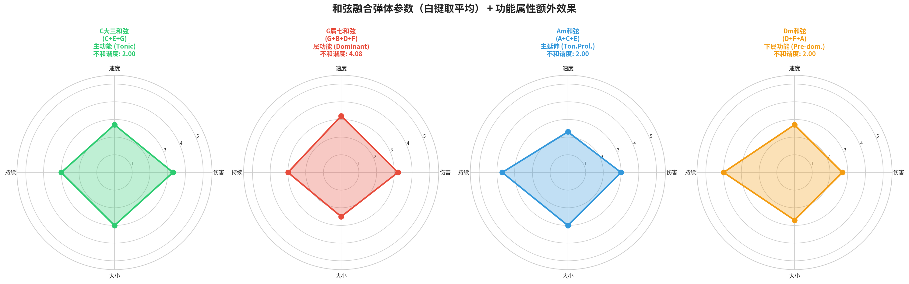

# 《Project Harmony》游戏设计深化方案

**作者：** Manus AI
**版本：** v4.0
**日期：** 2026年2月7日

---

## 修订说明

本 v4.0 方案是对游戏核心机制的一次**根本性重构**，旨在将“音乐即编程语言”这一核心理念贯彻到底。我们摒弃了预设技能的设计，转向一个完全由参数化和乐理规则驱动的生成式法术系统。本方案详细阐述了四个核心支柱：

1.  **白键法术**：作为基础弹体的四维参数空间。
2.  **黑键修饰符**：作为弹体行为的即时修饰。
3.  **和弦功能**：作为触发强大乐段效果的“函数”。
4.  **节奏型**：作为改变弹体行为模式的“模式”。

这个系统将为玩家提供前所未有的创造力和策略深度，让每一次战斗都成为一次独特的“编曲”体验。

---

## 1. 白键法术：四维参数弹体

每个白键音符不再是一个固定的技能，而是代表一种具有独特属性配比的**基础弹体**。我们定义了四个核心维度，每个维度的评级为1-5，且每个音符的四维总和恒定为**12**，以保证基础平衡。

> **四维参数：**
> - **伤害 (DMG):** 弹体的基础伤害值。
> - **飞行速度 (SPD):** 弹体的移动速度。
> - **持续时间 (DUR):** 弹体在消失前的存在时间或射程。
> - **弹体大小 (SIZE):** 弹体的碰撞体积或影响范围。

*图1：七个白键音符在四维参数空间中的分布。例如，G音(力量音)拥有最高的伤害，而D音(前进音)则拥有最快的飞行速度。*

下表详细列出了每个白键音符的参数配比及其设计思路：

| 音符 | 名称 | DMG | SPD | DUR | SIZE | 设计思路 |
| :--- | :--- | :--- | :--- | :--- | :--- | :--- |
| **C** | 基准音 | 3 | 3 | 3 | 3 | 均衡型弹体，所有属性平均分配。 |
| **D** | 前进音 | 2 | 5 | 3 | 2 | 高速小弹体，飞行速度最快，适合远距离精确打击。 |
| **E** | 柔和音 | 2 | 2 | 4 | 4 | 大范围持久弹体，覆盖面广，持续时间长。 |
| **F** | 沉稳音 | 2 | 1 | 5 | 4 | 缓慢但持久的大型弹体，适合区域控制。 |
| **G** | 力量音 | 5 | 3 | 2 | 2 | 高伤害集中弹体，爆发力最强。 |
| **A** | 忧郁音 | 4 | 2 | 4 | 2 | 高伤害持久弹体，缓慢但痛苦。 |
| **B** | 引导音 | 4 | 4 | 2 | 2 | 高速高伤害但短暂，有强烈的“趋向性”。 |

*图2：七个白键音符的四维参数条形对比图，可以更直观地看出各自的优劣势。*

---

## 2. 黑键修饰符：即时行为修正

黑键代表着一次性的**修饰符**，使用后会作用于下一个施放的法术，从根本上改变其行为。这为战斗增加了丰富的即时策略性。

*图3：五个黑键修饰符及其效果示意。*

| 音符 | 修饰符名称 | 效果描述 | 设计思路 |
| :--- | :--- | :--- | :--- |
| **C#/Db** | **锐化 (Sharp)** | 弹体获得**穿透**效果，可穿过敌人继续飞行（最多穿透3个）。 | 小二度的尖锐感 → 穿刺穿透。 |
| **D#/Eb** | **摇摆 (Swing)** | 弹体以**波动弹道**（正弦波）飞行，增加横向覆盖范围。 | 蓝调小三度的摇摆感 → 波浪弹道。 |
| **F#/Gb** | **分裂 (Tritone Split)** | 弹体在飞行中途**分裂**为2个，每个保留70%伤害。 | 三全音的不稳定与“魔鬼”意象 → 分裂。 |
| **G#/Ab** | **回响 (Echo)** | 弹体命中后在原地留下一个**回响**，0.5秒后再次造成50%伤害。 | 小六度的回味感 → 延迟回响。 |
| **A#/Bb** | **散射 (Scatter)** | 弹体命中后向周围**散射**3个小弹体，每个造成30%伤害。 | 小七度的扩散感 → 散射。 |

**叠加规则：**
- **修饰符叠加：** 两个不同的修饰符可以叠加作用于同一个弹体（例如，一个既穿透又分裂的弹体）。
- **子弹叠加：** 当一个和弦包含两个或以上白键时，其生成的弹体四维参数为所有白键参数的**平均值**。

---

## 3. 和弦功能：乐段级的强大函数

和弦系统现在与**和弦功能理论 (Harmonic Function Theory)** [1] 深度绑定。当玩家在自动序列器中构建出特定的**和弦进行 (Chord Progression)** 时，会触发一个与该进行的功能/情感色彩相符的强大**乐段效果 (Phrase Effect)**。

*图4：不同功能和弦融合出的弹体参数雷达图。例如，属功能(Dominant)的G7和弦融合出了偏向伤害和速度的弹体，并会触发爆发伤害的额外效果。*

| 和弦进行 (C大调) | 功能序列 | 情感色彩 | 游戏效果（乐段效果） |
| :--- | :--- | :--- | :--- |
| **I-V-I** | T-D-T | 基础的紧张-解决 | **[解决脉冲 (Resolution Pulse)]** 在最后一个I和弦处，释放一个中等范围的治疗波，为玩家恢复少量生命值。 |
| **I-IV-V-I** | T-PD-D-T | 明亮、有力、经典 | **[强力进行曲 (Power March)]** 在该乐段期间，所有弹体的**伤害(DMG)** +1。 |
| **I-vi-IV-V** | T-TP-PD-D | 温暖、怀旧、流行 | **[温暖之心 (Heart and Soul)]** 在该乐段期间，玩家获得一个缓慢再生的护盾。 |
| **ii-V-I** | PD-D-T | 精致、优雅、爵士 | **[优雅解决 (Elegant Cadence)]** 在最后一个I和弦处，重置所有黑键修饰符的冷却时间，并随机获得一个。 |
| **vi-IV-I-V** | TP-PD-T-D | 忧伤但有力量 | **[悲伤之力 (Sorrowful Strength)]** 在该乐段期间，玩家的**不和谐度**每秒自动减少，且弹体获得微弱的生命偷取效果。 |

---

## 4. 节奏型：小节级的行为模式

玩家在4x4自动序列器中编排的**节奏型**，会直接改变该小节内所有弹体的**行为模式**，为战斗增加另一层策略维度。

| 节奏型 | 示例 (4/4拍) | 弹体行为修饰 | 设计思路 |
| :--- | :--- | :--- | :--- |
| **均匀八分音符** | `x x x x x x x x` | **[连射 (Rapid Fire)]** 弹体大小-1，但每拍发射2个弹体。 | 轻快、流畅 → 射速加倍 |
| **附点节奏** | `x. x. x. x.` | **[重击 (Heavy Beat)]** 弹体飞行速度-1，但伤害+1，并获得击退效果。 | 推动力、重音感 → 更重、更有冲击力 |
| **切分节奏** | `_x x_ x_ x_ x` | **[闪避射击 (Evasive Shot)]** 弹体在发射时，玩家会向后进行一次微小位移。 | 意外感、重音移位 → 与位移结合 |
| **摇摆节奏 (Swing)** | (听感上长短交替) | **[摇摆弹道 (Swing Trajectory)]** 弹体以S型/波浪形轨迹飞行。 | 爵士摇摆感 → 曲线运动 |
| **三连音** | `xxx xxx xxx xxx` | **[三连发 (Triplet Burst)]** 弹体伤害变为50%，但每拍发射3个呈扇形的小弹体。 | 密集、华丽 → 分裂为三 |
| **休止符** | `x _ x _` | **[精准蓄力 (Focus Charge)]** 每有一个休止符，该小节内其他弹体的伤害和大小+0.5。 | 留白、呼吸感 → 积蓄力量 |

**乐段节奏奖励：** 如果连续**2个**小节使用相同的节奏型，则在该乐段（8拍）内，玩家会获得一个与该节奏型相关的**持续增益**，进一步鼓励玩家进行有规划的“编曲”。

---

## 结论

v4.0方案构建了一个高度模块化、可扩展且深度融合乐理的法术系统。它将战斗从简单的“按技能”转变为一个动态的、充满创造性的“音乐编程”过程，完美契合了《Project Harmony》的核心设计哲学。

## 参考文献

[1] Aldwell, E., & Schachter, C. (2003). *Harmony and Voice Leading*. Schirmer.
