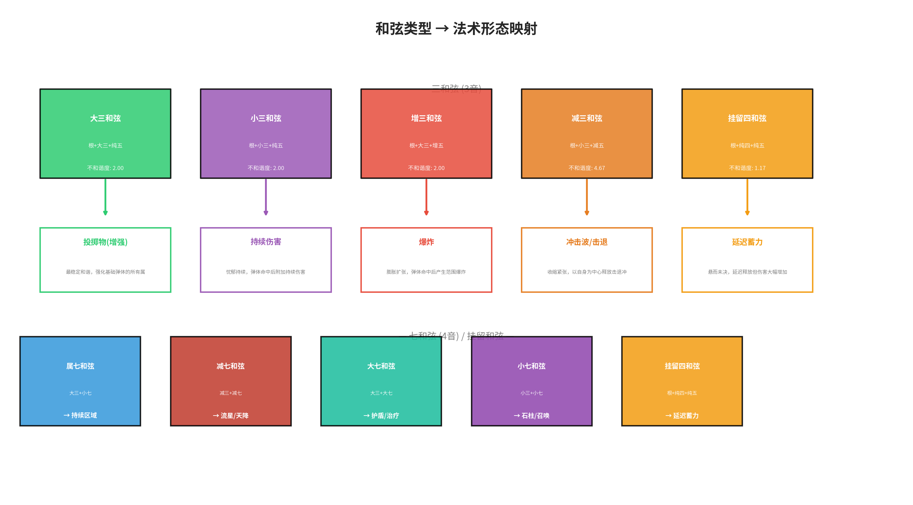
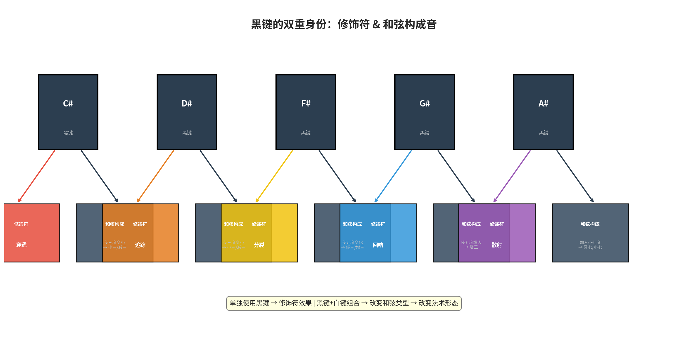
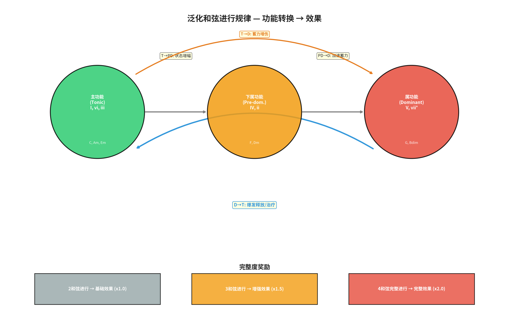

# 《Project Harmony》游戏设计深化方案

**作者：** Manus AI
**版本：** v5.0
**日期：** 2026年2月7日

---

## 修订说明

本 v5.0 方案在 v4.0 的参数化法术系统基础上，引入了**法术形态 (Spell Form)** 的全新维度，并对和弦系统进行了深度扩展与泛化，旨在提供更丰富的法术表现力和更符合直觉的创造规则。

1.  **法术形态维度**：和弦不再仅仅是参数的融合，其**类型**（大、小、增、减、七和弦等）将直接决定法术的**形态**（投掷物、爆炸、DOT、法阵、冲击波、区域、召唤等）。
2.  **黑键双重身份**：黑键不仅是独立的修饰符，更能作为**和弦的构成音**，参与和弦类型的判定，从而改变法术形态。
3.  **泛化和弦进行**：摒弃固定的和弦进行配方，提炼出基于**和弦功能转换**（如 T→D, D→T）的通用规则，并引入**完整度奖励**，使玩家能更自由地探索和弦组合的威力。
4.  **修饰符更新**：根据反馈，D# 黑键修饰符的效果由“波动弹道”更新为“**追踪**”。

---

## 1. 法术形态：由和弦类型决定

这是本次更新的核心。单个白键音符的基础形态依然是“投掷物”，但当它们与其它音符（包括黑键）组合成一个**和弦**时，法术的形态将由该和弦的**乐理类型**决定。

*图1：不同类型的和弦如何映射到截然不同的法术形态。*

| 和弦类型 | 构成规则 | 法术形态 | 设计思路 |
| :--- | :--- | :--- | :--- |
| **大三和弦** | 根+大三+纯五 | **强化弹体** | 最稳定和谐，强化基础弹体的所有属性。 |
| **小三和弦** | 根+小三+纯五 | **DOT弹体** | 忧郁持续，弹体命中后附加持续伤害（毒/火）。 |
| **增三和弦** | 根+大三+增五 | **爆炸弹体** | 膨胀扩张，弹体命中后产生范围爆炸。 |
| **减三和弦** | 根+小三+减五 | **冲击波** | 收缩紧张，以自身为中心释放击退冲击波。 |
| **属七和弦** | 大三+小七 | **法阵/区域** | 需要“解决”的紧张，在地面放置持续伤害/减益区域。 |
| **减七和弦** | 减三+减七 | **天降打击** | 极度不稳定，从天而降的延迟高伤害攻击（流星）。 |
| **大七和弦** | 大三+大七 | **护盾/治疗法阵** | 温暖丰满，放置一个持续治疗或提供护盾的区域。 |
| **小七和弦** | 小三+小七 | **召唤/构造** | 深沉厚重，从地面召唤一个石柱或炮台等构造物。 |
| **挂留和弦** | 根+纯四/纯二+纯五 | **蓄力弹体** | “悬而未决”，法术会延迟释放，但伤害和范围大幅增加。 |

---

## 2. 黑键的双重身份

黑键现在拥有两种截然不同的使用方式，极大地丰富了策略选择。

*图2：黑键既可以作为独立的修饰符，也可以作为和弦的一部分来改变其类型。*

1.  **作为修饰符**：单独使用时，黑键的功能与 v4.0 一致，为下一个法术附加一次性效果。**D#的效果已更新为“追踪”**。

| 音符 | 修饰符名称 | 效果描述 |
| :--- | :--- | :--- |
| **C#/Db** | **锐化 (Sharp)** | 弹体获得**穿透**效果。 |
| **D#/Eb** | **追踪 (Homing)** | 弹体自动**追踪**最近的敌人。 |
| **F#/Gb** | **分裂 (Split)** | 弹体在飞行中途**分裂**为2个。 |
| **G#/Ab** | **回响 (Echo)** | 弹体命中后在原地留下一个**回响**。 |
| **A#/Bb** | **散射 (Scatter)** | 弹体命中后向周围**散射**。 |

2.  **作为和弦构成音**：当黑键与一个或多个白键同时被编排进序列器时，它将作为和弦的一部分，改变和弦的性质，进而改变法术的形态。

> **示例：**
> - `C + E + G` = **C大三和弦** → **强化弹体**
> - `C + D# + G` (D#即Eb) = **C小三和弦** → **DOT弹体**
> - `C + E + G#` = **C增三和弦** → **爆炸弹体**
> - `C + E + G + A#` (A#即Bb) = **C属七和弦** → **法阵/区域**

---

## 3. 泛化的和弦进行规律

为了让玩家能更直观地理解和弦组合的逻辑，我们将固定的“配方”抽象为基于**和弦功能转换**的通用规则。

*图3：和弦功能之间的转换方向决定了触发效果的类型。*

### 功能转换效果

乐段效果不再由固定的I-V-I等进行触发，而是由任意两个相邻和弦的**功能转换**决定。

| 功能转换 | 含义 | 触发效果类型 |
| :--- | :--- | :--- |
| **D → T** | **紧张到解决** | 爆发性的正面效果（如：**爆发治疗、全屏伤害**） |
| **T → D** | **稳定到紧张** | 蓄力或增伤效果（如：**下一个法术伤害翻倍**） |
| **PD → D** | **准备到紧张** | 加速或增幅效果（如：**全体冷却缩减**） |
| **T → PD** | **稳定到准备** | 状态增益效果（如：**获得护盾、增加射程**） |
| **D → PD** | **逆行进行** | 触发不稳定的“混沌”效果（如：**随机释放一个法术**） |

### 完整度奖励

为了鼓励玩家构建更长、更复杂的和弦进行，我们引入了**完整度奖励**机制。

-   **2和弦进行**：触发基础效果 (x1.0 强度)。
-   **3和弦进行**：触发增强效果 (x1.5 强度)。
-   **4和弦完整进行 (如 T-PD-D-T)**：触发最强大的完整效果 (x2.0 强度)，并可能附带华丽的视觉特效。

这个系统不仅适用于和谐进行，**不和谐的和弦**（如减七、增三）同样遵循此规则，但它们的功能转换通常会导向更具攻击性或风险性的效果，其效果强度会受到其**不和谐度**的加成。

---

## 结论

v5.0方案在保持了参数化核心的自由度之上，通过引入“法术形态”和“泛化和弦规律”，极大地提升了系统的表现力和深度。玩家现在不仅是“编曲家”，更是“法术工程师”，通过对乐理规则的理解和运用，能够创造出无穷无尽、符合音乐直觉的战斗风格的强大魔法。
