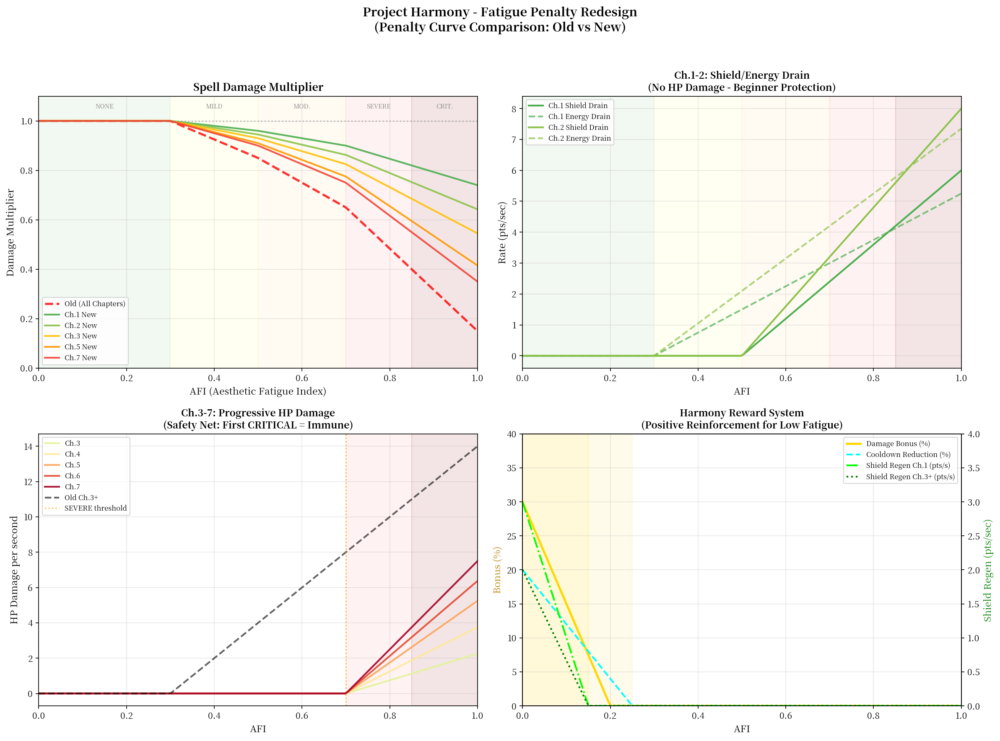
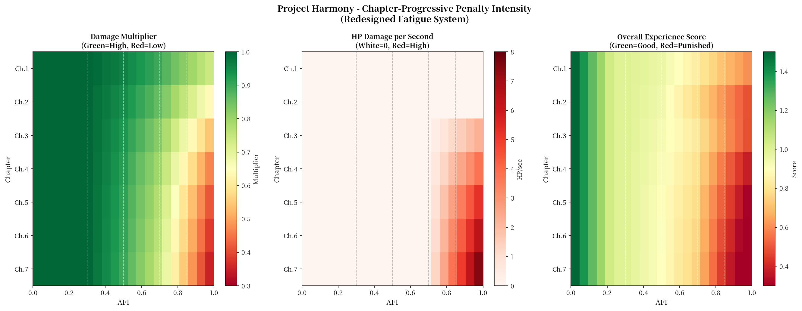
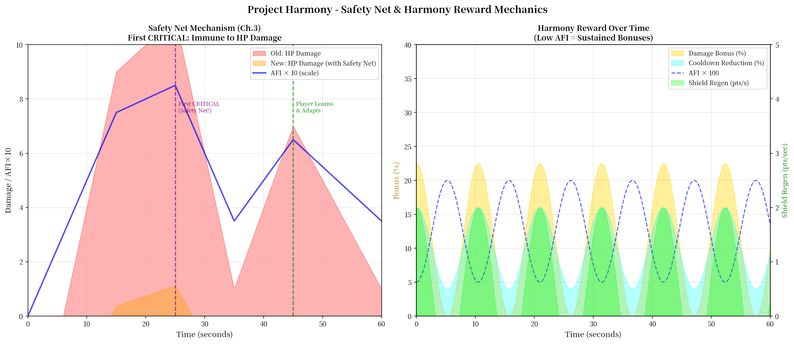
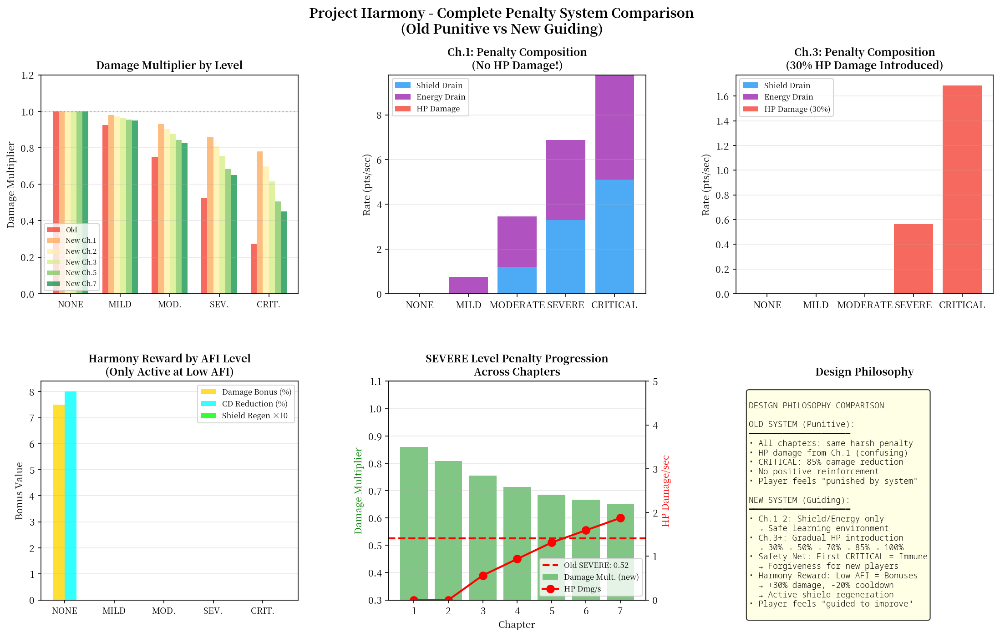

# Project Harmony 听感疲劳惩罚机制重设计文档

**版本**: 2.0
**作者**: Manus AI (game_balance_designer)
**日期**: 2026年3月1日

---

## 1. 设计背景与目标

根据玩家体验评估报告 [1]，当前版本的听感疲劳系统（Aesthetic Fatigue Index, AFI）虽然在概念上极具创新，但在新手期的实现上存在明显的负反馈问题。报告指出，前期的“不和谐腐蚀（直接扣血）”机制容易让玩家感到是在**“被系统惩罚”而非“被引导学习”**，这与游戏“战斗即混音”的核心理念相悖，并显著提高了新手玩家的挫败感和流失风险。

本次重设计的核心目标是将疲劳系统的定位从**“惩罚性” (Punitive) 彻底转变为“引导性” (Guiding)**。我们希望通过一套更平滑、更具正向激励的机制，在不牺牲系统深度的情况下，达成以下目标：

- **柔化新手曲线**：为新手玩家（尤其是在第1-2章）提供一个更安全的学习环境，鼓励他们探索和试错。
- **强化引导作用**：通过不同层级的反馈，清晰地向玩家传达“什么是好的操作”，而非仅仅惩罚“坏的操作”。
- **引入正向激励**：奖励玩家维持“和谐”的战斗节奏，使其成为一种主动追求的目标，而非仅仅是被动规避的惩罚。
- **保留后期挑战**：在游戏后期，惩罚机制需要回归，以维持对高水平玩家的策略深度和挑战性。

## 2. 现有系统 (v1.0) 问题分析

通过对 `fatigue_manager.gd` 的代码审查和玩家体验报告的分析，我们定位了当前系统的核心问题：

1.  **惩罚的“一刀切”**：所有章节应用了完全相同的惩罚曲线。对于刚接触游戏、尚在理解核心机制的玩家来说，`CRITICAL` 等级下高达 85% 的伤害削弱和直接的生命值腐蚀过于严厉。
2.  **过早引入生命值惩罚**：从第一章开始，不和谐法术和高AFI就会直接导致扣血。这在玩家的心理模型中，等同于“犯错即受罚”，而非“战斗资源管理”，带来了强烈的挫败感。
3.  **缺乏正向反馈**：系统只在玩家“做错”时出现，而在玩家“做对”（即保持低疲AFI）时没有任何奖励。这使得疲劳系统成为了一个纯粹的负面系统，玩家只会想方设法“避免”它，而不会去“利用”它。

## 3. 新版“引导式”疲劳系统设计

为了解决上述问题，我们设计了一套全新的、按章节渐进的、包含正负反馈闭环的疲劳系统。

### 3.1. 渐进式惩罚方案 (Progressive Penalties)

新方案的核心是根据玩家的游戏进程（章节）来动态调整惩罚的类型和强度，创造一条平滑的学习曲线。

#### 3.1.1. 第一、二章：新手保护区 (Beginner Protection)

在游戏的前两个章节，**彻底移除所有直接造成生命值（HP）伤害的惩罚**。取而代之的是更温和的资源削减，旨在“提醒”而非“惩罚”：

-   **护盾削减 (Shield Drain)**：当 AFI 进入 `MODERATE` (0.5) 及以上时，开始持续削减玩家的护盾。这是一个明确的视觉信号，提示玩家“你的操作正在变得单调”，但不会直接威胁其生存。
-   **能量流失 (Energy Drain)**：当 AFI 进入 `MILD` (0.3) 及以上时，开始少量扣除能量。这会轻微影响玩家的施法频率，引导他们放慢节奏。
-   **伤害削弱**：此阶段的伤害削弱惩罚被大幅削减，仅为完整强度（第7章）的 **40%-55%**，确保玩家即使在较高疲劳下仍有可观的战斗力。

#### 3.1.2. 第三、四章：过渡与学习 (Transition & Learning)

从第三章开始，随着玩家对核心机制的熟悉，我们逐步引入生命值惩罚，但强度远低于旧版：

-   **引入HP扣血**：当 AFI 进入 `SEVERE` (0.7) 及以上时，才开始造成生命值伤害。其基础伤害也仅为完整强度的 **30%-50%**。
-   **“安全网”机制 (Safety Net)**：为了防止玩家在初次面对扣血惩罚时产生恐慌，我们引入了“安全网”机制。**玩家在本局游戏中首次达到 `CRITICAL` 等级时，将完全免疫该次 `CRITICAL` 状态下的所有HP伤害**。这给了玩家一次宝贵的“免死金牌”，让他们有机会在不死亡的情况下观察并理解 `CRITICAL` 状态的后果。

#### 3.1.3. 第五章及以后：完整惩罚 (Full Penalty)

在游戏后期，惩罚机制将逐渐恢复到其应有的挑战性，以考验高水平玩家的资源管理能力。HP扣血的强度将从 **70% 逐步提升至 100%**，伤害削弱的曲线也变得更加陡峭。

### 3.2. “和谐奖励”系统 (Harmony Reward System)

这是本次重设计的另一核心——引入正向激励。当玩家主动维持低AFI（即打出“好听”的战斗节奏）时，系统将给予丰厚的奖励，使其成为一种高回报的策略选择。

-   **伤害加成**：当 AFI 低于 0.20 时，玩家将获得最高 **+30%** 的额外伤害加成。
-   **护盾恢复**：当 AFI 低于 0.15 时，玩家将获得持续的护盾恢复效果，在新手章节效果更强。
-   **冷却缩减**：当 AFI 低于 0.25 时，所有技能的冷却时间将获得最高 **-20%** 的缩减。

这套奖励机制将彻底改变玩家对疲劳系统的认知。AFI不再仅仅是一个需要规避的惩罚条，更是一个可以通过精妙操作来获取强大增益的“机会窗口”。

## 4. 核心数值表与曲线图

以下是新旧系统在关键章节的详细数值对比和相关曲线图。

### 4.1. 新版疲劳惩罚数值表（节选）

| AFI  | 等级     | 新版伤害倍率 (Ch.1) | 新版伤害倍率 (Ch.3) | 新版伤害倍率 (Ch.7) | 护盾削减/s (Ch.1) | HP扣血/s (Ch.3) | HP扣血/s (Ch.7) | 和谐奖励伤害 | 和谐护盾恢复 | 
| :--- | :------- | :------------------ | :------------------ | :------------------ | :---------------- | :-------------- | :-------------- | :----------- | :------------- | 
| 0.10 | NONE     | 1.000               | 1.000               | 1.000               | 0.0               | 0.0             | 0.0             | +15.0%       | 2.0/s          | 
| 0.40 | MILD     | 0.980               | 0.965               | 0.950               | 0.0               | 0.0             | 0.0             | 0%           | 0.0/s          | 
| 0.60 | MODERATE | 0.940               | 0.878               | 0.825               | 1.2               | 0.0             | 0.0             | 0%           | 0.0/s          | 
| 0.80 | SEVERE   | 0.860               | 0.732               | 0.617               | 3.6               | 0.8             | 2.5             | 0%           | 0.0/s          | 
| 0.90 | CRITICAL | 0.807               | 0.638               | 0.483               | 4.8               | 1.5             | 5.0             | 0%           | 0.0/s          | 

### 4.2. 惩罚曲线对比：旧版 vs 新版

此图清晰地展示了新版惩罚曲线（尤其是伤害倍率）相比于旧版的显著平滑化，以及按章节逐步加深的惩罚设计。

### 4.3. 章节渐进式惩罚热力图

这张热力图直观地展示了新版系统中，惩罚强度（包括伤害倍率和HP扣血）是如何随着章节推进而逐步提升的，完美体现了“引导式”的设计哲学。

### 4.4. 核心机制示意图：安全网与和谐奖励

此图通过模拟玩家行为，生动地展示了“安全网”机制如何在新手初次犯错时提供保护，以及“和谐奖励”系统如何在玩家保持优秀操作时提供持续增益。

### 4.5. 新旧设计哲学总览

最后，这张总览图从多个维度对比了新旧两个系统的设计理念和玩家感受，总结了本次重设计的核心改进。

## 5. 结论

通过本次重设计，Project Harmony 的听感疲劳系统已经从一个可能劝退新手的“惩罚工具”演变为一个能够有效引导玩家、鼓励精妙操作、并提供深度策略空间的“游戏节拍器”。

我们相信，这套全新的“引导式”系统将在保留游戏核心挑战的同时，极大地改善新手玩家的上手体验，让他们能更好地融入到“战斗即混音”的独特心流之中，从而显著提升游戏的留存率和长期口碑。

---

## 参考文献

[1] Manus AI. (2026). *Project Harmony 玩家体验评估报告*. Project Harmony GDD 附属文档. 
