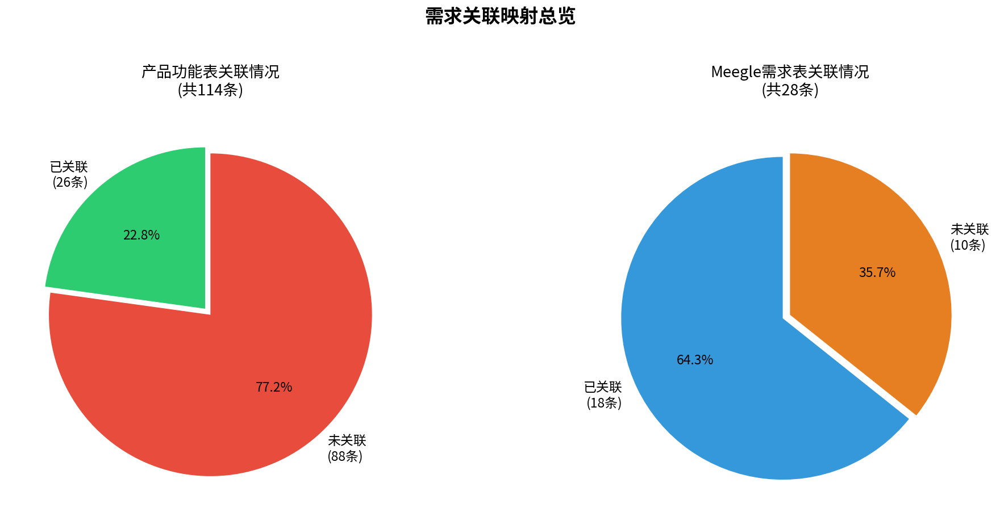
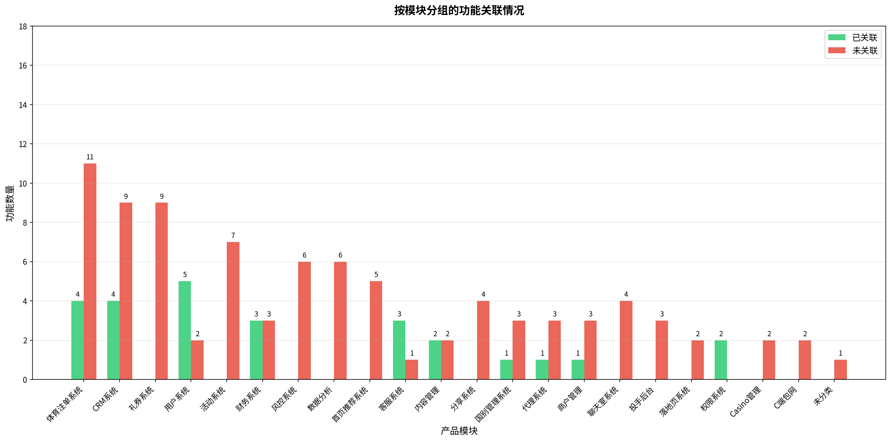
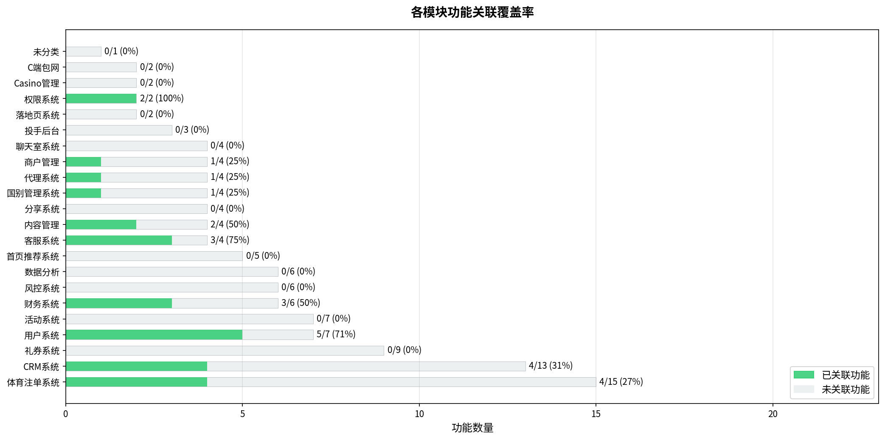
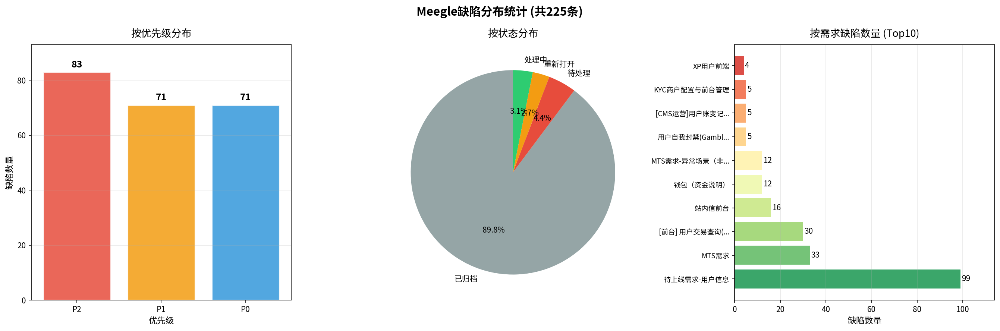
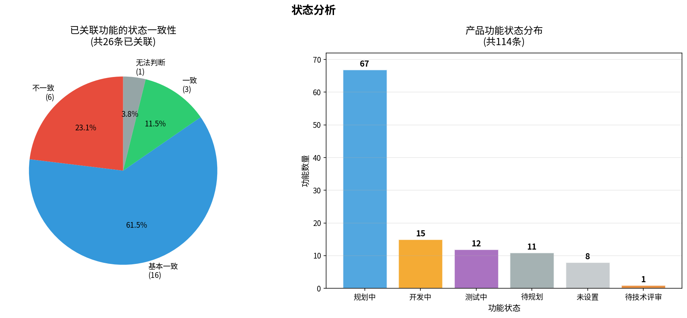

# 需求关联映射报告

> **生成时间**: 2026-03-01 23:40:36
> **数据来源**: 飞书多维表格 (BASE_ID: CyDxbUQGGa3N2NsVanMjqdjxp6e)

## 一、执行摘要

本报告基于飞书多维表格中的产品功能表（114条）与Meegle需求管理系统（28条需求）的数据，通过名称匹配、关键词匹配和语义分析，建立了两个系统之间的关联映射关系。

### 1.1 关键指标

| 指标 | 数值 | 说明 |
|------|------|------|
| 产品功能总数 | **114条** | 飞书产品功能表 |
| 已关联功能 | **26条** (22.8%) | 已与Meegle需求建立关联 |
| 未关联功能 | **88条** (77.2%) | 尚未对应Meegle需求 |
| Meegle需求总数 | **28条** | Meegle需求管理系统 |
| 已关联Meegle需求 | **18条** (64.3%) | 已与产品功能建立关联 |
| 未关联Meegle需求 | **10条** (35.7%) | 未在产品功能表中体现 |
| 状态不一致 | **6条** | 功能状态与Meegle状态不匹配 |
| Meegle任务总数 | **93条** | 关联任务数 |
| Meegle缺陷总数 | **225条** | 关联缺陷数 |

### 1.2 可视化概览

**图1: 需求关联映射总览**

**图2: 按模块分组的功能关联情况**

**图5: 各模块功能关联覆盖率**

## 二、按模块分组的关联映射表

以下按产品模块展示功能与Meegle需求的关联情况。

### 2.1 用户系统

> 功能总数: **7** | 已关联: **5** | 未关联: **2** | 覆盖率: **71%**

| 功能名称 | 功能状态 | 优先级 | Meegle需求 | Meegle状态 | 状态一致性 |
|---------|---------|--------|-----------|-----------|----------|
| 登录注册流程 | 测试中 | P0-核心 | *(未关联)* | - | - |
| KYC流程 | 测试中 | P1-重要 | KYC商户配置与前台管理 | 开发中 | ❌ 不一致 |
| 用户自我封禁(Gambling Games) | 开发中 | P1-重要 | 用户自我封禁(Gambling Games) | 开发中 | ✅ 一致 |
| KYC 流程优化 V1.1 | 测试中 | P1-重要 | [前台] KYC 优化 | 开发中 | ❌ 不一致 |
| 用户配置(Account Setting) | 规划中 | P2-一般 | *(未关联)* | - | - |
| 用户信息编辑 | 规划中 | P3-次要 | 待上线需求-用户信息 | 开发中 | 🔵 基本一致 |
| Transaction 优化V1.1 | N/A | N/A | [前台] 用户交易查询(Transaction) | 开发中 | ❓ 无法判断 |

### 2.2 体育注单系统

> 功能总数: **15** | 已关联: **4** | 未关联: **11** | 覆盖率: **27%**

| 功能名称 | 功能状态 | 优先级 | Meegle需求 | Meegle状态 | 状态一致性 |
|---------|---------|--------|-----------|-----------|----------|
| 订单清结算 | 测试中 | P0-核心 | *(未关联)* | - | - |
| 新版视觉（比赛卡片、详情页分组作为重点） | 规划中 | P0-核心 | 新版视觉（比赛卡片、详情页分组作为重点） | 开发中 | 🔵 基本一致 |
| UOF数据呈现 | 测试中 | P0-核心 | *(未关联)* | - | - |
| MTS注单单关/串关 | 测试中 | P0-核心 | MTS需求 | 开发中 | ❌ 不一致 |
| 赛果回滚冲正 | 测试中 | P0-核心 | *(未关联)* | - | - |
| 盘口展示优化 | 规划中 | P0-核心 | 盘口展示优化 | 开发中 | 🔵 基本一致 |
| MTS高级投注 | 规划中 | P1-重要 | MTS需求 | 开发中 | 🔵 基本一致 |
| CASHOUT | 规划中 | P1-重要 | *(未关联)* | - | - |
| 手动投注取消 API 需求 | 待技术评审 | P1-重要 | *(未关联)* | - | - |
| 赔率抽水调整 | 规划中 | P2-一般 | *(未关联)* | - | - |
| 三方赔率对接 | 规划中 | P2-一般 | *(未关联)* | - | - |
| 投注栏迭代 | 规划中 | P2-一般 | *(未关联)* | - | - |
| Bet Builder | 规划中 | P2-一般 | *(未关联)* | - | - |
| Head to Head数据对接 | N/A | P2-一般 | *(未关联)* | - | - |
| Icon数据对接 | N/A | P2-一般 | *(未关联)* | - | - |

### 2.3 CRM系统

> 功能总数: **13** | 已关联: **4** | 未关联: **9** | 覆盖率: **31%**

| 功能名称 | 功能状态 | 优先级 | Meegle需求 | Meegle状态 | 状态一致性 |
|---------|---------|--------|-----------|-----------|----------|
| 用户打标签 | 规划中 | P1-重要 | 用户标签管理(UserTag) | 开发中 | 🔵 基本一致 |
| KYC前端兼容多国别配置 | 测试中 | P1-重要 | [前台] KYC 优化 | 开发中 | ❌ 不一致 |
| 用户标签宽表 | 规划中 | P2-一般 | 用户标签管理(UserTag) | 开发中 | 🔵 基本一致 |
| 触达-站内信 | 规划中 | P2-一般 | 站内信管理 | 开发中 | 🔵 基本一致 |
| Optimove对接 | 规划中 | P3-次要 | *(未关联)* | - | - |
| 其他CRM对接 | 待规划 | P3-次要 | *(未关联)* | - | - |
| 用户圈选引擎 | 规划中 | P3-次要 | *(未关联)* | - | - |
| 营销活动创建 | 规划中 | P3-次要 | *(未关联)* | - | - |
| AB测试 | 规划中 | P3-次要 | *(未关联)* | - | - |
| 触达-SMS | 规划中 | P3-次要 | *(未关联)* | - | - |
| 触达-邮件 | 规划中 | P3-次要 | *(未关联)* | - | - |
| 触达-Push | 规划中 | P3-次要 | *(未关联)* | - | - |
| 触达-RCS | 规划中 | P3-次要 | *(未关联)* | - | - |

### 2.4 财务系统

> 功能总数: **6** | 已关联: **3** | 未关联: **3** | 覆盖率: **50%**

| 功能名称 | 功能状态 | 优先级 | Meegle需求 | Meegle状态 | 状态一致性 |
|---------|---------|--------|-----------|-----------|----------|
| 支付路由 | 测试中 | P0-核心 | 充提流程优化 V1.1 | 开发中 | ❌ 不一致 |
| 支付代收代付 | 测试中 | P0-核心 | 充提流程优化 V1.1 | 开发中 | ❌ 不一致 |
| 主钱包划转 | 规划中 | P1-重要 | *(未关联)* | - | - |
| Bonus 钱包划转 | 测试中 | P2-一般 | *(未关联)* | - | - |
| 钱包规则参数 | 规划中 | P2-一般 | 钱包（资金说明） | 开发中 | 🔵 基本一致 |
| 币种钱包设置 | 测试中 | P2-一般 | *(未关联)* | - | - |

### 2.5 客服系统

> 功能总数: **4** | 已关联: **3** | 未关联: **1** | 覆盖率: **75%**

| 功能名称 | 功能状态 | 优先级 | Meegle需求 | Meegle状态 | 状态一致性 |
|---------|---------|--------|-----------|-----------|----------|
| 站内信 | 开发中 | P1-重要 | 站内信前台 | 开发中 | ✅ 一致 |
| C端客服入口 | 开发中 | P2-一般 | 站内客服系统 | 开发中 | ✅ 一致 |
| FAQ管理 | 规划中 | P2-一般 | 平台各类型问答(FAQ) | 开发中 | 🔵 基本一致 |
| VIP客服 | 规划中 | P3-次要 | *(未关联)* | - | - |

### 2.6 内容管理

> 功能总数: **4** | 已关联: **2** | 未关联: **2** | 覆盖率: **50%**

| 功能名称 | 功能状态 | 优先级 | Meegle需求 | Meegle状态 | 状态一致性 |
|---------|---------|--------|-----------|-----------|----------|
| FAQ | 规划中 | P1-重要 | 平台各类型问答(FAQ) | 开发中 | 🔵 基本一致 |
| 公告管理 | 规划中 | P2-一般 | 平台系统管理(Setting) | 开发中 | 🔵 基本一致 |
| Banner管理 | 规划中 | P2-一般 | *(未关联)* | - | - |
| 文章系统 | 规划中 | P3-次要 | *(未关联)* | - | - |

### 2.7 权限系统

> 功能总数: **2** | 已关联: **2** | 未关联: **0** | 覆盖率: **100%**

| 功能名称 | 功能状态 | 优先级 | Meegle需求 | Meegle状态 | 状态一致性 |
|---------|---------|--------|-----------|-----------|----------|
| 角色管理 | 规划中 | P3-次要 | 平台系统管理(Setting) | 开发中 | 🔵 基本一致 |
| 权限管理 | 规划中 | P3-次要 | 平台系统管理(Setting) | 开发中 | 🔵 基本一致 |

### 2.8 国别管理系统

> 功能总数: **4** | 已关联: **1** | 未关联: **3** | 覆盖率: **25%**

| 功能名称 | 功能状态 | 优先级 | Meegle需求 | Meegle状态 | 状态一致性 |
|---------|---------|--------|-----------|-----------|----------|
| 国别设置 | 规划中 | P3-次要 | 平台系统管理(Setting) | 开发中 | 🔵 基本一致 |
| 多语言 | 规划中 | P3-次要 | *(未关联)* | - | - |
| 流程设置 | 规划中 | P3-次要 | *(未关联)* | - | - |
| 功能开关 | 规划中 | P3-次要 | *(未关联)* | - | - |

### 2.9 代理系统

> 功能总数: **4** | 已关联: **1** | 未关联: **3** | 覆盖率: **25%**

| 功能名称 | 功能状态 | 优先级 | Meegle需求 | Meegle状态 | 状态一致性 |
|---------|---------|--------|-----------|-----------|----------|
| 代理参数配置 | 规划中 | P3-次要 | 代理管理(Agent Management) | 开发中 | 🔵 基本一致 |
| 活动周期 | 规划中 | P3-次要 | *(未关联)* | - | - |
| 分享渠道管理 | 规划中 | P3-次要 | *(未关联)* | - | - |
| 分享物料管理 | 规划中 | P3-次要 | *(未关联)* | - | - |

### 2.10 商户管理

> 功能总数: **4** | 已关联: **1** | 未关联: **3** | 覆盖率: **25%**

| 功能名称 | 功能状态 | 优先级 | Meegle需求 | Meegle状态 | 状态一致性 |
|---------|---------|--------|-----------|-----------|----------|
| 多租户系统 | 待规划 | P3-次要 | 商户调用次数表 | 开发中 | 🔵 基本一致 |
| 租户参数配置 | 待规划 | P3-次要 | *(未关联)* | - | - |
| 租户信息 | 待规划 | P3-次要 | *(未关联)* | - | - |
| API接口 | 待规划 | P3-次要 | *(未关联)* | - | - |

### 2.11 礼券系统

> 功能总数: **9** | 已关联: **0** | 未关联: **9** | 覆盖率: **0%**

| 功能名称 | 功能状态 | 优先级 | Meegle需求 | Meegle状态 | 状态一致性 |
|---------|---------|--------|-----------|-----------|----------|
| Bonus创建 | 开发中 | P1-重要 | *(未关联)* | - | - |
| Freebet创建 | 开发中 | P1-重要 | *(未关联)* | - | - |
| 礼券发放 | 开发中 | P1-重要 | *(未关联)* | - | - |
| 礼券核销 | 开发中 | P1-重要 | *(未关联)* | - | - |
| Freespin创建 | 开发中 | P2-一般 | *(未关联)* | - | - |
| 有效期管理 | 开发中 | P2-一般 | *(未关联)* | - | - |
| 余额查询 | 开发中 | P2-一般 | *(未关联)* | - | - |
| 使用记录 | 开发中 | P2-一般 | *(未关联)* | - | - |
| 批次管理 | 规划中 | P2-一般 | *(未关联)* | - | - |

### 2.12 活动系统

> 功能总数: **7** | 已关联: **0** | 未关联: **7** | 覆盖率: **0%**

| 功能名称 | 功能状态 | 优先级 | Meegle需求 | Meegle状态 | 状态一致性 |
|---------|---------|--------|-----------|-----------|----------|
| 活动参数配置 | 开发中 | P1-重要 | *(未关联)* | - | - |
| 活动模版 | 开发中 | P1-重要 | *(未关联)* | - | - |
| 返水机制 | 规划中 | P1-重要 | *(未关联)* | - | - |
| Superodds | 规划中 | P2-一般 | *(未关联)* | - | - |
| 串关加赔 | 规划中 | P2-一般 | *(未关联)* | - | - |
| 0-0退赔 | 规划中 | P2-一般 | *(未关联)* | - | - |
| 营销入口配置 | 规划中 | P2-一般 | *(未关联)* | - | - |

### 2.13 风控系统

> 功能总数: **6** | 已关联: **0** | 未关联: **6** | 覆盖率: **0%**

| 功能名称 | 功能状态 | 优先级 | Meegle需求 | Meegle状态 | 状态一致性 |
|---------|---------|--------|-----------|-----------|----------|
| 订单风险管理 | 开发中 | P1-重要 | *(未关联)* | - | - |
| 标签用户风控 | 规划中 | P1-重要 | *(未关联)* | - | - |
| 标签规则集 | 规划中 | P1-重要 | *(未关联)* | - | - |
| 赛事异常监控 | 开发中 | P1-重要 | *(未关联)* | - | - |
| 自创盘口 | 待规划 | P3-次要 | *(未关联)* | - | - |
| 发版维护 | N/A | N/A | *(未关联)* | - | - |

### 2.14 数据分析

> 功能总数: **6** | 已关联: **0** | 未关联: **6** | 覆盖率: **0%**

| 功能名称 | 功能状态 | 优先级 | Meegle需求 | Meegle状态 | 状态一致性 |
|---------|---------|--------|-----------|-----------|----------|
| Metabase集成 | 规划中 | P3-次要 | *(未关联)* | - | - |
| GA集成 | 规划中 | P3-次要 | *(未关联)* | - | - |
| Adjust/AF数据 | 规划中 | P3-次要 | *(未关联)* | - | - |
| Pixel数据 | 规划中 | P3-次要 | *(未关联)* | - | - |
| 标签算法 | 规划中 | P3-次要 | *(未关联)* | - | - |
| 业务报表 | 待规划 | P3-次要 | *(未关联)* | - | - |

### 2.15 首页推荐系统

> 功能总数: **5** | 已关联: **0** | 未关联: **5** | 覆盖率: **0%**

| 功能名称 | 功能状态 | 优先级 | Meegle需求 | Meegle状态 | 状态一致性 |
|---------|---------|--------|-----------|-----------|----------|
| 串关推荐卡片 | 规划中 | P2-一般 | *(未关联)* | - | - |
| 中奖订单推荐 | 规划中 | P2-一般 | *(未关联)* | - | - |
| 卡片管理后台 | 规划中 | P2-一般 | *(未关联)* | - | - |
| 推荐算法 | 规划中 | P3-次要 | *(未关联)* | - | - |
| 个性化推荐 | 待规划 | P3-次要 | *(未关联)* | - | - |

### 2.16 分享系统

> 功能总数: **4** | 已关联: **0** | 未关联: **4** | 覆盖率: **0%**

| 功能名称 | 功能状态 | 优先级 | Meegle需求 | Meegle状态 | 状态一致性 |
|---------|---------|--------|-----------|-----------|----------|
| 系统分享 | 规划中 | P2-一般 | *(未关联)* | - | - |
| 三方分享 | 规划中 | P2-一般 | *(未关联)* | - | - |
| 图片分享 | 规划中 | P3-次要 | *(未关联)* | - | - |
| 分享场景 | 规划中 | P3-次要 | *(未关联)* | - | - |

### 2.17 聊天室系统

> 功能总数: **4** | 已关联: **0** | 未关联: **4** | 覆盖率: **0%**

| 功能名称 | 功能状态 | 优先级 | Meegle需求 | Meegle状态 | 状态一致性 |
|---------|---------|--------|-----------|-----------|----------|
| 聊天室建立 | 待规划 | N/A | *(未关联)* | - | - |
| 头像 / 昵称修改 | N/A | N/A | *(未关联)* | - | - |
| 分赛事群聊天 | N/A | N/A | *(未关联)* | - | - |
| 推单 / 晒单 | N/A | N/A | *(未关联)* | - | - |

### 2.18 投手后台

> 功能总数: **3** | 已关联: **0** | 未关联: **3** | 覆盖率: **0%**

| 功能名称 | 功能状态 | 优先级 | Meegle需求 | Meegle状态 | 状态一致性 |
|---------|---------|--------|-----------|-----------|----------|
| 渠道数据查询 | 规划中 | P3-次要 | *(未关联)* | - | - |
| Pixel绑定 | 规划中 | P3-次要 | *(未关联)* | - | - |
| 归因平台对接 | 规划中 | P3-次要 | *(未关联)* | - | - |

### 2.19 落地页系统

> 功能总数: **2** | 已关联: **0** | 未关联: **2** | 覆盖率: **0%**

| 功能名称 | 功能状态 | 优先级 | Meegle需求 | Meegle状态 | 状态一致性 |
|---------|---------|--------|-----------|-----------|----------|
| 注册落地页 | 规划中 | P2-一般 | *(未关联)* | - | - |
| 绑定落地页 | 规划中 | P2-一般 | *(未关联)* | - | - |

### 2.20 Casino管理

> 功能总数: **2** | 已关联: **0** | 未关联: **2** | 覆盖率: **0%**

| 功能名称 | 功能状态 | 优先级 | Meegle需求 | Meegle状态 | 状态一致性 |
|---------|---------|--------|-----------|-----------|----------|
| Casino优先级 | 规划中 | P3-次要 | *(未关联)* | - | - |
| Casino参数 | 规划中 | P3-次要 | *(未关联)* | - | - |

### 2.21 C端包网

> 功能总数: **2** | 已关联: **0** | 未关联: **2** | 覆盖率: **0%**

| 功能名称 | 功能状态 | 优先级 | Meegle需求 | Meegle状态 | 状态一致性 |
|---------|---------|--------|-----------|-----------|----------|
| 包网方案 | 待规划 | P3-次要 | *(未关联)* | - | - |
| 定制化 | 待规划 | P3-次要 | *(未关联)* | - | - |

### 2.22 未分类

> 功能总数: **1** | 已关联: **0** | 未关联: **1** | 覆盖率: **0%**

| 功能名称 | 功能状态 | 优先级 | Meegle需求 | Meegle状态 | 状态一致性 |
|---------|---------|--------|-----------|-----------|----------|
| N/A | N/A | N/A | *(未关联)* | - | - |

## 三、未关联功能清单

以下 **88** 个产品功能尚未与Meegle需求建立关联，需要产品团队进行补充或确认是否需要在Meegle中创建对应需求。

| # | 功能名称 | 所属模块 | 功能状态 | 优先级 | 功能说明 |
|---|---------|---------|---------|--------|---------|
| 1 | 登录注册流程 | 用户系统 | 测试中 | P0-核心 | 手机号+验证码、三方登录、referral |
| 2 | 订单清结算 | 体育注单系统 | 测试中 | P0-核心 | UOF结算对接 |
| 3 | UOF数据呈现 | 体育注单系统 | 测试中 | P0-核心 | N/A |
| 4 | 赛果回滚冲正 | 体育注单系统 | 测试中 | P0-核心 | N/A |
| 5 | 订单风险管理 | 风控系统 | 开发中 | P1-重要 | MTS订单接受/拒绝 |
| 6 | 标签用户风控 | 风控系统 | 规划中 | P1-重要 | 订单金额/提现金额限制/盘口限制 |
| 7 | 标签规则集 | 风控系统 | 规划中 | P1-重要 | 标签宽表规则配置 |
| 8 | 赛事异常监控 | 风控系统 | 开发中 | P1-重要 | 赛事取消、盘口异常、赔率异常告警 |
| 9 | 活动参数配置 | 活动系统 | 开发中 | P1-重要 | 活动周期和参数配置 |
| 10 | 活动模版 | 活动系统 | 开发中 | P1-重要 | 新客存款/VIP等活动模版 |
| 11 | CASHOUT | 体育注单系统 | 规划中 | P1-重要 | 提前结算功能 |
| 12 | 返水机制 | 活动系统 | 规划中 | P1-重要 | VIP返水配置 |
| 13 | Bonus创建 | 礼券系统 | 开发中 | P1-重要 | Bonus礼券创建 |
| 14 | Freebet创建 | 礼券系统 | 开发中 | P1-重要 | Freebet礼券创建 |
| 15 | 礼券发放 | 礼券系统 | 开发中 | P1-重要 | 礼券发放功能 |
| 16 | 礼券核销 | 礼券系统 | 开发中 | P1-重要 | 礼券核销功能 |
| 17 | 主钱包划转 | 财务系统 | 规划中 | P1-重要 | N/A |
| 18 | 手动投注取消 API 需求 | 体育注单系统 | 待技术评审 | P1-重要 | N/A |
| 19 | Bonus 钱包划转 | 财务系统 | 测试中 | P2-一般 | Bonus提现到Cash钱包 |
| 20 | 币种钱包设置 | 财务系统 | 测试中 | P2-一般 | 多币种钱包配置 |
| 21 | 赔率抽水调整 | 体育注单系统 | 规划中 | P2-一般 | MTS赔率抽水调整模版 |
| 22 | 三方赔率对接 | 体育注单系统 | 规划中 | P2-一般 | 其他三方赔率源对接 |
| 23 | 投注栏迭代 | 体育注单系统 | 规划中 | P2-一般 | 投注锁定、新选项添加、状态管理 |
| 24 | 系统分享 | 分享系统 | 规划中 | P2-一般 | 系统原生分享 |
| 25 | 三方分享 | 分享系统 | 规划中 | P2-一般 | GA/FB/TT分享对接 |
| 26 | 注册落地页 | 落地页系统 | 规划中 | P2-一般 | 注册引导页 |
| 27 | 绑定落地页 | 落地页系统 | 规划中 | P2-一般 | 绑定引导页 |
| 28 | Superodds | 活动系统 | 规划中 | P2-一般 | 超级赔率活动 |
| 29 | 串关加赔 | 活动系统 | 规划中 | P2-一般 | 串关加赔活动 |
| 30 | 0-0退赔 | 活动系统 | 规划中 | P2-一般 | 0-0退赔活动 |
| 31 | Bet Builder | 体育注单系统 | 规划中 | P2-一般 | SR Bet Builder |
| 32 | 营销入口配置 | 活动系统 | 规划中 | P2-一般 | 活动入口配置 |
| 33 | Freespin创建 | 礼券系统 | 开发中 | P2-一般 | Freespin礼券创建 |
| 34 | 有效期管理 | 礼券系统 | 开发中 | P2-一般 | 礼券有效期配置 |
| 35 | 余额查询 | 礼券系统 | 开发中 | P2-一般 | 礼券余额查询 |
| 36 | 使用记录 | 礼券系统 | 开发中 | P2-一般 | 礼券使用记录 |
| 37 | 批次管理 | 礼券系统 | 规划中 | P2-一般 | 固定/支付百分比/剩余张数量/口令红包 |
| 38 | 串关推荐卡片 | 首页推荐系统 | 规划中 | P2-一般 | 串关推荐卡片类型 |
| 39 | 中奖订单推荐 | 首页推荐系统 | 规划中 | P2-一般 | 用户中奖订单推荐卡片 |
| 40 | 卡片管理后台 | 首页推荐系统 | 规划中 | P2-一般 | B端卡片管理 |
| 41 | Banner管理 | 内容管理 | 规划中 | P2-一般 | Banner配置管理 |
| 42 | Head to Head数据对接 | 体育注单系统 | N/A | P2-一般 | 关联TheSport的Head to Head历史对战数据，... |
| 43 | Icon数据对接 | 体育注单系统 | N/A | P2-一般 | 关联TheSport的球队/联赛Icon图标数据，用于比赛列... |
| 44 | 用户配置(Account Setting) | 用户系统 | 规划中 | P2-一般 | 本功能用于提供平台用户一个统一的 个人化设置入口，用户可在平... |
| 45 | 自创盘口 | 风控系统 | 待规划 | P3-次要 | 自有盘口创建 |
| 46 | VIP客服 | 客服系统 | 规划中 | P3-次要 | VIP专属客服服务 |
| 47 | 多语言 | 国别管理系统 | 规划中 | P3-次要 | 多语言配置 |
| 48 | 流程设置 | 国别管理系统 | 规划中 | P3-次要 | 登录注册/KYC/钱包/支付提现流程配置 |
| 49 | 功能开关 | 国别管理系统 | 规划中 | P3-次要 | 部分功能开关配置 |
| 50 | Casino优先级 | Casino管理 | 规划中 | P3-次要 | 游戏优先级配置 |
| 51 | Casino参数 | Casino管理 | 规划中 | P3-次要 | 游戏参数配置 |
| 52 | 图片分享 | 分享系统 | 规划中 | P3-次要 | 图片生成分享 |
| 53 | 分享场景 | 分享系统 | 规划中 | P3-次要 | 盘口/单子/活动分享场景配置 |
| 54 | 渠道数据查询 | 投手后台 | 规划中 | P3-次要 | 投手查看渠道用户数据 |
| 55 | Pixel绑定 | 投手后台 | 规划中 | P3-次要 | 投手进行Pixel绑定 |
| 56 | 归因平台对接 | 投手后台 | 规划中 | P3-次要 | Adjust/Appsflyer对接 |
| 57 | 活动周期 | 代理系统 | 规划中 | P3-次要 | 代理活动周期配置 |
| 58 | 分享渠道管理 | 代理系统 | 规划中 | P3-次要 | 分享渠道配置 |
| 59 | 分享物料管理 | 代理系统 | 规划中 | P3-次要 | 分享图片设计管理 |
| 60 | Optimove对接 | CRM系统 | 规划中 | P3-次要 | Optimove外部CRM对接 |
| 61 | 其他CRM对接 | CRM系统 | 待规划 | P3-次要 | 术数/Customer IO/Firebase对接 |
| 62 | 用户圈选引擎 | CRM系统 | 规划中 | P3-次要 | 基于标签/前端行为的用户圈选 |
| 63 | 营销活动创建 | CRM系统 | 规划中 | P3-次要 | 选择客群/定义发放方式/发放内容 |
| 64 | AB测试 | CRM系统 | 规划中 | P3-次要 | 实验组/对照组配置 |
| 65 | 触达-SMS | CRM系统 | 规划中 | P3-次要 | 短信发送(含路由) |
| 66 | 触达-邮件 | CRM系统 | 规划中 | P3-次要 | AWS SMTP邮件发送 |
| 67 | 触达-Push | CRM系统 | 规划中 | P3-次要 | App Push推送 |
| 68 | 触达-RCS | CRM系统 | 规划中 | P3-次要 | RCS消息发送 |
| 69 | 推荐算法 | 首页推荐系统 | 规划中 | P3-次要 | 模块排序算法 |
| 70 | 个性化推荐 | 首页推荐系统 | 待规划 | P3-次要 | 基于用户行为的个性化推荐 |
| 71 | 文章系统 | 内容管理 | 规划中 | P3-次要 | 模版模式/代码模式 |
| 72 | Metabase集成 | 数据分析 | 规划中 | P3-次要 | 服务端数据BI |
| 73 | GA集成 | 数据分析 | 规划中 | P3-次要 | 前端数据分析 |
| 74 | Adjust/AF数据 | 数据分析 | 规划中 | P3-次要 | 归因平台数据分析 |
| 75 | Pixel数据 | 数据分析 | 规划中 | P3-次要 | FB/TT Pixel数据分析 |
| 76 | 标签算法 | 数据分析 | 规划中 | P3-次要 | 风控/运营标签算法 |
| 77 | 业务报表 | 数据分析 | 待规划 | P3-次要 | 业务数据报表 |
| 78 | 租户参数配置 | 商户管理 | 待规划 | P3-次要 | 租户商务参数配置 |
| 79 | 租户信息 | 商户管理 | 待规划 | P3-次要 | 租户信息管理 |
| 80 | API接口 | 商户管理 | 待规划 | P3-次要 | 对外API接口 |
| 81 | 包网方案 | C端包网 | 待规划 | P3-次要 | C端包网方案 |
| 82 | 定制化 | C端包网 | 待规划 | P3-次要 | 包网定制化配置 |
| 83 | 聊天室建立 | 聊天室系统 | 待规划 | N/A | 可以让平台用户进行文字聊天 |
| 84 | 头像 / 昵称修改 | 聊天室系统 | N/A | N/A | N/A |
| 85 | 分赛事群聊天 | 聊天室系统 | N/A | N/A | N/A |
| 86 | 推单 / 晒单 | 聊天室系统 | N/A | N/A | N/A |
| 87 | N/A | N/A | N/A | N/A | N/A |
| 88 | 发版维护 | 风控系统 | N/A | N/A | 为了规避发版导致的注单失败，应该设置一个维护时间，在维护期间... |

## 四、未关联Meegle需求清单

以下 **10** 个Meegle需求未在产品功能表中找到对应功能，可能是：
1. 技术性需求（如架构重构、性能优化）
2. 跨功能需求（如测试任务）
3. 产品功能表中遗漏的功能项

| # | Meegle需求标题 | 状态 | 优先级 | 标签 | 描述摘要 |
|---|--------------|------|--------|------|---------|
| 1 | 2026专项测试任务 | 开发中 | P1 重要不紧急 | Server | 脚本技术支持
性能测试方案
数据验证等 |
| 2 | XP前端页面适配移动端 | 开发中 | P5 已完成 | WEB | XP前端页面适配移动端 |
| 3 | 配合后端重构 odds_change 数据结构 | 开发中 | P5 已完成 | WEB | 配合后端重构 odds_change 数据结构 |
| 4 | XP用户前端 | 开发中 | P5 已完成 | WEB | SportRader页面数据展示逻辑 |
| 5 | MTS需求-异常场景（非正常结算流程） | 开发中 | P5 已完成 | WEB | 赛事回滚，冲正等业务需求 |
| 6 | VIP等级与奖励体系配置 | 开发中 | P1 重要不紧急 | CMS |  |
| 7 | VIP Detail | 开发中 | P1 重要不紧急 | WEB | 为使用户能留存在平台, 建立 VIP 等级, 透过 VIP 优惠及返利吸引平台用... |
| 8 | [CMS运营]用户账变记录 | 开发中 | P5 已完成 | CMS | 据指定用户的账号、UID 或手机号，查询其在平台内的 钱包账变记录（Transa... |
| 9 | SR-四步验证 | 开发中 | P5 已完成 | SportRader |  |
| 10 | 站内客服管理 | 开发中 | P0 重要且紧急 | CMS | 本功能旨在于平台内整合与强化客服系统，包含 线上即时文字客服 与 电话客服 两种... |

## 五、状态不一致清单

以下 **6** 个功能的状态与对应Meegle需求的状态存在不一致，需要团队进行核实和同步。

| 功能名称 | 功能状态 | Meegle需求 | Meegle状态 | 差异说明 |
|---------|---------|-----------|-----------|---------|
| 支付路由 | **测试中** | 充提流程优化 V1.1 | **开发中** | 功能已进入测试，但Meegle仍显示开发中 |
| 支付代收代付 | **测试中** | 充提流程优化 V1.1 | **开发中** | 功能已进入测试，但Meegle仍显示开发中 |
| MTS注单单关/串关 | **测试中** | MTS需求 | **开发中** | 功能已进入测试，但Meegle仍显示开发中 |
| KYC流程 | **测试中** | KYC商户配置与前台管理 | **开发中** | 功能已进入测试，但Meegle仍显示开发中 |
| KYC前端兼容多国别配置 | **测试中** | [前台] KYC 优化 | **开发中** | 功能已进入测试，但Meegle仍显示开发中 |
| KYC 流程优化 V1.1 | **测试中** | [前台] KYC 优化 | **开发中** | 功能已进入测试，但Meegle仍显示开发中 |

**建议**: 产品团队应定期同步飞书功能表与Meegle系统的状态，确保两个系统的数据一致性。

## 六、缺陷分布统计

Meegle系统中共记录 **225** 个缺陷，以下为详细分布情况。

**图3: Meegle缺陷分布统计**

### 6.1 缺陷优先级分布

| 优先级 | 数量 | 占比 |
|--------|------|------|
| P0 | 71 | 31.6% |
| P1 | 71 | 31.6% |
| P2 | 83 | 36.9% |

### 6.2 缺陷状态分布

| 状态 | 数量 | 占比 |
|------|------|------|
| 已归档 | 202 | 89.8% |
| 待处理 | 10 | 4.4% |
| 处理中 | 7 | 3.1% |
| 重新打开 | 6 | 2.7% |

### 6.3 按需求缺陷数量 (Top 10)

| 需求名称 | 缺陷数量 | 占比 |
|---------|---------|------|
| 待上线需求-用户信息 | 99 | 44.0% |
| MTS需求 | 33 | 14.7% |
| [前台] 用户交易查询(Transaction) | 30 | 13.3% |
| 站内信前台 | 16 | 7.1% |
| 钱包（资金说明） | 12 | 5.3% |
| MTS需求-异常场景（非正常结算流程） | 12 | 5.3% |
| 用户自我封禁(Gambling Games) | 5 | 2.2% |
| [CMS运营]用户账变记录 | 5 | 2.2% |
| KYC商户配置与前台管理 | 5 | 2.2% |
| XP用户前端 | 4 | 1.8% |

## 七、任务分布统计

Meegle系统中共记录 **93** 个任务。

### 7.1 按需求任务数量

| 需求名称 | 任务数量 |
|---------|---------|
| [前台] 用户交易查询(Transaction) | 11 |
| MTS需求 | 8 |
| KYC商户配置与前台管理 | 7 |
| [前台] KYC 优化 | 7 |
| 用户自我封禁(Gambling Games) | 7 |
| 站内客服系统 | 7 |
| 钱包（资金说明） | 7 |
| 盘口展示优化 | 6 |
| 站内客服管理 | 5 |
| 站内信前台 | 5 |
| XP用户前端 | 5 |
| 站内信管理 | 4 |
| [CMS运营]用户账变记录 | 4 |
| XP前端页面适配移动端 | 3 |
| 新版视觉（比赛卡片、详情页分组作为重点） | 2 |
| 2026专项测试任务 | 2 |
| MTS需求-异常场景（非正常结算流程） | 2 |
| 配合后端重构 odds_change 数据结构 | 1 |

## 八、状态分析

**图4: 状态一致性分析**

## 九、分析结论与建议

### 9.1 主要发现

1. **关联覆盖率偏低**: 产品功能表中仅 22.8% 的功能（26/114）与Meegle需求建立了关联，大量功能（88条）处于未关联状态。这表明产品功能表与需求管理系统之间存在显著的数据断层。

2. **Meegle需求覆盖率**: 28条Meegle需求中，18条（64.3%）已与产品功能建立关联，10条（35.7%）未找到对应的产品功能，主要集中在技术性需求和跨功能需求。

3. **状态不一致问题**: 6条已关联功能存在状态不一致，主要表现为产品功能表显示"测试中"而Meegle系统仍显示"开发中"，说明状态同步存在滞后。

4. **缺陷集中分布**: 225条缺陷中，"待上线需求-用户信息"（99条）和"MTS需求"（33条）是缺陷最集中的需求，需要重点关注。89.8%的缺陷已归档，当前活跃缺陷23条。

5. **高覆盖率模块**: 客服系统（75%）、用户系统（71%）、权限系统（100%）的关联覆盖率较高；礼券系统（0%）、活动系统（0%）、风控系统（0%）等模块完全未关联。

### 9.2 改进建议

| 优先级 | 建议 | 涉及范围 |
|--------|------|---------|
| 🔴 高 | 立即同步状态不一致的6条功能（支付路由、支付代收代付等已进入测试阶段的功能） | 财务系统、用户系统、体育注单系统 |
| 🔴 高 | 为礼券系统（9条）、活动系统（7条）、风控系统（6条）等零覆盖模块创建对应Meegle需求 | 礼券系统、活动系统、风控系统 |
| 🟡 中 | 建立产品功能表与Meegle需求的双向同步机制，避免状态滞后 | 全部模块 |
| 🟡 中 | 对"待上线需求-用户信息"的99条缺陷进行专项复查，确认是否已修复 | 用户系统 |
| 🟢 低 | 为聊天室系统、C端包网等规划中的功能预先创建Meegle需求占位 | 聊天室系统、C端包网 |

## 附录：数据说明

### 数据来源

| 数据表 | 表格ID | 记录数 |
|--------|--------|--------|
| 产品功能表 | tblLzX7wqGWFr9KP | 114条 |
| 产品模块表 | tblaDW4D2hQS2xCw | 21条 |
| Meegle需求表 | tblO4wA2agKU1ZSP | 28条 |
| Meegle任务表 | tblzyH3DKSz9IAG9 | 93条 |
| Meegle缺陷表 | tblLmzknrXtzhGFc | 225条 |

### 关联方法说明

本报告采用以下方法建立关联映射：
1. **手动映射**: 基于业务理解，对功能名称与Meegle需求标题进行人工对应
2. **名称相似度匹配**: 使用SequenceMatcher算法计算名称相似度（阈值≥0.6）
3. **关键词包含匹配**: 检查功能名称是否包含在Meegle需求标题中（或反向）

### 状态一致性判断标准

| 功能状态 | 对应Meegle状态 | 判断结果 |
|---------|--------------|---------|
| 规划中 | 待开发/规划中 | 一致 |
| 开发中 | 开发中 | 一致 |
| 测试中 | 测试中/QA | 一致 |
| 已上线 | 已完成/已上线 | 一致 |
| 功能测试中 | Meegle开发中 | 不一致 |
