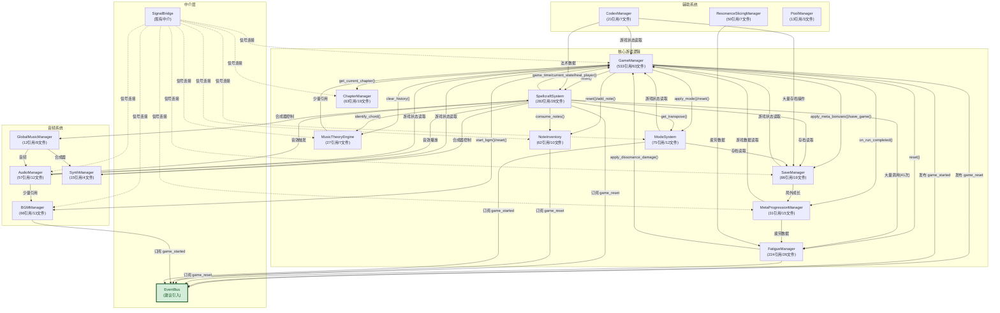

# Autoload 依赖关系图

**项目:** Project Harmony (Godot 4.6)
**任务 ID:** tsk-c61b04fa-930
**评估日期:** 2026年3月1日
**作者:** Manus AI (architecture_refactor_engineer)

---

## 1. 概述

本文档通过静态代码分析，对 Project Harmony 中核心 Autoload 单例之间的依赖关系进行了全面梳理。分析基于对 `gdszyy/project-harmony-gdd` 仓库中 `godot_project/scripts/autoload/` 目录下的 GDScript 脚本进行的系统性代码审查。

分析揭示了一个以 `GameManager` 为中心的高度耦合架构。许多核心系统（如 `SpellcraftSystem`, `FatigueManager`）不仅被 `GameManager` 直接调用，也反向引用 `GameManager`，形成了复杂的双向依赖网络。这种紧耦合是本次架构重构的主要动因。

## 2. 引用统计总览

以下数据通过对 `godot_project/scripts/` 目录下所有 `.gd` 文件进行正则表达式匹配统计得出：

| Autoload | 总引用次数 | 涉及文件数 | 主要引用来源 |
| :--- | :---: | :---: | :--- |
| `UIColors` | 1463 | 55 | 所有 UI 相关脚本（只读常量，耦合性低） |
| **`GameManager`** | **533** | **63** | `SpellcraftSystem`, `FatigueManager`, `AudioManager`, `SaveManager` 等 |
| `SpellcraftSystem` | 282 | 28 | `GameManager`, `FatigueManager`, `AudioManager`, `CodexManager` |
| `FatigueManager` | 224 | 26 | `SpellcraftSystem`, `GameManager`, `MetaProgressionManager` |
| `SaveManager` | 86 | 19 | `GameManager`, `MetaProgressionManager`, `CodexManager`, `ModeSystem` |
| `ModeSystem` | 75 | 12 | `GameManager`, `SpellcraftSystem`, `SaveManager` |
| `BGMManager` | 66 | 13 | `GameManager`, `AudioManager`, `SpellcraftSystem` |
| `ChapterManager` | 63 | 19 | `GameManager`, `SignalBridge` |
| `NoteInventory` | 62 | 10 | `SpellcraftSystem`, `GameManager`, `SignalBridge` |
| `AudioManager` | 57 | 12 | `SpellcraftSystem`, `GameManager`, `GlobalMusicManager` |
| `ResonanceSlicingManager` | 50 | 7 | `FatigueManager` |
| `MetaProgressionManager` | 31 | 15 | `GameManager`, `SaveManager`, `SpellcraftSystem` |
| `MusicTheoryEngine` | 27 | 7 | `SpellcraftSystem`, `GameManager` |
| `CodexManager` | 21 | 7 | `GameManager`, `SaveManager`, `SpellcraftSystem` |
| `SynthManager` | 15 | 4 | `SpellcraftSystem`, `GlobalMusicManager` |
| `PoolManager` | 13 | 3 | 战斗相关脚本 |
| `GlobalMusicManager` | 12 | 8 | `AudioManager`, `SynthManager` |
| `SignalBridge` | 0 | 0 | 不被其他 Autoload 直接引用（设计正确） |

## 3. Autoload 间直接依赖关系矩阵

以下矩阵展示了 Autoload 脚本文件内部对其他 Autoload 的直接引用关系（即一个 Autoload 的代码中直接使用了另一个 Autoload 的名称）：

| 来源 (Source) | 依赖目标 (Depends On) | 引用次数 | 主要调用内容 |
| :--- | :--- | :---: | :--- |
| `GameManager` | `FatigueManager` | 11 | `reset()`, `apply_resistance_upgrade()`, `query_fatigue()`, `apply_manual_fatigue()` |
| `GameManager` | `SpellcraftSystem` | 8 | `reset()`, `acquired_upgrades` 读取 |
| `GameManager` | `SaveManager` | 6 | `apply_meta_bonuses()`, `save_game()`, `get_dissonance_resist_multiplier()`, `add_resonance_fragments()` |
| `GameManager` | `BGMManager` | 4 | `start_bgm()`, `_reset_harmony_conductor()` |
| `GameManager` | `ModeSystem` | 4 | `apply_mode()`, `reset()` |
| `GameManager` | `ChapterManager` | 4 | `get_current_chapter()` |
| `GameManager` | `MetaProgressionManager` | 4 | `on_run_completed()` |
| `GameManager` | `NoteInventory` | 3 | `reset()`, `add_random_note()` |
| `GameManager` | `MusicTheoryEngine` | 2 | `clear_history()` |
| **`SpellcraftSystem`** | `FatigueManager` | **41** | `query_fatigue()`, `apply_spell_event()`, `apply_dissonance()` 等大量调用 |
| `SpellcraftSystem` | `GameManager` | 25 | `game_time`, `current_state`, `extended_chords_unlocked`, `heal_player()`, `get_note_effective_stats()` |
| `SpellcraftSystem` | `ModeSystem` | 12 | `get_transpose_offset()`, `get_active_scale()` 等 |
| `SpellcraftSystem` | `NoteInventory` | 9 | `consume_notes()`, `get_note_count()` 等 |
| `SpellcraftSystem` | `MusicTheoryEngine` | 7 | `identify_chord()`, `is_extended_chord()` 等 |
| `SpellcraftSystem` | `SaveManager` | 4 | 读取存档数据 |
| `SpellcraftSystem` | `GlobalMusicManager` | 5 | 音频相关 |
| `SpellcraftSystem` | `SynthManager` | 5 | 合成器控制 |
| `SpellcraftSystem` | `AudioManager` | 2 | 音效播放 |
| `FatigueManager` | `GameManager` | 20 | `apply_dissonance_damage()`, `current_state` 读取 |
| `FatigueManager` | `SpellcraftSystem` | 1 | 少量引用 |
| `SaveManager` | `MetaProgressionManager` | 11 | 局外成长数据读写 |
| `SaveManager` | `GameManager` | 5 | 游戏状态读取 |
| `SaveManager` | `SpellcraftSystem` | 1 | 少量引用 |
| `MetaProgressionManager` | `GameManager` | 13 | 游戏数据读取 |
| `MetaProgressionManager` | `FatigueManager` | 7 | 疲劳数据读取 |
| `MetaProgressionManager` | `SaveManager` | 7 | 存档操作 |
| `MetaProgressionManager` | `SpellcraftSystem` | 2 | 少量引用 |
| `AudioManager` | `GameManager` | 5 | 游戏状态读取 |
| `AudioManager` | `SpellcraftSystem` | 13 | 法术音效触发 |
| `AudioManager` | `BGMManager` | 1 | 少量引用 |
| `ModeSystem` | `GameManager` | 2 | 游戏状态读取 |
| `ModeSystem` | `SaveManager` | 2 | 存档数据读取 |
| `CodexManager` | `GameManager` | 8 | 游戏状态读取 |
| `CodexManager` | `SaveManager` | 29 | 大量存档操作 |
| `CodexManager` | `SpellcraftSystem` | 9 | 法术数据读取 |
| `SynthManager` | `GameManager` | 9 | 游戏状态读取 |
| `SignalBridge` | `GameManager` | 25 | 信号连接 |
| `SignalBridge` | `NoteInventory` | 15 | 信号连接 |
| `SignalBridge` | `ChapterManager` | 6 | 信号连接 |
| `SignalBridge` | `MusicTheoryEngine` | 5 | 信号连接 |
| `SignalBridge` | `ModeSystem` | 5 | 信号连接 |
| `SignalBridge` | `SaveManager` | 5 | 信号连接 |
| `SignalBridge` | `AudioManager` | 3 | 信号连接 |
| `SignalBridge` | `MetaProgressionManager` | 2 | 信号连接 |
| `SignalBridge` | `BGMManager` | 2 | 信号连接 |

## 4. 依赖关系图（Mermaid）

## 5. 主要发现与重构优先级

### 5.1. 关键问题

**问题一：`GameManager` 是"上帝对象"**

`GameManager` 直接引用了至少9个其他的核心 Autoload，同时又被多个系统反向引用，形成了架构的瓶颈。它的 `reset_game()` 函数尤为典型，直接调用了6个不同系统的 `reset()` 方法，这违反了"开放/封闭原则"——每次新增一个需要在游戏重置时被清理的系统，都需要修改 `GameManager` 的代码。

**问题二：`SpellcraftSystem` 与 `FatigueManager` 的强耦合**

`SpellcraftSystem` 对 `FatigueManager` 的引用高达41次，几乎每一个法术施放操作都需要查询或更新疲劳状态。这种强耦合使得两个系统难以独立修改或测试。

**问题三：双向依赖形成循环**

`GameManager` → `FatigueManager` → `GameManager` 的循环依赖是最典型的架构反模式，它使得两个系统的初始化顺序变得脆弱，任何一方的修改都可能影响另一方。

### 5.2. 重构优先级

| 优先级 | 目标 | 预期收益 | 风险 |
| :---: | :--- | :--- | :--- |
| P1 | 解耦 `GameManager.reset_game()` 和 `start_game()` | 移除6个直接依赖 | 低 |
| P2 | 解耦 `GameManager.game_over()` 与 `SaveManager` | 解耦存档逻辑 | 中 |
| P3 | 减少 `SpellcraftSystem` 对 `GameManager` 的反向依赖 | 打破循环依赖 | 中高 |
| P4 | 将 `FatigueManager` 的不和谐伤害通过事件传递 | 打破 FM→GM 循环 | 中 |
